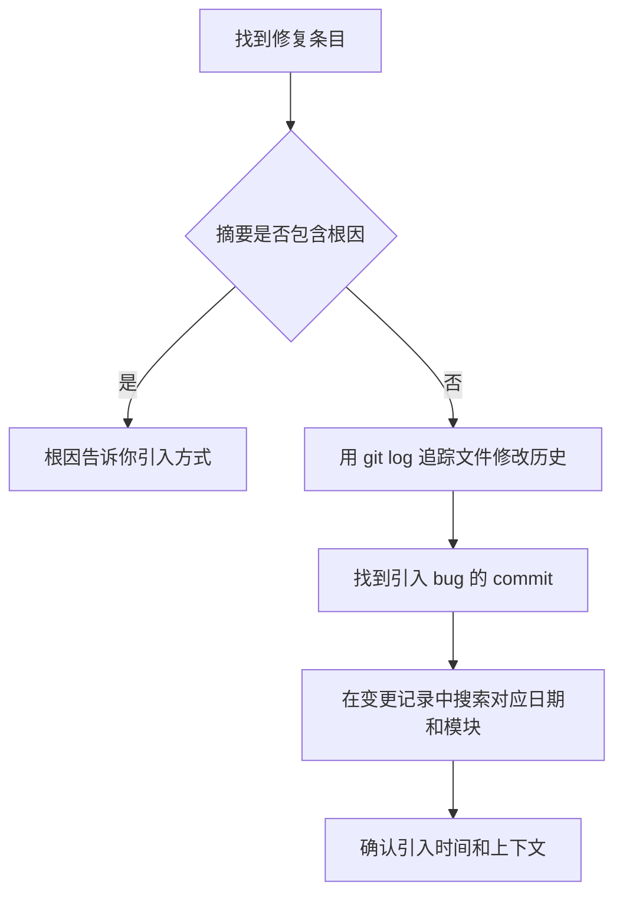

# M04 变更记录如何阅读——流水日志、版本归档与变更类型解读

小林想了解 v0.1.47 版本做了哪些改动。她打开 [docs/changes/changelog.md](../../../../docs/changes/changelog.md)，从第一行开始往下读。1854 行之后，她发现自己读了一整份倒序排列的变更流水，从 2026-08-07 一直追溯到 2026-04-22，但仍然不清楚 v0.1.47 和 v0.1.46 的区别是什么——因为这份文件没有版本边界标记。

她又去 `docs/changes/releases/` 目录翻了翻，看到了 32 个以版本号命名的子目录。她打开 [docs/changes/releases/v0.1.47/changelog.md](../../../../docs/changes/releases/v0.1.47/changelog.md)，26 行读完，这个版本改了什么一目了然：5 个修复 + 2 个 Runtime 与发布项 + 1 个验证项。

但小林接下来又犯了两个错误。第一，她看到 v0.1.47 归档里写着"修复 Windows 多 Agent worker 的 ESM 模块 URL 解析"，就以为这个 bug 从 v0.1.47 才开始存在。实际上，这个 bug 可能从更早的版本就已经存在了，v0.1.47 只是修复了它。第二，她看到流水日志中有一条 `## 2026-06-04 — refactor：Monorepo 架构迁移`，就以为这是 v0.1.14 的改动。但 Monorepo 迁移发生在 v0.1.14 之前，只是变更记录在 v0.1.14 时期才开始规范化写入。

本课解决一个定位问题：当你需要知道"系统在什么时间改了什么模块"时，怎样从变更记录中精确找到对应条目，怎样区分流水日志和版本归档的不同用途，怎样避免把"修复时间"当成"引入时间"、把"记录时间"当成"发生时间"。

## 场景：从"我想知道版本间有什么不同"到"我能定位改动时间和模块"

M01 已经解决了"怎样从索引找到正确的文档"。M02 和 M03 解决了"怎样判断文档是否完整和可信"。M04 要解决的问题是：变更记录是一类特殊的文档——它不描述系统应该怎样设计，而记录系统实际上做了什么改动。这种特殊性使它的阅读方式与设计文档不同。

| 对比维度 | 设计文档（M03） | 变更记录（M04） |
| --- | --- | --- |
| 文档目的 | 定义"系统应该怎样" | 记录"系统实际上改了什么" |
| 可信度信号 | 版本号、状态字段、适用范围声明 | 日期、变更类型、影响模块路径 |
| 与代码的关系 | 可能不一致（设计意图 vs 实现） | 应该一致（但记录时间可能晚于改动时间） |
| 阅读风险 | 把设计意图当成实现现状 | 把修复时间当成引入时间 |

## 1. 变更记录的双轨结构

### 1.1 两份文件，两种用途

OriginOS 的变更记录系统由两个核心文件组成：

| 文件 | 路径 | 内容 | 用途 |
| --- | --- | --- | --- |
| **流水日志** | [docs/changes/changelog.md](../../../../docs/changes/changelog.md) | 按时间倒序排列的所有变更条目，1854 行 | 追踪"系统在哪个日期改了什么" |
| **版本归档** | [docs/changes/releases/v{version}/changelog.md](../../../../docs/changes/releases/) | 按版本聚合的变更，32 个版本目录 | 了解"某个版本对外发布了什么" |

[docs/changes/releases/README.md](../../../../docs/changes/releases/README.md) 明确定义了两者关系：

```markdown
- 每个版本目录必须包含 `changelog.md`，只记录该版本对外发布需要展示的更新内容
- 发布脚本会优先读取当前版本对应文件，并将其生成 `release_summary`、`release_notes` 和 `changelog` 后推送到官网接口
- `docs/changes/changelog.md` 保留为按时间追加的全量变更流水。
```

这三句话揭示了两个关键区别：

| 区别 | 流水日志 | 版本归档 |
| --- | --- | --- |
| **写入时机** | 每次变更完成后立即追加 | 在版本发布时整理 |
| **内容筛选** | 无筛选，记录所有变更 | 只记录"对外发布需要展示"的变更 |
| **消费者** | 开发团队内部 | 官网用户和版本升级者 |
| **自动化用途** | 无 | 发布脚本读取并生成 release_summary / release_notes / changelog |

### 1.2 为什么需要两条路

一个具体例子说明两条路的必要性。

小林想追踪"Pi Agent 流式帧去重"这个功能是什么时候加入的。她在流水日志中搜索"stream-dedupe"，找到：

```
## 2026-06-27 — fix：统一 Agent 流式帧去重并缩减 mac 包体积
**类型**：fix
**影响模块**：`packages/core/src/lib/integrations/pi-agent/stream-dedupe.ts`、...
```

这条记录告诉她：2026-06-27，`stream-dedupe.ts` 被创建并接入 Agent 流式链路。

但如果小林想了解"v0.1.14 对用户有什么影响"，她不应该去流水日志中按日期范围过滤——因为 v0.1.14 的发布日期和流水日志中条目的日期并不完全对齐。她应该直接打开 [docs/changes/releases/v0.1.14/changelog.md](../../../../docs/changes/releases/v0.1.14/changelog.md)，那里已经按发布团队认为用户需要知道的方式整理好了。

```mermaid
flowchart TD
    A[需要了解变更] --> B{问题类型}
    B -->|某个模块何时被改动| C[查流水日志<br/>docs/changes/changelog.md]
    B -->|某个版本发布了什么| D[查版本归档<br/>docs/changes/releases/v{version}/changelog.md]
    B -->|某个 bug 何时被修复| C
    B -->|升级到新版本会得到什么| D
    C --> E[按日期或关键词搜索]
    D --> F[直接阅读版本整理后的变更列表]
```

## 2. 流水日志的条目格式精读

### 2.1 条目结构

打开 [docs/changes/changelog.md](../../../../docs/changes/changelog.md)，每条变更记录遵循统一的格式：

```markdown
## YYYY-MM-DD — type：title

**类型**：type
**影响模块**：`path1`、`path2`、...
**摘要**：1-3 句话描述变更原因和结果
```

这个格式与 [AGENTS.md 变更管理规约](../../../../AGENTS.md) 中定义的格式完全一致：

> 变更摘要格式（同时用于 `docs/changes/changelog.md` 和 `docs/changes/releases/v<version>/changelog.md`）：
> ```
> ## YYYY-MM-DD — <类型>：<标题>
> **类型**：feat / fix / refactor / docs
> **影响模块**：<模块路径列表>
> **摘要**：<1-3 句话描述变更原因和结果>
> ```

以一条真实条目为例：

```markdown
## 2026-07-02 — feat：Dock 支持左侧、底部和右侧配置

**类型**：feat
**影响模块**：`packages/core/src/types/os.ts`, `packages/web/src/store/dockStore.ts`,
`packages/web/src/components/os/dock`, `packages/web/src/app/dock/page.tsx`,
`packages/web/src/components/os/settings/SettingsDialog.tsx`,
`packages/desktop/src/main/window-manager.ts`,
`packages/web/src/components/os/DesktopOnboarding.tsx`
**摘要**：Dock 位置新增 `left` / `bottom` / `right` 配置并持久化，设置页可切换位置；
Web Dock、Electron 独立 Dock 窗口、hover 热区、Tooltip 和引导高亮均按配置同步调整，
避免只支持固定左侧或底部。
```

这条条目的四个字段分别告诉你：

| 字段 | 值 | 你能从中读到什么 |
| --- | --- | --- |
| 标题行 | `2026-07-02 — feat：Dock 支持左侧、底部和右侧配置` | 日期 + 类型 + 一句话描述 |
| 类型 | `feat` | 新增功能（不是修复、不是重构） |
| 影响模块 | 7 个文件路径，跨 core/types、web/store、web/components、desktop/main | 改动横跨三个包（core、web、desktop），涉及类型定义、状态管理和 UI |
| 摘要 | 3 句话 | 为什么要改（避免只支持固定位置）、改了什么（新增 3 种配置）、改后怎样（所有相关 UI 同步调整） |

### 2.2 标题行中的日期与类型

标题行 `## YYYY-MM-DD — type：title` 是条目的快速索引。它的设计允许你不读正文就能做初步筛选：

- **按日期筛选**：`2026-07-02` — 直接在文件中搜索 `## 2026-07` 可以找到 7 月的所有变更
- **按类型筛选**：`feat：` — 搜索 `— feat：` 可以找到所有新增功能，`— fix：` 可以找到所有修复

但标题行的类型和正文中的类型字段可能不完全一致——下节会详细分析。

### 2.3 影响模块路径的解读

影响模块字段列出了本次变更涉及的所有文件路径。这些路径有三种模式：

| 路径模式 | 含义 | 例子 |
| --- | --- | --- |
| `packages/core/src/...` | Core 包内的改动 | `packages/core/src/lib/integrations/pi-agent/core/agent.ts` |
| `packages/web/src/...` | Web 包内的改动 | `packages/web/src/store/dockStore.ts` |
| `packages/desktop/...` | Desktop 包内的改动 | `packages/desktop/src/main/window-manager.ts` |
| `docs/...` | 文档改动 | `docs/specs/epic-OS/story-OS.15/README.md` |
| `AGENTS.md` / `CLAUDE.md` | 架构规约变更 | 架构围栏升级 |

通过影响模块字段，你可以快速判断一次变更的影响范围：

- 只涉及 `packages/core/`：改动在核心包，影响所有版本
- 涉及 `packages/core/` 和 `packages/web/`：改动横跨核心和 Web
- 涉及 `packages/desktop/scripts/`：改动在桌面发布脚本
- 涉及 `docs/`：纯文档变更，不影响运行时行为
- 涉及 `AGENTS.md`：架构规约变更，可能影响所有后续开发

**一个常见的误读**：影响模块中列出了 `docs/changes/releases/v{version}/changelog.md`，意味着本次变更本身也更新了版本归档。这不是说本次变更是 v{version} 版本的全部内容，只是说变更记录也被同步维护了。

## 3. 变更类型的分类体系

### 3.1 AGENTS.md 定义的四种类型

[AGENTS.md 变更管理规约](../../../../AGENTS.md) 只定义了四种变更类型：

| 类型 | 含义 | AGENTS.md 原文 |
| --- | --- | --- |
| `feat` | 新增功能 | — |
| `fix` | 修复 bug | — |
| `refactor` | 代码重构 | — |
| `docs` | 文档变更 | — |

### 3.2 流水日志中实际观察到的八种类型

但实际流水日志中出现了八种类型：

| 类型 | 实际观察到的条目数 | 含义 | 与 AGENTS.md 定义的关系 |
| --- | --- | --- | --- |
| `feat` | 多 | 新增功能 | ✅ AGENTS.md 已定义 |
| `fix` | 最多 | 修复 bug | ✅ AGENTS.md 已定义 |
| `refactor` | 多 | 代码重构 | ✅ AGENTS.md 已定义 |
| `docs` | 多 | 文档变更 | ✅ AGENTS.md 已定义 |
| `release` | 少 | 版本发布 | ❌ AGENTS.md 未定义，实际使用 |
| `ci` | 少 | CI/CD 变更 | ❌ AGENTS.md 未定义，实际使用 |
| `chore` | 少 | 维护性工作 | ❌ AGENTS.md 未定义，实际使用 |
| `test` | 少 | 新增或补充测试 | ❌ AGENTS.md 未定义，实际使用 |

这四种额外类型（release、ci、chore、test）在实践中很常见，它们借鉴了 Conventional Commits 的分类体系。AGENTS.md 没有更新到包含这些类型，但流水日志中已经在使用。

**阅读含义**：当你看到一条类型为 `ci` 的条目时，你知道它影响的是 CI/CD 配置，不影响运行时代码。当你看到一条类型为 `test` 的条目时，你知道它只增加了测试覆盖，不改变产品行为。这些区分在 AGENTS.md 的四类型体系中无法表达。

### 3.3 版本归档中的类型重新分组

版本归档不像流水日志那样逐条列出日期和类型。它按"对外展示"的需要重新分组。

以 [docs/changes/releases/v0.1.47/changelog.md](../../../../docs/changes/releases/v0.1.47/changelog.md) 为例：

```markdown
# OriginOS CE v0.1.47 Changelog

发布日期：2026-08-07

## 修复

- 修复 Windows 多 Agent worker 的 ESM 模块 URL 解析。
- 将 CompletionGuard 限定在 Agent、RoleAgent 和技能窗体...
- ...

## Runtime 与发布

- 引入受控 Pi Task Runtime 适配边界...
- ...

## 验证

- Windows x64、macOS arm64、macOS x64 构建和真实安装包...
```

版本归档把流水日志中的多条 `fix` 和 `feat` 条目，按用户关心的维度重新组织为"修复"、"Runtime 与发布"、"验证"三个板块。这种重组使得版本归档更适合非技术读者，但丧失了流水日志中的精确日期和影响模块路径。

两种格式的对比：

| 维度 | 流水日志 | 版本归档 |
| --- | --- | --- |
| 排列方式 | 按日期倒序 | 按功能板块分组 |
| 每条记录的粒度 | 一条 commit 级变更 | 多条变更合并为一条摘要 |
| 精确度 | 包含完整路径和 1-3 句摘要 | 只包含用户可理解的一句话描述 |
| 日期信息 | 每条都有精确日期 | 只有版本发布日期 |
| 目标读者 | 开发者 | 用户和运维 |

## 4. 版本归档与流水日志的映射关系

### 4.1 版本目录结构

`docs/changes/releases/` 下有 32 个版本目录：

```
docs/changes/releases/
├── README.md
├── v0.1.14/
│   └── changelog.md
├── v0.1.15/
│   └── changelog.md
├── ...
└── v0.1.47/
    └── changelog.md
```

每个版本目录下只有一个 `changelog.md` 文件。目录命名规则：`v<version>`，版本号与 `packages/desktop/package.json` 中的版本号一致。

### 4.2 两种格式的映射

同一次变更可能同时出现在流水日志和版本归档中。但两者的对应关系不是一对一的：

| 映射情况 | 例子 | 原因 |
| --- | --- | --- |
| **一条流水条目 → 版本归档中的一行摘要** | 流水中 "fix：修复 Windows 打包版技能工作目录解析错误" → 归档中 "修复 Windows 打包版技能工作目录解析错误" | 归档简化了标题，去掉类型前缀 |
| **多条流水条目 → 版本归档中合并为一行** | 流水中多条 desktop release fix → 归档中 "修复 macOS 签名与公证校验" | 归档按用户视角合并相关修复 |
| **流水条目不出现在版本归档中** | 流水中 "test：补齐长会话稳定性回归样例" | 内部测试补充不属于"对外发布需要展示"的变更 |
| **版本归档包含流水日志中没有的内容** | 归档中 "macOS 签名与公证校验通过" | 归档可以补充验证结果，这是流水日志不记录的 |

最后一种情况值得特别注意：**版本归档可能包含流水日志中没有的信息**——特别是验证结果。流水日志只记录"做了什么改动"，不记录"改动后的验证结果"。但版本归档的"验证"板块会明确写出"Windows x64、macOS arm64、macOS x64 构建和真实安装包 Pi Task Runtime 校验通过"——这是版本发布团队补充的验证证据。

### 4.3 版本归档的生成方式

[docs/changes/releases/README.md](../../../../docs/changes/releases/README.md) 提到：

> 发布脚本会优先读取当前版本对应文件，并将其生成 `release_summary`、`release_notes` 和 `changelog` 后推送到官网接口

这意味着版本归档不仅是给人读的，还是发布自动化链路的输入。发布脚本 `packages/desktop/scripts/release-notes.js` 读取 `docs/changes/releases/v<version>/changelog.md`，生成三种格式的输出：

| 输出格式 | 用途 |
| --- | --- |
| `release_summary` | 官网接口的简短摘要 |
| `release_notes` | 官网展示的完整更新说明 |
| `changelog` | 标准格式的变更列表 |

这解释了为什么版本归档的格式与流水日志不同——版本归档需要被自动化脚本解析，所以它的格式更结构化（使用 `## 修复`、`## Runtime 与发布` 等固定板块标题），而流水日志是纯人工维护的，格式更自由。

## 5. 变更记录与 git log 的交叉验证

### 5.1 为什么需要交叉验证

变更记录是人工维护的。它可能遗漏某些改动，也可能记录的日期与实际提交日期不一致。当你需要精确知道某个文件的改动历史时，应该同时使用变更记录和 git log。

| 信息来源 | 优点 | 缺点 |
| --- | --- | --- |
| 变更记录 | 有变更类型分类、影响模块汇总、1-3 句摘要 | 可能遗漏、日期可能不精确 |
| git log | 精确到每次提交、包含完整 diff | 没有"变更类型"分类、提交信息可能不完整 |

### 5.2 两种交叉验证场景

**场景 1：从变更记录验证到 git log**

小林在流水日志中看到：

```
## 2026-06-27 — fix：统一 Agent 流式帧去重并缩减 mac 包体积
**影响模块**：`packages/core/src/lib/integrations/pi-agent/stream-dedupe.ts`、...
```

她想知道这个修复具体改了什么代码。运行：

```bash
git log --oneline --since=2026-06-27 --until=2026-06-28 -- packages/core/src/lib/integrations/pi-agent/stream-dedupe.ts
```

这会列出 2026-06-27 当天对 `stream-dedupe.ts` 的所有提交。如果变更记录准确，应该能找到对应的 commit。

**场景 2：从 git log 定位到变更记录**

小林在代码中看到 `stream-dedupe.ts` 文件，想知道它是什么时候被创建的。运行：

```bash
git log --diff-filter=A --follow -- packages/core/src/lib/integrations/pi-agent/stream-dedupe.ts
```

这会找到创建该文件的 commit。然后她在变更记录中搜索该文件的路径，确认变更记录是否有对应条目。

### 5.3 交叉验证的常见不一致

| 不一致情况 | 原因 | 影响 | 处理方法 |
| --- | --- | --- | --- |
| git log 中有提交但变更记录中没有 | 变更记录未及时更新 | 可能遗漏了重要改动 | 以 git log 为准，标记"变更记录缺失" |
| 变更记录中的日期与 git commit 日期不同 | 变更记录按"记录写入日期"而非"代码提交日期" | 可能导致时间线判断偏差 | 以 git commit 日期为精确时间 |
| 变更记录中的影响模块不完整 | 只列出了主要模块，省略了间接影响 | 可能低估改动的影响范围 | 用 git log --stat 查看完整文件列表 |
| 变更记录中的摘要与 commit message 不同 | 摘要是事后整理，commit message 是当场写的 | 两者表述角度不同 | 摘要更侧重"对系统的影响"，commit message 更侧重"做了什么操作" |

## 6. 四种典型阅读模式

### 6.1 追踪某个模块的变更历史

**问题**：Pi Agent 的流式消息处理经历了哪些改动？

**方法**：在流水日志中搜索模块路径关键词。

```bash
grep "stream-dedupe\|display-content\|message\.ts" docs/changes/changelog.md
```

找到相关条目后，按时间倒序排列，最近的变化在最前面。阅读时注意：影响模块字段可能使用了不同的文件路径表示（有时包含 `packages/core/src/` 前缀，有时省略），搜索时用文件名而非完整路径更可靠。

**易错点**：搜索结果只包含"在影响模块字段中列出的"条目。如果一个改动间接影响了该模块但没有在影响模块中列出，就搜不到。

### 6.2 了解两个版本之间的差异

**问题**：从 v0.1.41 升级到 v0.1.47，系统有什么变化？

**方法**：依次打开两个版本之间的所有版本归档。

```
docs/changes/releases/v0.1.42/changelog.md
docs/changes/releases/v0.1.43/changelog.md
docs/changes/releases/v0.1.44/changelog.md
docs/changes/releases/v0.1.45/changelog.md
docs/changes/releases/v0.1.46/changelog.md
docs/changes/releases/v0.1.47/changelog.md
```

按版本号从小到大阅读，这样改动的时间线是正向的。

**不要用流水日志来回答这个问题**。流水日志按日期排列，不标版本边界，你需要知道每个版本的发布日期才能在流水中划定范围——而这些信息只有版本归档才有。

### 6.3 追踪某个 bug 的引入和修复时间

**问题**：Windows 打包版技能工作目录解析错误是什么时候引入的？

**方法**：先在流水日志中找到修复条目：

```
## 2026-07-17 — fix：修复 Windows 打包版技能工作目录解析错误
**摘要**：根因是 bash 工具缺少 Windows 平台支持...
```

然后往前追溯，找到引入该 bug 的变更。在这个例子中，摘要已经说明了根因——"bash 工具缺少 Windows 平台支持"意味着 bug 在 bash-tools.ts 首次创建时就存在了（因为从未支持 Windows），而不是某次改动引入的。

但不是所有摘要都包含根因。如果摘要只说"修复了 X"，你需要用 git log 追踪该文件的修改历史，找到引入 bug 的 commit。



**关键区分**：修复时间 ≠ 引入时间。修复条目的日期只告诉你"什么时候修的"，不告诉你"什么时候坏的"。很多 bug 在引入后数周甚至数月才被发现和修复。

### 6.4 判断某次架构规约变更的影响

**问题**：AGENTS.md 什么时候增加了 OpenSpec Proposal 规约？

**方法**：在流水日志中搜索 `AGENTS.md` 作为影响模块：

```
## 2026-07-29 — docs：实施隔离边界调整为 OpenSpec Proposal
**影响模块**：`AGENTS.md`, `docs/changes/changelog.md`,
`docs/changes/releases/v0.1.45/changelog.md`
**摘要**：AGENTS.md 升级到 v2.5.0。Story 继续作为需求和验收边界，
但不再直接对应 Git 分支...
```

这条记录告诉你：AGENTS.md v2.5.0 引入了 OpenSpec Proposal 机制。摘要中包含了版本号（v2.5.0），你可以对照 AGENTS.md 头部的版本号确认当前版本是否包含这个变更。

**注意**：影响 AGENTS.md 的变更通常是 `docs` 类型，但它们的实际影响远超文档——架构规约的变更会影响所有后续开发的工作方式。阅读这类条目时，不能因为类型是 `docs` 就跳过。

## 7. 四种失败路径

### 7.1 把流水日志当成版本间差异

后果：小林想了解 v0.1.46 和 v0.1.47 的区别，她在流水日志中搜索两个日期之间的条目。但她不知道 v0.1.47 的发布日期是 2026-08-07，所以她无法准确划定日期范围。即使她找到了正确范围，流水日志中包含了大量不属于这两个版本的内部改动（如测试补充、文档更新），让她难以区分哪些是用户可感知的变更。

正确做法：版本间差异直接读版本归档。流水日志回答"什么时候改了什么"，版本归档回答"这个版本对外发布了什么"。

### 7.2 把修复时间当成引入时间

后果：小林看到"2026-07-17 — fix：修复 Windows 打包版技能工作目录解析错误"，就以为这个 bug 是 7 月 17 日引入的。但实际根因是 bash 工具从未支持 Windows 平台——这个 bug 从最初引入 bash-tools.ts 时就存在了，只是在 Windows 打包版发布后才被发现。

正确做法：区分修复时间和引入时间。修复条目的日期只告诉你"什么时候修的"。要找到引入时间，需要追踪代码历史。如果摘要中说明了根因（如"根因是 bash 工具缺少 Windows 平台支持"），根因通常会告诉你引入方式。

### 7.3 把变更记录当成完整改动清单

后果：小林在变更记录中搜索 `memory-tracker.ts`，没有找到任何条目，就以为这个文件从未被修改过。但实际上，`memory-tracker.ts` 在 2026-06-26 的 "refactor：MemoryBlockManager 改为委托 memory-core 单写者" 条目的影响模块中被列为 `memory-tracker.ts`（路径被简写了），搜索完整路径搜不到。

正确做法：变更记录可能使用简写路径或遗漏间接影响的文件。当变更记录中找不到时，用 git log 做补充验证。搜索时用文件名而非完整路径。

### 7.4 忽略 `docs` 类型条目的实际影响

后果：小林看到"2026-07-29 — docs：实施隔离边界调整为 OpenSpec Proposal"，类型是 `docs`，就跳过了。但这条变更修改了 AGENTS.md，引入了 OpenSpec Proposal 机制，改变了所有后续 Story 的实施方式。忽略这条记录会导致小林不理解为什么新的 Story 不再直接对应 Git 分支。

正确做法：当 `docs` 类型条目的影响模块包含 `AGENTS.md` 或 `CLAUDE.md` 时，必须仔细阅读——架构规约变更的实际影响通常远超普通文档更新。影响模块包含 `docs/specs/` 的条目也值得关注，因为它们可能改变了 Story 的状态或约束。

## 8. 文档覆盖台账

| 本课直接精读的文档 | 精读范围 | 配对验证 | 本课只证明什么 |
| --- | --- | --- | --- |
| [docs/changes/changelog.md](../../../../docs/changes/changelog.md) | 全文 1854 行（逐条验证格式一致性） | 对照 git log 验证日期和路径对应 | 流水日志的条目格式、类型分布、日期范围 |
| [docs/changes/releases/README.md](../../../../docs/changes/releases/README.md) | 全文 9 行 | 对照发布脚本 `release-notes.js` 验证读取逻辑 | 双轨结构的定义、版本归档的自动化用途 |
| [docs/changes/releases/v0.1.47/changelog.md](../../../../docs/changes/releases/v0.1.47/changelog.md) | 全文 26 行 | 对照流水日志中 2026-08-07 附近条目验证覆盖 | 版本归档的板块化格式、与流水日志的映射 |
| [docs/changes/releases/v0.1.14/changelog.md](../../../../docs/changes/releases/v0.1.14/changelog.md) | 全文 68 行 | 对照流水日志中 2026-07-15 至 2026-07-17 条目验证覆盖 | 早期版本归档的格式（逐条 vs 板块化）、变更类型标签 |
| [AGENTS.md](../../../../AGENTS.md) 变更管理规约章节 | 变更摘要格式定义区 | 对照流水日志实际格式验证一致性 | 规约定义的四种类型与实际使用的八种类型的差异 |

本课没有精读的内容也要明说：

- `docs/changes/releases/` 中其余 30 个版本的 changelog.md 只做了目录级确认（确认存在和文件大小），未逐份精读
- `packages/desktop/scripts/release-notes.js` 发布脚本的具体解析逻辑未精读，只通过 releases/README.md 了解了其输入输出关系
- git log 交叉验证的具体执行结果留给读者练习
- 版本归档与流水日志之间条目的精确对应关系（哪些流水条目被合并、哪些被省略）需要逐版本比对，本课只验证了 v0.1.14 和 v0.1.47 两个版本

## 9. 练习：变更记录定位

以下四个定位任务，请分别说出你应该打开哪个文件、用什么方法搜索、以及找到后先看什么。

### 任务 A：了解 Pi Agent 的 loop detector 何时被加入

已知信息：loop detector 用于检测 Agent 重复相同工具调用。

### 任务 B：了解 v0.1.41 到 v0.1.42 之间系统有什么变化

已知信息：v0.1.41 和 v0.1.42 是两个连续的版本。

### 任务 C：判断"Monorepo 架构迁移"发生在哪个版本

已知信息：流水日志中有一条 `2026-06-04 — refactor：Monorepo 架构迁移`。

### 任务 D：判断 AGENTS.md v2.4.0 引入了什么变更

已知信息：AGENTS.md 头部标注版本为 v2.6.2。

### 参考答案

**任务 A：**

| 维度 | 判断 |
| --- | --- |
| 应打开的文件 | [docs/changes/changelog.md](../../../../docs/changes/changelog.md) |
| 搜索方法 | 搜索 `loop-detector` 或 `loop detector` |
| 先看什么 | 找到条目后，先看日期（何时加入）和影响模块（涉及哪些文件），再看摘要了解加入的原因和方式 |
| 验证方法 | 用 `git log --diff-filter=A -- packages/core/src/lib/integrations/pi-agent/tools/loop-detector.ts` 验证文件创建时间是否与变更记录日期一致 |

**任务 B：**

| 维度 | 判断 |
| --- | --- |
| 应打开的文件 | [docs/changes/releases/v0.1.42/changelog.md](../../../../docs/changes/releases/v0.1.42/changelog.md) |
| 搜索方法 | 直接打开阅读，无需搜索 |
| 先看什么 | 先看发布日期，再按板块（修复 / 新功能 / 验证等）阅读 |
| 注意事项 | 不要用流水日志来回答版本间差异问题——流水日志没有版本边界标记 |

**任务 C：**

| 维度 | 判断 |
| --- | --- |
| 方法 | 在流水日志中找到 `2026-06-04 — refactor：Monorepo 架构迁移` 条目，记录日期为 2026-06-04。然后检查 `docs/changes/releases/` 下各版本的 changelog.md，找到发布日期在 2026-06-04 之后的第一个版本。该版本应该包含这次迁移。 |
| 易错点 | Monorepo 迁移发生在 v0.1.14 之前（v0.1.14 的归档日期是 2026-07-15），但不能因为记录在 v0.1.14 时期的流水日志中就认为它是 v0.1.14 的改动。变更记录的写入时间可能晚于实际改动时间。 |

**任务 D：**

| 维度 | 判断 |
| --- | --- |
| 方法 | 在流水日志中搜索 `AGENTS.md` 作为影响模块，找到包含"v2.4.0"或"v2.4"的条目。预期找到 `2026-07-29 — docs：Story 实施增加独立分支与 Worktree 隔离规约`，其摘要中提到"AGENTS.md 升级到 v2.4.0"，引入了 Story 独立分支和 Worktree 隔离规约。 |
| 先看什么 | 摘要中提到的版本号和引入的规约内容 |

## 10. 口头验收

学完本课后，不看正文也应能回答下面五个问题：

1. 流水日志和版本归档分别回答什么问题？它们的核心区别是什么？
2. 变更记录条目的三个必须包含的字段是什么？每个字段分别告诉你什么？
3. AGENTS.md 定义了哪四种变更类型？流水日志中实际使用了哪八种？额外的四种分别是什么含义？
4. 为什么"修复时间"不等于"引入时间"？请用一个具体例子说明。
5. 当变更记录的类型是 `docs` 但影响模块包含 `AGENTS.md` 时，为什么不能跳过？

合格回答不要求背诵所有版本号或日期，但必须能说清双轨结构的用途区别、条目格式中每个字段的作用、以及四种阅读模式各自适合什么问题。能说清"这个文件回答什么问题，那个文件回答什么问题"，比只说清"它们在哪里"更重要。
