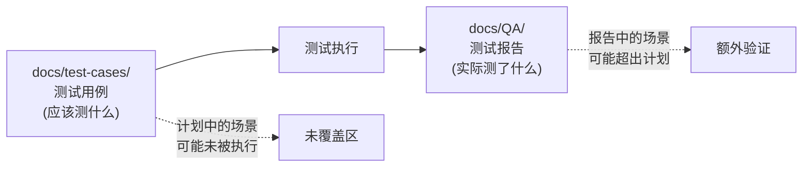
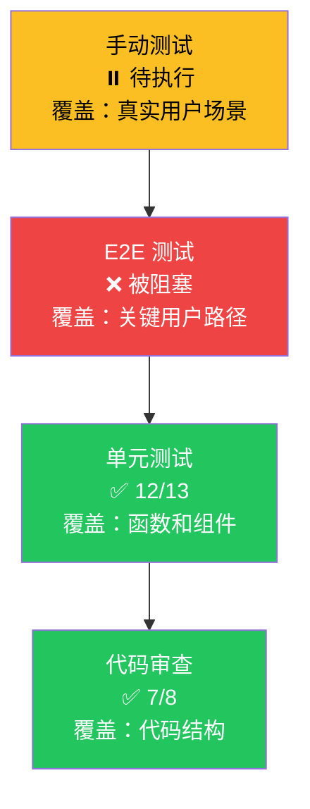
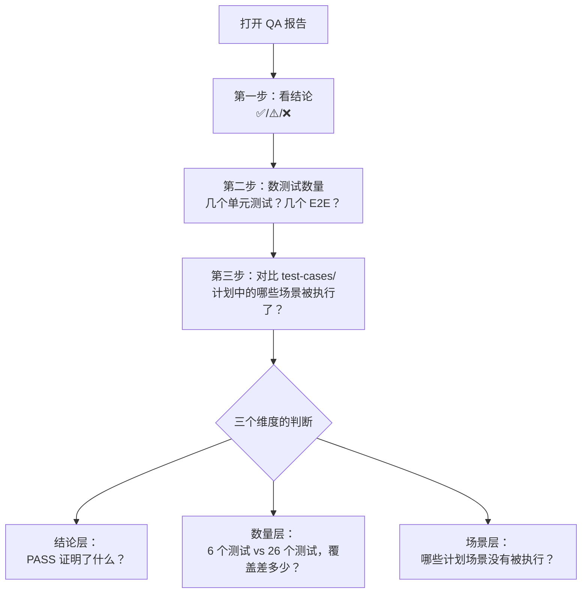

# M05 QA 报告与测试用例如何阅读——通过和全覆盖有何不同，测试计划和测试结果如何区分

小林接到一个任务：确认 Story OS.7（Agent 托管服务）是否经过充分验证。她打开 [docs/QA/OS.7-AgentHost-Test-Report.md](../../../../docs/QA/OS.7-AgentHost-Test-Report.md)，看到执行摘要的第一行写着 `✅ PASS`，就写了一份报告："OS.7 测试全部通过，功能已充分验证。"

但技术负责人看完后说：**"你的结论有风险。报告确实写了 PASS，但只跑了 6 个单元测试。6 个单元测试覆盖了 Agent 托管服务的哪些场景？是否覆盖了会话超时、并发访问、错误恢复？报告的 PASS 只说明被测的 6 个场景通过了，不说明所有场景都测试了。"**

小林的错误在于把"通过"等同于"全覆盖"。一份 QA 报告的 PASS 结论只能证明一件事：**被列出的那些测试场景在报告时刻行为正确**。它不能证明未被列出的场景没有问题，也不能证明测试覆盖了所有失败路径。

更严重的是，小林后来又在 `docs/test-cases/` 中找到了一份极其详细的测试用例文档 [test-cases-1.1-interview-start.md](../../../../docs/test-cases/epic-1-project-quick-launch/test-cases-1.1-interview-start.md)，包含 6 个单元测试、4 个集成测试、5 个 E2E 测试、4 个边界测试、4 个错误场景测试和 3 个性能测试——但所有 AC 测试结果都是 ☐（未勾选）。她以为这份文档是测试结果，实际上它是测试计划——定义了"应该测什么"，但还没有执行。

本课解决一个判断问题：当你打开一份 QA 报告或测试用例文档时，怎样区分"测试计划"与"测试结果"，怎样判断"通过"覆盖了哪些场景，怎样识别报告中隐藏的风险信号。

## 场景：从"报告说通过"到"我知道它证明了什么"

M01 解决了"怎样从索引找到正确的文档"。M02 和 M03 解决了"怎样判断 Story 文档和设计文档是否完整和可信"。M04 解决了"变更记录怎样定位改动时间和模块"。M05 要解决的问题是：QA 文档和测试报告是一类特殊的文档——它们不描述系统应该怎样设计，而记录系统实际上被验证了什么。这种特殊性使"通过"这个词的含义比初学者以为的要窄得多。

| 对比维度 | 设计文档（M03） | 变更记录（M04） | QA 报告（M05） |
| --- | --- | --- | --- |
| 文档目的 | 定义"系统应该怎样" | 记录"系统实际上改了什么" | 记录"系统实际上被验证了什么" |
| 可信度信号 | 版本号、状态字段、适用范围声明 | 日期、变更类型、影响模块路径 | 测试数量、覆盖场景、验证层级 |
| 与代码的关系 | 可能不一致（设计意图 vs 实现） | 应该一致（但记录时间可能晚于改动时间） | 应该一致（但只覆盖被测场景） |
| 阅读风险 | 把设计意图当成实现现状 | 把修复时间当成引入时间 | 把"通过"当成"全覆盖" |

## 1. QA 文档的四类分类

### 1.1 `docs/QA/` 中的四种文档类型

打开 [docs/QA/](../../../../docs/QA/) 目录，29 份文件。按文档的责任和内容，可以分为四类：

| 类别 | 文件数 | 核心责任 | 代表文件 |
| --- | --- | --- | --- |
| **验证/测试报告** | 9 | 记录某次测试的执行结果：通过几项、失败几项、覆盖了哪些场景 | `OS.7-AgentHost-Test-Report.md`、`OS.5-Acrylic-Test-Report.md`、`STARTUP-TEST-REPORT.md` |
| **测试计划** | 5 | 定义将要测试哪些场景、用什么策略、达到什么覆盖率 | `spotlight-fix-test-plan.md`、`e2e-test-suite.md`、`svg-icon-testing-strategy.md` |
| **质量保障文档** | 3 | 评估质量体系本身的合理性，不记录具体测试结果 | `cognitive-framework-quality-assurance.md`、`test-plan-optimization-summary.md` |
| **验证/评估报告** | 5 | 对已完成功能或修复的综合评估，可能包含多轮验证 | `homepage-redesign-verification.md`、`epic-t-mvp-qa-assessment.md` |
| **归档** | 5 | 历史上的 bug 修复验证记录 | `archive/P0-BUG-001-Homepage-Error.md` 等 |

加上 [docs/test-cases/](../../../../docs/test-cases/) 目录中的 8 份测试用例文档，QA 相关文档总计 37 份。

这四类文档的核心区别：

| 维度 | 测试报告 | 测试计划 | 质量保障文档 | 验证/评估报告 |
| --- | --- | --- | --- | --- |
| 时态 | 过去时（已执行） | 将来时（将执行） | 无时态（体系评估） | 过去时（已评估） |
| 可证明什么 | 被测场景在报告时刻的行为 | 无（计划还没执行） | 质量体系的设计合理性 | 功能或修复的综合评估结论 |
| 不能证明什么 | 未被列出场景的行为 | 任何测试结果 | 具体功能的正确性 | 未来变更后的行为 |
| 最常见的误读 | 把"通过"当成"全覆盖" | 把计划当成结果 | 把体系评估当成功能验证 | 把"验证通过"当成"永不过时" |

### 1.2 `docs/test-cases/` 与 `docs/QA/` 的关系

`docs/test-cases/` 中的文档定义"应该测什么"，`docs/QA/` 中的测试报告记录"实际测了什么"。两者的关系类似设计文档与变更记录的关系——前者定义意图，后者记录事实。



理想情况下，测试报告的覆盖范围应该等于或大于测试用例的覆盖范围。但实际项目中，两者经常不对齐——测试用例中定义的某些场景可能因为时间或环境限制没有被执行，而测试报告可能包含计划之外的临时验证。

## 2. 测试报告的结构精读

### 2.1 完整通过的报告：OS.7 Agent 托管服务

[docs/QA/OS.7-AgentHost-Test-Report.md](../../../../docs/QA/OS.7-AgentHost-Test-Report.md) 共 344 行，是一份典型的"完整通过"报告。它的结构：

| 区段 | 行号 | 内容 | 阅读重点 |
| --- | --- | --- | --- |
| 执行摘要 | 1—20 | ✅ PASS、Story ID、日期、测试环境 | 先看这里确认整体结论 |
| 交付物验证 | 22—60 | 对照 Story 需求逐项确认 | 每项是否都有✅？有没有⚠️？ |
| 组件验证 | 62—120 | 各组件的功能验证结果 | 验证了哪些组件？跳过了哪些？ |
| Hooks 验证 | 122—170 | React Hooks 的行为验证 | Hooks 的测试场景是否覆盖了边界？ |
| 集成层验证 | 172—220 | Agent 与其他模块的集成 | 集成范围是否包含你关心的模块？ |
| 单元测试结果 | 222—270 | 6 个单元测试，全部通过 | **关键数字：只有 6 个** |
| 架构评估 | 272—300 | 代码审查和架构合规性 | 是否有架构违规？ |
| 代码质量 | 302—330 | 代码风格和最佳实践 | 是否有 P3 建议？ |
| 发现的问题 | 332—340 | P3 建议：MessageList 时间戳、AgentDialog 关闭确认、MessageInput 字符限制 | P3 虽然不阻塞通过，但代表改进空间 |
| 验收结论 | 342—344 | PASS | 最终结论 |

这份报告的一个关键数字隐藏在"单元测试结果"区段：**6 个单元测试**。6 个单元测试对于 Agent 托管服务来说是否充分？报告没有回答这个问题——它只告诉你 6 个测试全部通过。

### 2.2 基本通过但功能未全的报告：STARTUP

[docs/QA/STARTUP-TEST-REPORT.md](../../../../docs/QA/STARTUP-TEST-REPORT.md) 共 140 行，结论是 ✅ PASS，但仔细阅读会发现大量⏳标记。

| 区段 | 内容 | 信号 |
| --- | --- | --- |
| 执行摘要 | ✅ Basic Pass | "Basic"修饰了"Pass"——基本通过，不是全面通过 |
| 功能验证 | 侧边栏导航 ⏳、项目创建 ⏳、项目管理 ⏳、应用打开 ⏳ | 四个核心功能标记为 pending |
| 实现状态 | 三个模块使用 mock 实现 | Mock 意味着功能没有真实实现 |
| Pi Agent 集成 | 已禁用 | 核心交互层未验证 |
| 数据持久化 | 未实现 | 数据不会保存 |

这份报告的 PASS 结论和 OS.7 的 PASS 结论含义完全不同。OS.7 的 PASS 表示"被测功能验证通过"；STARTUP 的 PASS 表示"基本启动验证通过，但大量功能处于 pending 状态"。如果读者只看执行摘要的 ✅ PASS，就会以为项目启动功能已经全面可用。

### 2.3 部分完成的报告：OS.4 Spotlight E2E

[docs/QA/OS.4-E2E-Test-Report.md](../../../../docs/QA/OS.4-E2E-Test-Report.md) 共 466 行，是三份报告中最有价值的教学案例。它展示了多层级验证中的混合结果：

| 验证层级 | 结果 | 说明 |
| --- | --- | --- |
| 代码审查 | ✅ 7/8 通过 | 1 项需要改进 |
| 单元测试 | ✅ 12/13 通过 | 1 项失败 |
| E2E 测试 | ❌ 被阻塞 | 浏览器会话冲突导致无法执行 |
| 手动测试 | ⏸️ 待执行 | E2E 被阻塞后手动测试也暂停 |

整体状态：⚠️ 测试部分完成——需要手动验证。

这份报告的关键教学价值在于：**同一个 Story 的不同验证层级可以给出不同结论**。代码审查大部分通过、单元测试大部分通过，但 E2E 测试被阻塞——这意味着用户层面的端到端行为根本没有被自动验证。如果读者只看代码审查和单元测试的结果，就会以为 Spotlight 功能已经充分验证，但实际上用户能否正常使用 Spotlight 还没有被确认。

### 2.4 完整通过的报告变体：OS.5 Acrylic 材质系统

[docs/QA/OS.5-Acrylic-Test-Report.md](../../../../docs/QA/OS.5-Acrylic-Test-Report.md) 的结论也是 ✅ PASS，10/10 测试通过。但与 OS.7 不同，OS.5 的报告还包含了变体验证：3 种材质变体（standard / subtle / strong）分别验证。这意味着 OS.5 的"通过"比 OS.7 的"通过"覆盖了更多场景——至少它验证了不同配置下的行为差异。

### 2.5 聚合报告：epic-os-completion-report

[docs/QA/epic-os-completion-report.md](../../../../docs/QA/epic-os-completion-report.md) 是一份汇总报告，覆盖 OS.1—OS.8 所有 Story，显示 76/76（100%）测试通过率。

这种聚合报告的阅读风险是：**100% 通过率可能掩盖单个 Story 的覆盖不足**。OS.7 的 6 个单元测试全部通过，贡献了 6/76 的通过数。但 6 个测试对于 Agent 托管服务是否充分？聚合报告不会回答这个问题——它只关心"是否通过"，不关心"覆盖是否充分"。

## 3. 三个关键区分

### 3.1 测试计划 ≠ 测试结果

这是 QA 文档阅读中最容易犯的错误。一个具体例子说明两者的区别：

[docs/test-cases/epic-1-project-quick-launch/test-cases-1.1-interview-start.md](../../../../docs/test-cases/epic-1-project-quick-launch/test-cases-1.1-interview-start.md) 共 2008 行，包含：

| 区段 | 内容 | 结果标记 |
| --- | --- | --- |
| 测试策略 | 测试金字塔（单元 → 集成 → E2E） | — |
| 覆盖率目标 | 单元 >80%、集成 >70%、E2E 关键 100% | 目标，不是结果 |
| 6 个单元测试 | 完整的测试代码，可执行 | — |
| 4 个集成测试 | 完整的测试代码，可执行 | — |
| 5 个 E2E 测试 | 完整的测试代码，可执行 | — |
| AC 验收测试 | AC1—AC6 的 Given/When/Then + 测试步骤 | **全部 ☐（未勾选）** |

这份文档的 AC 验收测试部分，每条 AC 的格式是：

```markdown
### AC1: [验收标准描述]
- Given: [前置条件]
- When: [触发动作]
- Then: [预期结果]
- 测试步骤: 1. ... 2. ... 3. ...
- 结果: ☐ 通过 / ☐ 失败
```

所有结果都是 ☐——没有任何一条 AC 被勾选。这意味着这些测试还没有执行。这份 2008 行的文档是一个详细的测试计划，不是测试报告。

| 维度 | 测试计划（test-cases/） | 测试报告（QA/） |
| --- | --- | --- |
| 时态 | 将来时："将要测试以下场景" | 过去时："已经测试了以下场景" |
| 结果标记 | ☐ 未勾选 | ✅ 通过 / ❌ 失败 |
| 证明力 | 无——计划可以写得很完美，但没执行就没有证据 | 有限——只证明被列出的场景在报告时刻的行为 |
| 阅读目的 | 了解"应该测什么"和"怎样测" | 了解"实际测了什么"和"测出了什么结果" |

**误读后果**：如果把 test-cases-1.1-interview-start.md 的 2008 行内容当成测试结果，就会以为"访谈启动功能已经经过了 6 个单元测试 + 4 个集成测试 + 5 个 E2E 测试 + 4 个边界测试 + 4 个错误场景测试 + 3 个性能测试的全面验证"。实际上，这些测试都还没有执行。

### 3.2 "通过" ≠ "全覆盖"

三份报告的"通过"含义对比：

| 报告 | 结论 | 测试数量 | 实际覆盖 | "通过"证明什么 |
| --- | --- | --- | --- | --- |
| OS.7 | ✅ PASS | 6 个单元测试 | 6 个测试场景 | 这 6 个场景在报告时刻行为正确 |
| STARTUP | ✅ Basic Pass | 未明确列出 | 基本启动验证 | 系统能启动，但大量功能未验证 |
| OS.5 | ✅ PASS | 10 个测试 + 3 种变体 | 10 个场景 × 3 种配置 | 30 种组合在报告时刻行为正确 |

OS.5 的"通过"比 OS.7 的"通过"覆盖更广——因为 OS.5 不仅测了更多场景，还验证了不同配置下的行为差异。但即使 OS.5 也没有覆盖所有可能的用户操作序列和边界条件。

**"通过"的证明范围可以用一个公式表示：**

```
"通过"证明的范围 = 报告中列出的测试场景 × 报告时刻
```

公式右边的两个因子都限制了"通过"的证明力：

- **场景限制**：未被列出的场景，"通过"什么也证明不了。OS.7 的 6 个单元测试可能没有覆盖会话超时和并发访问——这两个场景的通过与否，报告不提供任何信息。
- **时间限制**：即使被列出的场景，"通过"只代表报告时刻的行为。如果代码在报告之后被修改，之前的"通过"可能不再成立。

### 3.3 代码级验证 ≠ 用户级验证

OS.4 的报告最清楚地展示了这个区分：

| 验证层级 | OS.4 结果 | 这一层能证明什么 | 这一层不能证明什么 |
| --- | --- | --- | --- |
| 代码审查 ✅ 7/8 | 代码结构和实现方式符合规范 | 代码写得合理 | 代码运行时行为正确 |
| 单元测试 ✅ 12/13 | 单个函数和组件的行为正确 | 被测的函数和组件按预期工作 | 函数组合后的整体行为正确 |
| E2E 测试 ❌ 被阻塞 | 未能执行 | — | 用户实际使用场景的端到端行为 |
| 手动测试 ⏸️ 待执行 | 未能执行 | — | 用户能否正常完成操作 |

这四层验证形成一个金字塔，每一层覆盖不同范围：



代码审查通过说明代码写得合理，但不说明代码运行正确。单元测试通过说明函数和组件行为正确，但不说明它们组合后整体行为正确。E2E 测试通过说明关键用户路径端到端可行，但不说明所有用户路径都可行。手动测试通过说明真实用户可以完成操作，但不说明所有用户都能完成。

**判断要点**：当 QA 报告只有代码审查和单元测试的结果时，它只能证明"代码层面的正确性"，不能证明"用户体验层面的正确性"。如果 E2E 测试和手动测试缺失或被阻塞，意味着用户层面的验证还是空白。

## 4. 报告中的五种信号

### 4.1 ✅ PASS——被测场景通过

✅ PASS 意味着报告列出的所有测试场景在报告时刻行为正确。但 PASS 本身不告诉你测了多少场景。

阅读 PASS 时必须追问三个问题：

| 追问 | 为什么重要 | 在报告中哪里找 |
| --- | --- | --- |
| 通过了多少个测试？ | 6 个测试通过和 60 个测试通过的含义完全不同 | 单元测试结果区段 |
| 每个测试覆盖了什么场景？ | "通过"只覆盖被测场景，必须知道哪些场景被覆盖了 | 组件验证或测试用例列表 |
| 哪些场景没有被测试？ | 未被测试的场景不代表没有问题 | 报告通常不列出——这是最关键的信息缺口 |

### 4.2 ⏳ Pending——功能存在但未验证

⏳ 意味着功能已实现（或部分实现），但在报告时刻没有被验证。STARTUP 报告中的四个核心功能（侧边栏导航、项目创建、项目管理、应用打开）都标记为 ⏳ pending。

**阅读含义**：⏳ 不等于❌失败。它意味着"不知道是否正确"。如果一份报告中大量功能标记为 ⏳，说明这份报告的覆盖范围很有限。

### 4.3 ❌ Blocked——测试无法执行

❌ 被阻塞意味着测试设计好了，但因为环境或依赖问题无法执行。OS.4 的 E2E 测试被阻塞原因是"浏览器会话冲突"——这不是功能 bug，而是测试环境问题。

**阅读含义**：被阻塞的测试不提供任何关于功能正确性的信息。被阻塞的原因可能揭示环境配置问题（如 OS.4 的浏览器会话冲突），但不代表被测功能本身有问题。然而，因为被阻塞的层级是 E2E——最接近用户行为的验证层级——它的缺失意味着用户层面的验证空白。

### 4.4 ⚠️ 部分完成——混合结果

⚠️ 是最需要仔细阅读的信号。OS.4 的整体状态是 ⚠️ 测试部分完成，因为四个验证层级给出了不同的结论。

**阅读含义**：⚠️ 报告不能简单地说"通过"或"不通过"。读者必须逐层看每一层的结论，判断哪一层的验证对当前问题最有意义。如果关心代码质量，代码审查 ✅ 7/8 可能已经足够；如果关心用户能否使用 Spotlight，E2E ❌ 和手动 ⏸️ 说明验证还不充分。

### 4.5 P3 建议——通过但不完美

OS.7 报告在"发现的问题"区段列出了三个 P3 建议：MessageList 时间戳、AgentDialog 关闭确认、MessageInput 字符限制。P3 不阻塞验收，但代表改进空间。

**阅读含义**：P3 建议是报告中最容易被忽略的信息。它们不影响 PASS 结论，但代表了用户可能遇到的小问题。如果一份报告中 P3 建议很多，即使结论是 PASS，也应该关注——可能暗示功能虽然能工作，但用户体验不够好。

## 5. 测试用例文档的结构精读

### 5.1 test-cases/ 的组织方式

[docs/test-cases/](../../../../docs/test-cases/) 目录下有 8 份文件，按 Epic 组织：

```
docs/test-cases/
├── skill-framework-e2e/
│   └── README.md
├── epic-2-workspace/
│   ├── api-integration-tests.md
│   ├── test-cases-2.1-file-list.md
│   ├── TEST-STRATEGY.md
│   └── README.md
└── epic-1-project-quick-launch/
    ├── test-cases-1.1-interview-start.md
    ├── test-cases-1.2-questions-collection.md
    └── test-cases-1.3-ontology-generation.md
```

每个 Epic 目录下的测试用例文档按 Story 编号命名：`test-cases-{story-number}-{feature-name}.md`。`TEST-STRATEGY.md` 定义整个 Epic 的测试策略，`README.md` 提供目录级导航。

### 5.2 一份典型测试用例文档的结构

以 [test-cases-1.1-interview-start.md](../../../../docs/test-cases/epic-1-project-quick-launch/test-cases-1.1-interview-start.md) 为例，2008 行的文档包含以下区段：

| 区段 | 行号范围 | 内容 | 对阅读者的价值 |
| --- | --- | --- | --- |
| 测试策略 | 开头 | 测试金字塔、覆盖率目标 | 了解计划中的测试范围和深度 |
| 单元测试用例 | 中前 | 完整的测试代码（Vitest + Testing Library） | 可以直接了解每个测试覆盖的场景 |
| 集成测试用例 | 中 | 跨模块测试代码 | 了解模块间交互的验证点 |
| E2E 测试用例 | 中后 | Playwright 测试代码 | 了解关键用户路径的验证点 |
| AC 验收测试 | 后 | Given/When/Then + 测试步骤 + ☐ 结果 | **最重要的判断点——结果是否被勾选？** |
| 测试数据集 | 末尾 | 有效/无效输入样本、会话状态样本 | 了解测试覆盖的输入边界 |
| 边界测试 | 末尾 | 极端值和边界条件 | 了解是否覆盖了边缘情况 |

**AC 验收测试中的勾选框是区分测试计划和测试结果的关键信号**。如果所有结果都是 ☐，说明测试还没执行；如果有 ✅ 或 ❌，说明测试已经执行并有结果。

### 5.3 测试策略中的覆盖率目标

测试用例文档通常在开头声明覆盖率目标：

```markdown
| 测试层级 | 目标覆盖率 | 实际覆盖率 |
|---------|----------|----------|
| 单元测试 | > 80% | 待测量 |
| 集成测试 | > 70% | 待测量 |
| E2E 测试 | 关键路径 100% | 待执行 |
```

"待测量"和"待执行"明确标注了目标与实际的差距。如果一份测试用例文档声明了覆盖率目标但没有实际覆盖率数据，它就只是计划——目标写得再高，没有执行就没有证据。

**阅读含义**：当测试用例文档中的"实际覆盖率"列写着"待测量"或为空时，不要把覆盖率目标当成实际覆盖率。80% 的目标不等于 80% 的实际覆盖。

## 6. 四种失败路径

### 6.1 把"通过"当成"没有 bug"

后果：小林看到 OS.7 报告写着 ✅ PASS，6 个单元测试全部通过，就以为 Agent 托管服务没有任何 bug。但 6 个单元测试只验证了基本的消息发送和接收功能，没有测试会话超时、并发访问、网络断开恢复等场景。用户在实际使用中遇到会话超时后 Agent 无响应的问题，小林会很困惑——"不是测试通过了吗？"

正确做法：看到 PASS 后追问"测了多少场景"和"哪些场景没有被测试"。QA 报告的 PASS 只覆盖被列出的场景，未被列出的场景是信息空白，不是安全保证。

### 6.2 把测试计划当成测试结果

后果：小林读 test-cases-1.1-interview-start.md，看到 6 个单元测试 + 4 个集成测试 + 5 个 E2E 测试 + 4 个边界测试 + 4 个错误场景测试 + 3 个性能测试，共 26 个测试场景，就以为访谈启动功能已经经过了全面验证。但所有 AC 结果都是 ☐ 未勾选——这些测试还没有执行。小林基于这个判断向团队保证"功能已验证"，但功能实际上从未被测试过。

正确做法：检查测试结果标记。☐ 未勾选 = 计划未执行；✅ 勾选 = 测试通过；❌ 勾选 = 测试失败。如果所有结果都是 ☐，这份文档是测试计划，不是测试报告。

### 6.3 忽略 ⏳ 和 ❌ 的含义

后果：小林读 STARTUP 报告，看到 ✅ Basic Pass，就把报告放在一边。但她没有注意到四个核心功能标记为 ⏳ pending、三个模块使用 mock 实现、Pi Agent 集成被禁用、数据持久化未实现。她以为"项目启动功能已验证"，实际上只验证了"系统能启动"这一件事。

正确做法：⏳ 和 ❌ 是报告中最需要关注的信号。⏳ 代表"不知道是否正确"，❌ 代表"无法验证"或"验证失败"。一份报告中的 ⏳ 越多，它的覆盖范围越有限。

### 6.4 把聚合报告的 100% 通过率当成全面覆盖

后果：小林看到 epic-os-completion-report.md 显示 76/76（100%）测试通过率，就以为所有 OS Story 都经过了全面验证。但 OS.7 只贡献了 6 个单元测试的通过数——6 个场景通过不等于 Agent 托管服务全面验证。聚合报告的 100% 通过率掩盖了单个 Story 的覆盖不足。

正确做法：聚合报告提供全局视角，但不替代单个 Story 的详细报告。当需要判断某个功能的验证充分性时，回到对应 Story 的详细 QA 报告，看具体的测试数量和覆盖场景。

## 7. 判断测试覆盖范围的实操方法

### 7.1 三步判断法

当你拿到一份 QA 报告，按以下三步判断它的覆盖范围：



**第一步：看结论**。✅ PASS、⚠️ 部分完成、❌ 失败，三种结论的含义不同。

**第二步：数测试数量**。不只看通过率，还要看绝对数量。6/6 通过和 60/60 通过的覆盖范围完全不同。

**第三步：对比 test-cases/**。如果存在对应的测试用例文档，检查计划中的哪些场景在报告中有结果。计划中有 26 个测试场景但报告中只有 6 个有结果，说明 20 个场景未被验证。

### 7.2 判断覆盖是否充分的标准

"充分"没有绝对标准——它取决于你需要回答什么问题。

| 你需要回答的问题 | 至少需要哪个层级的验证 | 示例 |
| --- | --- | --- |
| "这段代码的函数是否按预期工作？" | 单元测试 | OS.7 的 6 个单元测试可以回答 |
| "这个功能能否正常使用？" | 集成测试 + E2E | OS.4 的 E2E ❌ 说明无法回答 |
| "用户能否完成核心操作？" | E2E + 手动测试 | STARTUP 的 ⏳ pending 说明无法回答 |
| "功能在不同配置下都正确吗？" | 单元测试 + 变体验证 | OS.5 的 3 种材质变体可以部分回答 |
| "所有 Story 的测试整体通过率如何？" | 聚合报告 | epic-os-completion-report 可以回答 |

### 7.3 报告可信度的快速判断

与 M03 中设计文档的可信度框架类似，QA 报告也有可信度信号：

| 可信度 | 信号 | 含义 |
| --- | --- | --- |
| **高可信** | 测试数量 ≥20、覆盖单元+集成+E2E、结果有 ✅/❌ 勾选、有测试数据集 | 报告覆盖了多层验证，结果有明确证据 |
| **中可信** | 测试数量 5—20、只覆盖单元或只覆盖 E2E、结果有勾选 | 验证存在但不全面 |
| **低可信** | 测试数量 <5、大量 ⏳ 或 ❌ Blocked、结果未勾选 | 验证不充分或未执行 |

## 8. 文档覆盖台账

| 本课直接精读的文档 | 精读范围 | 配对验证 | 本课只证明什么 |
| --- | --- | --- | --- |
| [docs/QA/OS.7-AgentHost-Test-Report.md](../../../../docs/QA/OS.7-AgentHost-Test-Report.md) | 全文 344 行 | 对照 Story OS.7 的 requirements 验证测试场景覆盖 | 完整通过报告的结构、6 个测试的覆盖范围、P3 建议的含义 |
| [docs/QA/STARTUP-TEST-REPORT.md](../../../../docs/QA/STARTUP-TEST-REPORT.md) | 全文 140 行 | 对照项目启动功能列表验证 pending 功能 | "Basic Pass"的含义、⏳ 信号的解读 |
| [docs/QA/OS.4-E2E-Test-Report.md](../../../../docs/QA/OS.4-E2E-Test-Report.md) | 全文 466 行 | 对照 Spotlight 功能需求验证四层验证的覆盖 | 多层级混合结果、❌ Blocked 的含义、代码级 vs 用户级验证 |
| [docs/QA/OS.5-Acrylic-Test-Report.md](../../../../docs/QA/OS.5-Acrylic-Test-Report.md) | 前 80 行 | 对照 OS.7 验证变体验证的差异 | 变体验证对覆盖范围的提升 |
| [docs/QA/epic-os-completion-report.md](../../../../docs/QA/epic-os-completion-report.md) | 前 80 行 | 对照单个 Story 报告验证聚合数据的含义 | 聚合报告的 100% 通过率可能掩盖单 Story 覆盖不足 |
| [docs/test-cases/epic-1-project-quick-launch/test-cases-1.1-interview-start.md](../../../../docs/test-cases/epic-1-project-quick-launch/test-cases-1.1-interview-start.md) | 全文 2008 行 | 对照 AC 结果勾选状态验证计划 vs 结果 | 测试用例文档的结构、☐ 未勾选 = 测试计划、Given/When/Then 格式 |
| [docs/QA/spotlight-fix-test-plan.md](../../../../docs/QA/spotlight-fix-test-plan.md) | 前 50 行 | — | 测试计划的格式、与测试报告的区别 |
| [docs/QA/test-plan-optimization-summary.md](../../../../docs/QA/test-plan-optimization-summary.md) | 前 50 行 | — | 质量保障文档的格式、体系评估与功能验证的区别 |

本课没有精读的内容也要明说：

- `docs/QA/` 中其余 21 份文件（其他测试报告、验证报告、归档文件）只做了目录级分类，未逐份精读
- `docs/test-cases/` 中其余 7 份文件（epic-2 的测试策略和用例、skill-framework-e2e）只做了目录级确认，未逐份精读
- OS.4、OS.5、STARTUP 报告中的具体测试代码和截图路径未验证有效性
- 聚合报告中各 Story 的详细测试结果对比留给读者练习
- test-cases 中各 AC 的具体 Given/When/Then 内容留给读者对照 requirements.md 验证

## 9. 练习：QA 报告判断

以下四个判断任务，请分别给出：报告类型、覆盖范围、可信度等级、以及报告能证明什么和不能证明什么。

### 任务 A：判断 OS.7 Agent 托管服务测试报告

已知信息：344 行，结论 ✅ PASS，6 个单元测试全部通过，代码审查通过，3 个 P3 建议。

### 任务 B：判断 STARTUP 测试报告

已知信息：140 行，结论 ✅ Basic Pass，四个核心功能 ⏳ pending，三个模块 mock 实现，Pi Agent 集成禁用，数据持久化未实现。

### 任务 C：判断 test-cases-1.1-interview-start.md

已知信息：2008 行，包含 6 个单元测试代码、4 个集成测试代码、5 个 E2E 测试代码、覆盖率目标声明，AC1—AC6 结果全部 ☐ 未勾选。

### 任务 D：判断 OS.4 Spotlight E2E 测试报告

已知信息：466 行，整体状态 ⚠️ 测试部分完成，代码审查 ✅ 7/8，单元测试 ✅ 12/13，E2E ❌ 被阻塞，手动测试 ⏸️ 待执行。

### 参考答案

**任务 A：**

| 维度 | 判断 |
| --- | --- |
| 报告类型 | 验证/测试报告 |
| 覆盖范围 | 代码审查 + 6 个单元测试 + 组件验证 + Hooks 验证 + 集成层验证。未覆盖 E2E 和手动测试。 |
| 可信度 | 中可信——验证存在但不全面，6 个单元测试数量较少 |
| 能证明什么 | 6 个被测场景在报告时刻行为正确；代码结构符合规范；3 个 P3 建议代表了改进空间 |
| 不能证明什么 | 会话超时、并发访问、错误恢复等未测试场景的正确性；用户层面的端到端行为 |

**任务 B：**

| 维度 | 判断 |
| --- | --- |
| 报告类型 | 验证/测试报告 |
| 覆盖范围 | 基本启动验证。核心功能（导航、创建、管理、打开）未验证。Mock 实现、Pi Agent 禁用、持久化缺失。 |
| 可信度 | 低可信——大量功能标记 ⏳ pending，"Basic Pass"只证明系统能启动 |
| 能证明什么 | 系统能启动，基本页面能加载 |
| 不能证明什么 | 核心功能是否可用；用户能否完成项目创建和管理；数据能否持久化；Pi Agent 交互是否正常 |

**任务 C：**

| 维度 | 判断 |
| --- | --- |
| 报告类型 | 测试计划（不是测试结果） |
| 覆盖范围 | 计划覆盖了 26 个测试场景（6 单元 + 4 集成 + 5 E2E + 4 边界 + 4 错误 + 3 性能），但全部未执行 |
| 可信度 | 不适用——计划没有执行就没有可信度可言 |
| 能证明什么 | 无——所有 AC 结果 ☐ 未勾选，证明不了任何功能行为 |
| 不能证明什么 | 一切——这份文档是"应该测什么"的定义，不是"实际测了什么"的记录 |

**任务 D：**

| 维度 | 判断 |
| --- | --- |
| 报告类型 | 验证/测试报告（部分完成） |
| 覆盖范围 | 代码审查覆盖 7/8 项，单元测试覆盖 12/13 个函数/组件。E2E 和手动测试缺失。 |
| 可信度 | 中可信（代码层面）——代码审查和单元测试大部分通过，但用户层面验证空白 |
| 能证明什么 | 代码结构基本合理；被测的 12 个函数/组件行为基本正确 |
| 不能证明什么 | 用户能否正常使用 Spotlight；E2E 路径是否端到端可行；被阻塞的 E2E 场景的正确性 |

## 10. 口头验收

学完本课后，不看正文也应能回答下面五个问题：

1. `docs/QA/` 中的四种文档类型分别是什么？每种类型的时态和证明力有何不同？
2. 为什么 QA 报告的 ✅ PASS 不等于"功能没有 bug"？请用一个具体例子说明。
3. 怎样区分测试计划和测试结果？在文档中看什么信号？
4. OS.4 报告的四个验证层级分别给出了什么结论？为什么同一个 Story 不同层级的结论不同？
5. 当你需要判断某个功能的验证充分性时，应该看聚合报告还是单个 Story 的详细报告？为什么？

合格回答不要求背诵具体测试数量，但必须能说清"通过"的证明范围、测试计划与测试结果的区别、以及多层级验证中不同层级能证明什么。能说清"这份报告证明了什么、没有证明什么"，比只说清"这份报告结论是 PASS"更重要。
