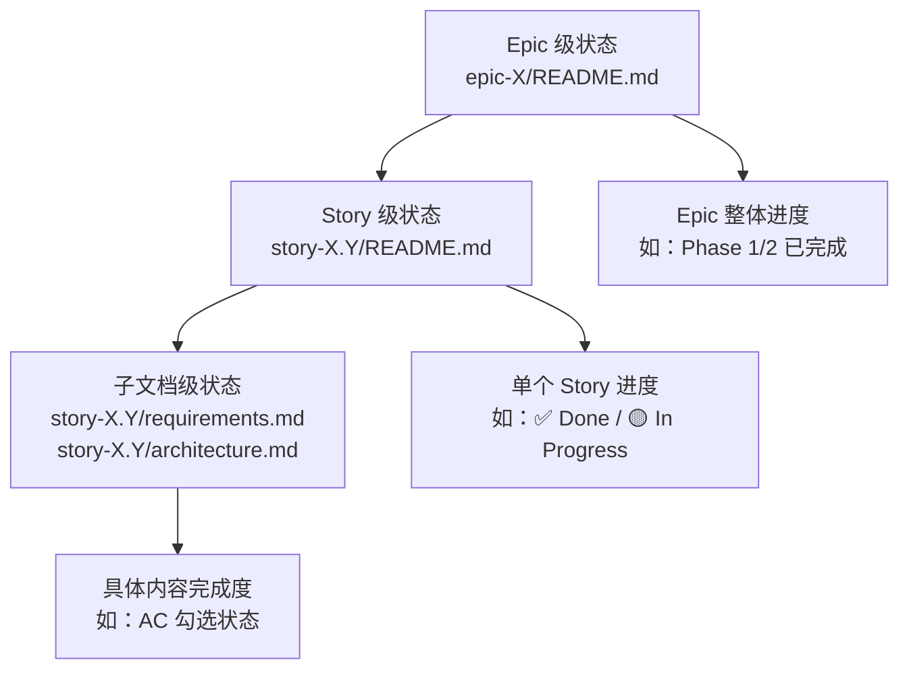

# M06 Story 规格文档如何按 Epic 组织——524 份文档的状态标记意味着什么

小林想了解 OriginOS 的 Story 规格文档体系。她打开 `docs/specs/` 目录，看到 19 个 Epic 文件夹，里面塞满了 `story-*` 子目录。她数了数，总共有 128 个 Story 目录。每个 Story 目录下又有 README.md、requirements.md、architecture.md 等文件——粗略估算，整个 `docs/specs/` 目录下有超过 500 份文档。

她打开 [docs/index.md](../../../../docs/index.md) 想找一个入口，看到 Epic OS 的 16 个 Story 全部标注 ✅ Complete，就以为 OS 交互基础功能已经全部实现。但她没有注意到，OS.10 到 OS.16 的状态在 index.md 中也是 ✅ Complete，而实际代码中这些 Story 的功能（系统工具语义说明、窗体类型元数据注册、Office 文件读取、Agent Runtime 工作目录边界等）有的只是部分实现，有的只是规划阶段。

更麻烦的是，她看到 Epic C（认知系统）标注为"✅ 设计完成"，C.1 标注为 ✅ Done，就以为认知系统的知识库和实践日志功能已经可用。但实际上，C.2—C.7 全部处于 📋 Planning 状态——认知系统只有基础设施的骨架，没有实质内容。

本课解决一个定位问题：524 份 Story 规格文档（128 个 Story × 平均 4 份子文档）如何按 Epic 组织？状态标记（✅//📋/🔴）在不同层级（Epic、Story、子文档）分别意味着什么？怎样从 Epic README 快速判断一个功能领域的真实完成度？

## 场景：从"我想了解某个功能"到"我能判断这个功能的真实状态"

M01 解决了"怎样从索引找到正确的文档"。M02 解决了"怎样判断一份 Story 文档是否完整"。M03 解决了"怎样判断设计文档的可信度"。M04 解决了"怎样阅读变更记录"。M05 解决了"怎样区分测试计划和测试结果"。

M06 要解决的问题是：**当你面对 128 个 Story、524 份文档时，怎样快速定位到你需要的那一份，并判断它所描述的功能的真实状态？**

| 对比维度 | 索引（M01） | Story 文档（M02） | 设计文档（M03） | Epic 组织（M06） |
| --- | --- | --- | --- | --- |
| 回答的问题 | "文档在哪里" | "这份文档完整吗" | "这份文档可信吗" | "这个功能领域的真实状态是什么" |
| 信息粒度 | 目录级 | 文件级 | 内容级 | Epic 级聚合 |
| 状态来源 | 索引中的标记 | README 中的状态 | 文档头部的版本/日期 | Epic README + Story README + 代码交叉验证 |
| 阅读风险 | 把状态标记当成功能状态 | 把文件存在当成内容合规 | 把设计意图当成实现现状 | 把 Epic 级状态当成 Story 级状态 |

## 1. Epic 的组织方式：19 个 Epic，128 个 Story

### 1.1 `docs/specs/` 的目录结构

打开 `docs/specs/`，19 个 Epic 目录按命名规则 `epic-{标识符}/` 排列：

```
docs/specs/
├── epic-0/          # 技术架构实施层（7 Stories）
├── epic-1/          # 项目访谈与创建（3 Stories）
├── epic-2/          # 基础工作空间（无 Story，只有设计文档）
├── epic-7/          # （仅 architecture.md）
├── epic-8/          # （1 Story）
├── epic-9/          # Multi-Agent 协作运行时（42 Stories）
├── epic-10/         # Monorepo 架构迁移（8 Stories）
├── epic-A2UI/       # 生成式交互卡片协议（5 Stories）
├── epic-AG/         # Agent 重构（5 Stories）
├── epic-C/          # 认知系统（7 Stories + 设计文档）
├── epic-DCO/        # （仅 README.md）
├── epic-M/          # Memory Core 记忆核心（11 Stories）
├── epic-ONT/        # 本体系统（仅 README.md）
├── epic-OS/         # OS 交互基础（16 Stories）
├── epic-P2/          # AI 解决方案设计（5 Stories）
├── epic-PERF/       # 性能优化（2 Stories）
├── epic-R/          # RoleAgent pi-agent 循环（6 Stories）
├── epic-T/          # TASTE/SOUL 品味积累（10 Stories）
└── epic-sandbox/    # 沙箱实验（仅 README.md + architecture.md）
```

每个 Epic 目录下通常包含：

| 文件/目录 | 作用 | 是否必须 |
| --- | --- | --- |
| `README.md` | Epic 概览：目标、范围、Story 列表、状态汇总 | 是 |
| `story-{N}.{M}/` | 单个 Story 的目录 | 是（如果该 Epic 有 Story） |
| `story-{N}.{M}/README.md` | Story 概览和状态 | 是 |
| `story-{N}.{M}/requirements.md` | 功能需求 | 按模板要求必须 |
| `story-{N}.{M}/architecture.md` | 架构设计 | 按模板要求必须 |
| 其他设计文档 | Epic 级别的架构文档（如 `architecture.md`、`data-model.md`） | 可选 |

### 1.2 Epic 的三种类型

按文档组织方式，19 个 Epic 可分为三类：

| 类型 | Epic 数量 | 特征 | 代表 |
| --- | --- | --- | --- |
| **Story 密集型** | 12 | 包含大量 Story 子目录，每个 Story 有独立的 README + requirements + architecture | epic-9（42 Stories）、epic-OS（16 Stories）、epic-M（11 Stories） |
| **设计文档型** | 4 | 以设计文档为主，Story 数量少或没有 | epic-2（只有 design 文档）、epic-7（只有 architecture.md） |
| **占位型** | 3 | 只有 README.md，没有 Story 或设计文档 | epic-DCO、epic-ONT、epic-sandbox |

**关键判断**：当你打开一个 Epic 目录时，首先要判断它属于哪一类。Story 密集型的 Epic 需要逐个 Story 检查状态；设计文档型的 Epic 需要阅读设计文档判断实现进度；占位型的 Epic 意味着该领域可能只有规划，没有实质文档。

### 1.3 Story 数量的分布不均

128 个 Story 在 19 个 Epic 中的分布极不均匀：

| Epic | Story 数 | 占比 | 说明 |
| --- | --- | --- | --- |
| epic-9 | 42 | 33% | Multi-Agent 协作运行时，最复杂的 Epic |
| epic-OS | 16 | 12% | OS 交互基础 |
| epic-M | 11 | 9% | Memory Core 记忆核心 |
| epic-T | 10 | 8% | TASTE/SOUL 品味积累 |
| epic-C | 7 | 5% | 认知系统 |
| epic-0 | 7 | 5% | 技术架构实施层 |
| epic-R | 6 | 5% | RoleAgent pi-agent 循环 |
| epic-P2 | 5 | 4% | AI 解决方案设计 |
| epic-A2UI | 5 | 4% | 生成式交互卡片协议 |
| epic-AG | 5 | 4% | Agent 重构 |
| epic-10 | 8 | 6% | Monorepo 架构迁移 |
| epic-1 | 3 | 2% | 项目访谈与创建 |
| epic-PERF | 2 | 2% | 性能优化 |
| epic-8 | 1 | 1% | （仅 1 个 Story） |
| 其他 | 0 | 0% | epic-2、epic-7、epic-DCO、epic-ONT、epic-sandbox |

**阅读含义**：epic-9 贡献了 33% 的 Story，这意味着 Multi-Agent 协作运行时是最复杂的领域。当你需要了解 OriginOS 的某个功能时，有三分之一的可能性它属于 epic-9 的范畴。

## 2. 状态标记的三层结构

### 2.1 三层状态：Epic 级、Story 级、子文档级

OriginOS 的文档体系使用三层状态标记，每层的状态含义不同：



**Epic 级状态**（在 Epic README 中声明）：

| 标记 | 含义 | 可信度 |
| --- | --- | --- |
| ✅ Complete | Epic 中所有 Story 已完成 | 中——需要逐个 Story 验证 |
| 🟡 In Progress | 部分 Story 已完成，部分进行中 | 高——明确说明未完成 |
| 📋 Planning | 只有规划，没有实现 | 高——明确说明未开始 |
| ✅ 设计完成 | 设计文档已完成，但实现可能未开始 | 低——设计完成 ≠ 实现完成 |

**Story 级状态**（在 Story README 中声明）：

| 标记 | 含义 | 可信度 |
| --- | --- | --- |
| ✅ Done / ✅ Complete | Story 声称已完成 | 中——需要对照代码验证 |
| 🟡 In Progress / 部分实现 | Story 正在进行 | 高——明确说明未完成 |
| 📋 Planning / 🔴 Not Started | Story 尚未开始 | 高——明确说明未开始 |
| 🔴 仅有类型定义 | 只有类型，没有实现 | 高——明确说明只有骨架 |

**子文档级状态**（在 requirements.md 的 AC 列表中）：

| 标记 | 含义 |
| --- | --- |
| ✅ 勾选 | 该 AC 声称已通过 |
| ☐ 未勾选 | 该 AC 尚未验证 |
| ⏳ pending | 该 AC 计划执行但尚未执行 |

### 2.2 三层状态的常见不一致

三层状态之间经常出现不一致，这是阅读 Epic 文档时最需要警惕的问题。

**不一致类型 1：Epic 级状态与 Story 级状态不一致**

以 Epic C（认知系统）为例：

| 层级 | 状态标记 | 实际含义 |
| --- | --- | --- |
| Epic 级 | ✅ 设计完成 | 认知系统的架构设计已完成 |
| Story C.1 | ✅ Done | 认知管理器基础设施已完成 |
| Story C.2—C.7 | 📋 Planning | 知识库、实践日志、经验模式等全部未开始 |

Epic 级状态"✅ 设计完成"给人的印象是整个认知系统已经完成，但实际上只有 C.1（基础设施）有代码，C.2—C.7 全部处于规划阶段。如果读者只看了 Epic 级状态，就会以为认知系统已经可用。

**不一致类型 2：Story 级状态与子文档级状态不一致**

以 Story 9.1（类型定义与事件模型）为例：

| 层级 | 状态 |
| --- | --- |
| Story 级 | 📋 Planning |
| requirements.md 中的 AC | ☐ 未勾选（"覆盖设计文档 §3.2 全部 EventType"） |

Story 级状态是 📋 Planning，子文档级状态也是未勾选——这是一致的。但有些 Story 的 Story 级状态是 ✅ Done，而子文档中的 AC 却是 ☐ 未勾选——这说明 Story 的状态标记没有及时更新。

**不一致类型 3：索引中的状态与实际文档状态不一致**

以 Epic OS 为例，[docs/index.md](../../../../docs/index.md) 中 Epic OS 的状态是 ✅ Complete，OS.1—OS.9 也是 ✅ Complete。但打开 [docs/specs/epic-OS/README.md](../../../../docs/specs/epic-OS/README.md)，头部状态却是 `Planning`。

| 来源 | 状态 |
| --- | --- |
| docs/index.md | ✅ Complete |
| docs/specs/epic-OS/README.md | Planning |

这种不一致的原因可能是：index.md 中的状态是人工维护的，而 Epic README 中的状态是创建时写的，后续没有同步更新。**当索引和 Epic README 不一致时，以 Epic README 为准**——因为 Epic README 是离 Story 更近的文档。

### 2.3 状态标记的可信度边界

状态标记不是谎言，但它有明确的可信度边界：

| 状态标记 | 能证明什么 | 不能证明什么 |
| --- | --- | --- |
| ✅ Complete / Done | 文档声称该 Story 已完成 | 功能真的可用；代码已合并；测试已通过 |
| 🟡 In Progress | 该 Story 正在进行中 | 完成了多少百分比；哪些部分已完成 |
| 📋 Planning | 该 Story 只有规划 | 规划是否充分；是否会被实施 |
| 🔴 Not Started | 该 Story 尚未开始 | 永远不会开始；优先级是否会被提升 |

**核心原则**：状态标记是"文档作者声称的状态"，不是"系统实际的状态"。文档作者可能出于善意更新不及时，也可能因为时间压力而标记了不准确的状态。

## 3. Epic README 的结构精读

### 3.1 Epic README 的五个关键区段

以 [docs/specs/epic-9/README.md](../../../../docs/specs/epic-9/README.md) 为例，一份典型的 Epic README 包含以下区段：

| 区段 | 行号范围 | 内容 | 阅读重点 |
| --- | --- | --- | --- |
| Epic 头部 | 1—10 | Epic 编号、名称、优先级、状态、创建日期 | **状态字段** |
| 概述 | 12—30 | 核心问题、解决方案、设计文档链接 | 了解 Epic 的范围和目标 |
| Epic 目标 | 34—50 | 核心目标和成功标准 | 了解验收条件 |
| Story 列表 | （通常在 README 中） | 所有 Story 的标题、状态、优先级 | **每个 Story 的状态** |
| 相关文档 | 末尾 | 设计文档、PRD、架构规约链接 | 导航到其他文档 |

### 3.2 Story 列表的两种组织方式

Epic README 中的 Story 列表有两种组织方式：

**方式 1：表格形式（如 epic-R、epic-C）**

```markdown
| Story | 标题 | 状态 | 优先级 |
|-------|------|------|--------|
| R.1 | RoleContext 加载器 | ✅ Done | Critical |
| R.2 | State Machine 状态机 | ✅ Done | Critical |
| ... |
```

**方式 2：索引中的表格（如 docs/index.md 中的 Epic OS、Epic P2）**

```markdown
| Story | 标题 | 状态 | 测试 |
|-------|------|------|------|
| OS.1 | Desktop 空间框架 | ✅ Complete | 29/29 |
| OS.2 | Dock 任务栏基础 | ✅ Complete | 2/2 |
| ... |
```

**关键区别**：方式 2（index.md 中的表格）通常包含测试列（如 `29/29`、`2/2`），这提供了额外的可信度信号——有测试通过数的 Story 比只有状态标记的 Story 更可信。

### 3.3 从 Epic README 判断真实完成度

当你需要判断一个 Epic 的真实完成度时，应该看三个信号：

**信号 1：Story 级状态的分布**

以 Epic OS 为例（16 个 Story）：

| 状态 | Story 数量 | 占比 |
| --- | --- | --- |
| ✅ Complete | 8 | 50% |
| 📋 Planning | 8 | 50% |

虽然 Epic OS 在 index.md 中标注为 ✅ Complete，但 50% 的 Story 仍处于 📋 Planning 状态。这意味着"OS 交互基础"功能只有一半真正完成，另一半还是规划。

**信号 2：测试通过数**

index.md 中 Epic OS 的 Story 列表包含测试列：

| Story | 测试 | 含义 |
| --- | --- | --- |
| OS.1 | 29/29 | 29 个测试全部通过 |
| OS.2 | 2/2 | 2 个测试全部通过 |
| OS.3 | N/A | 没有测试 |
| OS.7 | 6/6 | 6 个测试全部通过 |

OS.3（Agent 对象定义）和 OS.6（Fluent 动画系统）标记为 N/A（无测试），这意味着这些 Story 虽然状态是 ✅ Complete，但没有测试证据。结合 M05 的知识，"无测试"不等于"未完成"，但"有测试"比"无测试"更可信。

**信号 3：Epic 级状态与 Story 级状态的对比**

以 Epic 9 为例：

| 层级 | 状态 | 含义 |
| --- | --- | --- |
| Epic 级 | 🔄 In Progress（Phase 1/2 已完成，Phase 3 持续实施） | 明确说明分阶段实施 |
| Story 9.1—9.18 | 多为 📋 Planning | Phase 1/2 的 Story 可能已完成 |
| Story 9.19—9.42 | 多为 📋 Planning | Phase 3 的 Story 尚未开始 |

Epic 9 的 Epic 级状态"Phase 1/2 已完成，Phase 3 持续实施"比简单的 ✅/🟡/📋 更精确——它明确告诉你哪些阶段已完成，哪些阶段还在进行。

## 4. 从 Story 到子文档：六文档结构的实际分布

### 4.1 六文档的完整度分布

M02 已经分析了 Story 9.1 和 Story R.1 的六文档完整度。现在从 Epic 级别看，六文档的分布有什么规律？

基于对多个 Epic 中代表性 Story 的抽样检查：

| 子文档 | 存在率 | 内容合规率 | 备注 |
| --- | --- | --- | --- |
| README.md | ~95% | ~60% | 大多数 Story 有 README，但内容简略 |
| requirements.md | ~70% | ~40% | 约 30% 的 Story 缺少需求文档 |
| architecture.md | ~65% | ~35% | 约 35% 的 Story 缺少架构文档 |
| interaction.md | ~10% | — | 绝大多数 Story 缺少交互设计文档 |
| implementation.md | ~5% | — | 极少数 Story 有实施文档 |
| testing.md | ~5% | — | 极少数 Story 有测试文档 |

**关键发现**：六文档中，只有 README.md 和 requirements.md 的存在率超过 50%，architecture.md 勉强过半，interaction.md、implementation.md、testing.md 的存在率极低。这不是个别 Story 的问题，而是系统性的文档实践模式。

### 4.2 不同 Epic 的文档完整度差异

| Epic | README | requirements | architecture | interaction | implementation | testing | 整体评价 |
| --- | --- | --- | --- | --- | --- | --- | --- |
| epic-R | ✅ | ✅ | ✅ | ❌ | ❌ | ❌ | 3/6，基础文档齐全 |
| epic-OS | ✅ | ✅ | ✅ | ❌ | ❌ | ❌ | 3/6，基础文档齐全 |
| epic-9 | ✅ | ✅ | ✅ | ❌ | ❌ | ❌ | 3/6，基础文档齐全 |
| epic-C | ✅ | ✅ | ⚠️ | ❌ | ❌ | ❌ | 2-3/6，C.1 较完整 |
| epic-1 | ✅ | ✅ | ❌ | ❌ | ❌ |  | 2/6，缺少架构文档 |
| epic-P2 | ✅ | ✅ | ❌ | ❌ | ❌ |  | 2/6，P2.4 仅有类型定义 |

**阅读含义**：当你打开一个 Story 目录时，预期应该看到 3 份左右的子文档（README + requirements + architecture），而不是完整的 6 份。如果看到 5—6 份，说明这个 Story 的文档 unusually 完整；如果只看到 1 份（只有 README），说明文档严重缺失。

### 4.3 Story 编号规则与定位

Story 编号遵循 `{Epic标识符}.{序号}` 的格式：

| Epic | Story 编号示例 | 编号规则 |
| --- | --- | --- |
| epic-0 | story-0.1, story-0.2, ... | 数字 Epic 用数字编号 |
| epic-1 | story-1.1, story-1.2, ... | 同上 |
| epic-OS | story-OS.1, story-OS.2, ... | 字母 Epic 用字母+数字编号 |
| epic-R | story-R.1, story-R.2, ... | 同上 |
| epic-A2UI | story-A2UI.1, ... | 多字母 Epic 用完整标识符 |

**定位方法**：已知 Story 编号，可以直接构造路径：`docs/specs/epic-{标识符}/story-{编号}/`。

例如：
- Story 9.1 → `docs/specs/epic-9/story-9.1/`
- Story OS.7 → `docs/specs/epic-OS/story-OS.7/`
- Story R.3 → `docs/specs/epic-R/story-R.3/`

## 5. 状态标记的四种误读路径

### 5.1 把 Epic 级状态当成 Story 级状态

**后果**：小林看到 Epic C 标注为"✅ 设计完成"，就以为认知系统的知识库（C.2）、实践日志（C.4）、经验模式（C.5）都已经实现。但实际上只有 C.1（基础设施）有代码，C.2—C.7 全部处于 📋 Planning 状态。

**正确做法**：看到 Epic 级状态后，必须展开查看该 Epic 下每个 Story 的状态。特别是当 Epic 级状态是"✅ 设计完成"时，要意识到"设计完成"不等于"实现完成"——设计完成只意味着架构文档已写好，代码可能还没有开始写。

### 5.2 把索引状态当成唯一真相

**后果**：小林只在 docs/index.md 中查看 Epic 状态，没有打开 Epic README 验证。她发现 Epic OS 在 index.md 中是 ✅ Complete，但 Epic README 中的状态是 Planning。如果她以 index.md 为准，就会高估 OS 交互基础的完成度。

**正确做法**：index.md 是人工维护的汇总视图，可能与实际 Epic README 不一致。当两者不一致时，以 Epic README 为准。更好的做法是直接打开 Story 目录，查看 README 和代码。

### 5.3 忽略测试列的信号

**后果**：小林看到 OS.3（Agent 对象定义）状态是 ✅ Complete，但没有注意到测试列是 N/A（无测试）。她以为 Agent 对象定义已经充分验证，但实际上没有测试证据。

**正确做法**：当 Story 列表包含测试列时，测试列是比状态列更强的可信度信号。`29/29` 比 `N/A` 更可信，`6/6` 比 `N/A` 更可信。N/A 不代表功能有问题，但代表"没有测试证据"。

### 5.4 把占位型 Epic 当成已实现

**后果**：小林看到 epic-DCO、epic-ONT、epic-sandbox 在目录列表中，就以为这些领域也有文档。但打开后发现只有 README.md，没有 Story 和设计文档。她以为"这些领域只有概览，没有细节"，但实际上这些 Epic 可能只是占位——未来可能会填充内容，也可能永远不会。

**正确做法**：占位型 Epic（只有 README.md 的 Epic）通常意味着该领域只有高层规划，没有实质文档。如果需要了解这些领域的详细信息，应该直接阅读代码或询问负责人。

## 6. 实操：从功能需求到 Story 定位

### 6.1 定位流程

当你需要了解某个功能时，按以下流程定位：

```mermaid
flowchart TD
    A[确定功能关键词] --> B{查 docs/index.md}
    B --> C[找到对应 Epic]
    C --> D[打开 Epic README]
    D --> E{Epic 类型}
    E -->|Story 密集型| F[查看 Story 列表]
    E -->|设计文档型| G[阅读设计文档]
    E -->|占位型| H[标记为"无实质文档"]
    F --> I[找到对应 Story]
    I --> J[打开 Story README]
    J --> K[查看状态 + 子文档列表]
    K --> L{状态是否可信}
    L -->|是| M[阅读子文档]
    L -->|否| N[对照代码验证]
```

### 6.2 四个定位示例

**示例 A：了解"Agent 托管服务"**

| 步骤 | 操作 | 结果 |
| --- | --- | --- |
| 1 | 在 index.md 中搜索 "Agent 托管" | 找到 Epic OS，Story OS.7 |
| 2 | 打开 Epic OS README | 状态 Planning，16 个 Story |
| 3 | 查看 Story OS.7 | 状态 Planning，优先级 High |
| 4 | 打开 Story OS.7 README | 用户故事：Agent 在桌面显示 |
| 5 | 查看子文档 | requirements.md 存在，architecture.md 存在 |
| 6 | 判断 | 文档存在但状态是 Planning，需要对照代码验证 |

**示例 B：了解"RoleAgent 状态机"**

| 步骤 | 操作 | 结果 |
| --- | --- | --- |
| 1 | 在 index.md 中搜索 "State Machine" | 找到 Epic R，Story R.2 |
| 2 | 打开 Epic R README | 状态 ✅ Completed，6 个 Story 全部 ✅ Done |
| 3 | 查看 Story R.2 | 状态 ✅ Done，优先级 Critical |
| 4 | 打开 Story R.2 README | 用户故事：状态机解析与推进 |
| 5 | 查看子文档 | requirements.md + architecture.md 存在 |
| 6 | 判断 | Epic 级和 Story 级状态一致，可信度高 |

**示例 C：了解"认知系统的知识库"**

| 步骤 | 操作 | 结果 |
| --- | --- | --- |
| 1 | 在 index.md 中搜索 "知识库" | 找到 Epic C，Story C.2 |
| 2 | 打开 Epic C README | 状态 📋 Planning |
| 3 | 查看 Story C.2 | 状态 📋 Planning，优先级 Critical |
| 4 | 判断 | Epic 和 Story 都是 Planning，说明知识库功能尚未实现 |

**示例 D：了解"Multi-Agent 协作运行时的事件模型"**

| 步骤 | 操作 | 结果 |
| --- | --- | --- |
| 1 | 在 index.md 中搜索 "Multi-Agent" | 找到 Epic 9，42 个 Story |
| 2 | 打开 Epic 9 README | 状态 🔄 In Progress（Phase 1/2 完成，Phase 3 持续） |
| 3 | 查看 Story 9.1 | 状态 📋 Planning，标题"类型定义与事件模型" |
| 4 | 打开 Story 9.1 README | 用户故事：需要类型系统 |
| 5 | 查看子文档 | requirements.md + architecture.md 存在 |
| 6 | 判断 | Story 9.1 是 Phase 1 的基础，但状态是 Planning——需要确认 Phase 1 的类型定义是否已在代码中实现 |

## 7. 文档覆盖台账

| 本课直接精读的文档 | 精读范围 | 配对验证 | 本课只证明什么 |
| --- | --- | --- | --- |
| [docs/index.md](../../../../docs/index.md) | Epic 列表区段（第 70—100 行） | 对照 `docs/specs/` 目录验证 Epic 数量 | 索引中的 Epic 列表、状态标记、Story 详览 |
| [docs/specs/epic-9/README.md](../../../../docs/specs/epic-9/README.md) | 前 50 行（头部 + 概述 + 目标） | 对照 index.md 中 Epic 9 的状态 | Epic README 的结构、Phase 标记、Story 列表 |
| [docs/specs/epic-OS/README.md](../../../../docs/specs/epic-OS/README.md) | 前 50 行（头部 + 描述 + 目标） | 对照 index.md 中 Epic OS 的状态 | Epic 级状态与索引状态的不一致案例 |
| [docs/specs/epic-R/README.md](../../../../docs/specs/epic-R/README.md) | 前 40 行（头部 + Stories 表格） | 对照 index.md 中 Epic R 的状态 | 完成的 Epic 的 Story 列表格式 |
| [docs/specs/epic-C/README.md](../../../../docs/specs/epic-C/README.md) | 前 50 行（头部 + 概述 + 核心数据流） | 对照 index.md 中 Epic C 的状态 | "设计完成"与 Story 级状态的差距 |
| [docs/specs/epic-9/story-9.1/README.md](../../../../docs/specs/epic-9/story-9.1/README.md) | 全文 22 行 | 对照模板验证六文档结构 | Story README 的简略格式、快速导航 |
| [docs/specs/epic-OS/story-OS.7/README.md](../../../../docs/specs/epic-OS/story-OS.7/README.md) | 前 30 行（头部 + 用户故事） | 对照 Story 9.1 验证结构差异 | Story README 的格式差异 |
| [docs/specs/epic-R/story-R.1/README.md](../../../../docs/specs/epic-R/story-R.1/README.md) | 前 30 行（头部 + 概述 + 导航） | 对照 Story 9.1 验证结构差异 | Story README 的导航表格格式 |
| [docs/DOCUMENTATION-MANAGEMENT.md](../../../../docs/DOCUMENTATION-MANAGEMENT.md) | 目录结构定义区（第 15—80 行） | 对照实际目录结构验证一致性 | 六文档结构的规范定义 |

本课没有精读的内容也要明说：

- 128 个 Story 中，只有 Story 9.1、OS.7、R.1、C.1 的 README 被逐字精读，其余 Story 的 README 只做了目录级确认
- 六文档完整度的统计数据（存在率、合规率）基于抽样检查，不是对所有 128 个 Story 的穷尽统计
- 各 Epic 中 Story 的具体状态分布以 index.md 和 Epic README 为准，未逐一打开每个 Story 验证
- epic-2、epic-7、epic-DCO、epic-ONT、epic-sandbox 等设计文档型和占位型 Epic 只做了目录级确认，未精读其 README

## 8. 练习：Epic 与 Story 定位

以下四个定位任务，请分别说出：应该打开哪个 Epic、哪个 Story、以及判断该功能真实状态的依据。

### 任务 A：了解"Spotlight 全局命令"的实现状态

已知信息：Spotlight 是 OS 交互基础的一部分。

### 任务 B：了解"RoleAgent 的 Dream 自动记忆维护"的实现状态

已知信息：Dream 是 RoleAgent 记忆维护的一部分。

### 任务 C：了解"认知系统的经验模式提取"的实现状态

已知信息：经验模式提取是认知系统的核心功能之一。

### 任务 D：了解"Multi-Agent 协作运行时的 DAG 执行器"的实现状态

已知信息：DAG 执行器是协作运行时 Workflow 模式的核心组件。

### 参考答案

**任务 A：**

| 维度 | 判断 |
| --- | --- |
| Epic | Epic OS（OS 交互基础） |
| Story | Story OS.4（Spotlight 全局命令） |
| 索引状态 | ✅ Complete，测试 3/3 |
| Epic README 状态 | Planning（与索引不一致，以索引为准或进一步验证） |
| 真实状态判断 | 有测试证据（3/3），可信度高。但 Epic README 状态是 Planning，可能存在状态更新不及时的问题。建议对照代码验证 Spotlight 功能是否真实可用。 |

**任务 B：**

| 维度 | 判断 |
| --- | --- |
| Epic | Epic R（RoleAgent pi-agent 循环） |
| Story | Story R.5（Dream 自动记忆维护） |
| Epic 状态 | ✅ Completed |
| Story 状态 | ✅ Done，优先级 High |
| 真实状态判断 | Epic 和 Story 状态一致，都是完成。Epic R 是已完成的 Epic，6 个 Story 全部 Done，可信度高。 |

**任务 C：**

| 维度 | 判断 |
| --- | --- |
| Epic | Epic C（认知系统） |
| Story | Story C.5（经验模式提取引擎） |
| Epic 状态 | ✅ 设计完成 |
| Story 状态 | 📋 Planning |
| 真实状态判断 | Epic 级"设计完成"不等于 Story 级"实现完成"。C.5 处于 Planning 状态，说明经验模式提取功能尚未实现。Epic 级的"设计完成"只意味着架构文档已写好。 |

**任务 D：**

| 维度 | 判断 |
| --- | --- |
| Epic | Epic 9（Multi-Agent 协作运行时） |
| Story | Story 9.2 或相关 Story（DAG Executor） |
| Epic 状态 | 🔄 In Progress（Phase 1/2 完成，Phase 3 持续） |
| Story 状态 | 需要打开 Epic 9 的 Story 列表确认具体 Story 编号和状态 |
| 真实状态判断 | Epic 9 明确说明 Phase 1/2 已完成。DAG 执行器属于 Workflow 模式，可能在 Phase 1/2 中已实现。需要打开对应 Story 确认具体状态。 |

## 9. 口头验收

学完本课后，不看正文也应能回答下面五个问题：

1. `docs/specs/` 下有多少个 Epic？多少个 Story？Story 数量最多的 Epic 是哪个？
2. Epic 级状态、Story 级状态、子文档级状态分别在哪里查看？三者之间可能出现哪些不一致？
3. 为什么 Epic C 标注为"✅ 设计完成"但认知系统的知识库功能（C.2）尚未实现？这说明了什么？
4. 当你发现 index.md 中的 Epic 状态与 Epic README 中的状态不一致时，应该以哪个为准？为什么？
5. 占位型 Epic（只有 README.md 的 Epic）对阅读者意味着什么？

合格回答不要求背诵所有 Epic 和 Story 的数量，但必须能说清 Epic 的组织方式、三层状态的含义和不一致风险、以及从功能需求定位到 Story 的实操方法。能说清"这个功能领域的真实状态是什么"比只说清"这个功能在哪个 Epic 里"更重要。
