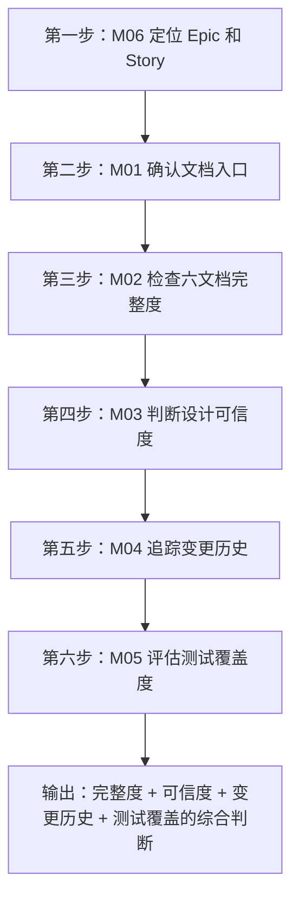
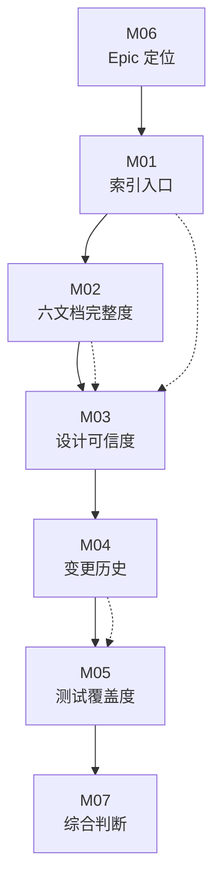

# M07 综合复盘——把七节课的判断能力变成可操作的定位流程

小林学完 M01—M06 后，面对一个实际问题：技术负责人问她"Agent 托管服务（OS.7）的文档是否完整、设计是否可信、测试是否充分"。

她知道自己需要检查：
1. OS.7 在哪个 Epic 里？（M06 — Epic 定位）
2. OS.7 的六份子文档是否齐全？（M02 — 六文档结构）
3. OS.7 的设计文档是否可信？（M03 — 设计文档可信度）
4. OS.7 的变更记录在哪里？（M04 — 变更记录定位）
5. OS.7 的测试报告覆盖了多少场景？（M05 — QA 报告阅读）
6. OS.7 的文档入口在哪里？（M01 — 索引定位）

但她不知道的是：**这六个问题应该按什么顺序问、每个问题需要检查哪些具体文件、检查完后如何汇总成一份判断结论。**

本课把 M01—M06 的分散知识汇集成一条可操作的定位流程，让读者在面对"某个功能是否完整、可信、已验证"的问题时，知道先做什么、再做什么、最后输出什么。

## 1. 从"一个问题"到"六步判断"

### 1.1 问题类型与对应课次的映射

任何关于"某个功能是否完整、可信、已验证"的问题，都可以分解为六个子问题：

| 子问题 | 对应课次 | 核心动作 | 输出 |
| --- | --- | --- | --- |
| 这个功能在哪个 Epic 里？ | M06 | 查索引 → 打开 Epic README → 找到 Story | Story 路径 |
| 这个 Story 的文档完整吗？ | M02 | 对照模板检查六份子文档 | 文档完整度报告 |
| 这个 Story 的设计可信吗？ | M03 | 检查版本、日期、状态、适用范围 | 可信度评级 |
| 这个功能何时被改动过？ | M04 | 查变更记录 → 交叉验证 git log | 改动时间线 |
| 这个功能被测试过吗？ | M05 | 查 QA 报告 → 数测试数量 → 对比 test-cases/ | 测试覆盖度报告 |
| 文档入口在哪里？ | M01 | 查 index.md → 确认 Epic/Story 路径 | 导航路径 |

这六个子问题不是随意排列的——它们有严格的依赖关系：



**为什么是这个顺序？**

- **先定位（M06）**：不知道 Story 在哪里，就谈不上检查文档。
- **再确认入口（M01）**：找到 Story 后，先确认 README 中的链接是否完整——链接是导航枢纽，链接缺失意味着后续检查可能找不到对应的子文档。
- **再检查完整度（M02）**：有了入口，才能检查六份子文档是否齐全。
- **再判断可信度（M03）**：文档齐全不等于内容可信——需要检查版本、日期、状态。
- **再追踪变更（M04）**：设计可信不等于没有改动——需要确认文档描述的是否与代码一致。
- **最后评估测试（M05）**：代码存在不等于经过验证——需要检查测试报告。

### 1.2 六步判断的实操示例

以"Agent 托管服务（OS.7）"为例，演示六步判断的完整流程。

**第一步：M06 — 定位 Epic 和 Story**

| 动作 | 操作 | 结果 |
| --- | --- | --- |
| 查索引 | 打开 docs/index.md，搜索 "OS.7" 或 "Agent 托管" | 找到 Epic OS，Story OS.7 |
| 打开 Epic | `docs/specs/epic-OS/README.md` | 状态 Planning，16 个 Story |
| 打开 Story | `docs/specs/epic-OS/story-OS.7/` | README.md + requirements.md + architecture.md 存在 |
| 确认 Story 路径 | `docs/specs/epic-OS/story-OS.7/` | ✅ 已定位 |

**第二步：M01 — 确认文档入口**

| 动作 | 操作 | 结果 |
| --- | --- | --- |
| 打开 Story README | `docs/specs/epic-OS/story-OS.7/README.md` | 状态 Planning，优先级 High |
| 检查链接区 | README 中的快速导航 | 链接到 requirements.md 和 architecture.md |
| 检查子文档列表 | 目录下列出文件 | README.md + requirements.md + architecture.md，共 3 份 |
| 确认入口 | — | ✅ 入口完整，但子文档只有 3 份 |

**第三步：M02 — 检查六文档完整度**

| 子文档 | 是否存在 | 内容合规性 | 备注 |
| --- | --- | --- | --- |
| README.md | ✅ | 头部 + 用户故事 + 功能需求 | 基本完整 |
| requirements.md | ✅ | 产品需求、功能需求、交互流程 | 有 PRD 格式，但缺少 Given/When/Then AC |
| architecture.md | ✅ | 架构层次、UI Layer、Component Layer | 有架构图，但缺少 AGENTS.md 符合性声明 |
| interaction.md | ❌ | — | 缺失 |
| implementation.md | ❌ | — | 缺失 |
| testing.md | ❌ | — | 缺失 |

**完整度结论**：3/6 份文档存在，缺少 interaction.md、implementation.md、testing.md。已存在的 3 份中，requirements.md 缺少 Given/When/Then 格式的 AC，architecture.md 缺少 AGENTS.md 符合性声明。

**第四步：M03 — 判断设计可信度**

| 检查项 | 发现 | 可信度影响 |
| --- | --- | --- |
| 版本号 | requirements.md v1.0，architecture.md v1.0 | 初版，可能未经过迭代修订 |
| 日期 | 2026-03-09（requirements）、2026-03-12（architecture） | 距今约 6 个月，可能部分过时 |
| 状态 | "草稿"（requirements）、"架构设计"（architecture） | 不是最终版本 |
| 适用范围 | 无明确声明 | 无法判断与代码的对齐度 |
| 架构图 | 有 ASCII 架构图（UI Layer → Component Layer） | 结构化程度高，但需要代码验证 |

**可信度结论**：中可信——文档结构化程度高，但版本号低、日期较早、状态为草稿，需要对照代码验证。

**第五步：M04 — 追踪变更历史**

| 动作 | 操作 | 结果 |
| --- | --- | --- |
| 查变更记录 | 在 `docs/changes/changelog.md` 中搜索 "OS.7" 或 "Agent 托管" | 未找到直接匹配的条目 |
| 查模块路径 | 搜索 "Agent" + "Desktop" + "Dock" 相关变更 | 找到若干相关条目 |
| 交叉验证 | `git log --oneline -- packages/core/src/lib/integrations/pi-agent/` | 需要执行验证 |

**变更历史结论**：变更记录中没有直接对应 OS.7 的条目，说明该 Story 的实现可能分散在多个模块的变更中，或者文档更新滞后于代码变更。

**第六步：M05 — 评估测试覆盖度**

| 动作 | 操作 | 结果 |
| --- | --- | --- |
| 查 QA 报告 | `docs/QA/OS.7-AgentHost-Test-Report.md` | 存在，344 行，✅ PASS |
| 数测试数量 | 单元测试结果区段 | 6 个单元测试全部通过 |
| 检查覆盖场景 | 组件验证、Hooks 验证、集成层验证 | 覆盖了基本功能 |
| 检查 E2E 测试 | 报告中未提及 E2E | 未覆盖 |
| 检查 test-cases/ | `docs/test-cases/` 中无 OS.7 对应文件 | 无测试用例文档 |

**测试覆盖结论**：6 个单元测试全部通过，但无 E2E 测试，无测试用例文档。覆盖范围有限——只验证了代码层面的基本功能，未验证用户层面的端到端行为。

### 1.3 综合判断输出

将六步判断的结果汇总成一份综合报告：

| 维度 | 结论 | 风险等级 |
| --- | --- | --- |
| **文档完整度** | 3/6 份文档存在，缺少交互设计、实施指南和测试策略 | 🔴 高 — 关键文档缺失 |
| **设计可信度** | 中可信，版本低、日期早、状态为草稿 | 🟡 中 — 需要代码验证 |
| **变更历史** | 无直接对应的变更记录 | 🟡 中 — 文档可能滞后 |
| **测试覆盖度** | 6 个单元测试通过，无 E2E，无测试用例文档 | 🔴 高 — 用户层面验证空白 |
| **综合评估** | 文档不完整，设计可信度中等，测试覆盖不足 | 🔴 高 — 不建议作为生产依赖 |

**最终结论**：Agent 托管服务（OS.7）的文档不完整、设计可信度中等、测试覆盖不足。虽然 QA 报告标注 ✅ PASS，但只覆盖了 6 个单元测试场景，缺少交互设计、实施指南和端到端测试证据。在将该功能作为生产依赖之前，建议补充缺失文档、对照代码验证设计、并增加 E2E 测试覆盖。

## 2. 六步判断的通用模板

把上面的示例抽象成可复用的模板：

### 2.1 定位检查清单

```markdown
## 功能审查报告：{功能名称}

### 第一步：定位 Epic 和 Story
- [ ] 在 docs/index.md 中找到对应 Epic
- [ ] 打开 Epic README，确认 Story 列表
- [ ] 打开 Story 目录，确认文件列表
- **Story 路径**: `docs/specs/epic-{N}/story-{N.M}/`

### 第二步：确认文档入口
- [ ] 打开 Story README.md
- [ ] 检查链接区是否完整
- [ ] 确认子文档列表
- **入口完整度**: {完整/部分/缺失}

### 第三步：检查六文档完整度
- [ ] README.md 存在？内容合规？
- [ ] requirements.md 存在？有 Given/When/Then AC？
- [ ] architecture.md 存在？有 AGENTS.md 符合性声明？
- [ ] interaction.md 存在？
- [ ] implementation.md 存在？
- [ ] testing.md 存在？
- **文档完整度**: {N/6}

### 第四步：判断设计可信度
- [ ] 检查版本号（高版本号 = 经过多次修订）
- [ ] 检查日期（近期更新 = 较低过时风险）
- [ ] 检查状态（Accepted/Complete > draft/Planning）
- [ ] 检查适用范围声明（有声明 > 无声明）
- [ ] 检查架构审查警告（有警告 = 需要降级可信度）
- **可信度评级**: {高/中/低}

### 第五步：追踪变更历史
- [ ] 在 docs/changes/changelog.md 中搜索相关关键词
- [ ] 检查对应版本的版本归档
- [ ] 用 git log 交叉验证
- **变更历史**: {有明确记录/分散在多条记录中/无记录}

### 第六步：评估测试覆盖度
- [ ] 查找 QA 报告（docs/QA/）
- [ ] 数测试数量（单元/集成/E2E）
- [ ] 检查 test-cases/ 中的测试用例
- [ ] 判断覆盖场景是否充分
- **测试覆盖度**: {充分/部分/不足}

### 综合判断
| 维度 | 结论 | 风险 |
| --- | --- | --- |
| 文档完整度 | | |
| 设计可信度 | | |
| 变更历史 | | |
| 测试覆盖度 | | |
| **综合评估** | | |
```

### 2.2 快速判断版本

如果不需要完整的六步判断，可以使用快速判断版本（30 秒版本）：

| 检查项 | 快速方法 | 如果缺失 |
| --- | --- | --- |
| 文档完整度 | 看 Story 目录下有几份文件 | < 3 份 → 文档不完整 |
| 设计可信度 | 看 README 中的版本号和日期 | 无版本号或日期 > 6 个月 → 可信度低 |
| 变更历史 | 在 changelog 中搜索 Story 编号 | 搜不到 → 文档可能滞后 |
| 测试覆盖度 | 看 index.md 中的测试列 | N/A 或空白 → 测试覆盖不足 |

## 3. 常见场景的判断策略

### 3.1 场景一：判断一个新功能是否值得依赖

**问题**："我想在项目中使用 OriginOS 的 Multi-Agent 协作运行时，这个功能稳定吗？"

**判断策略**：

1. **定位**：Epic 9，42 个 Story
2. **重点检查**：
   - Epic 级状态：🔄 In Progress（Phase 1/2 完成，Phase 3 持续）→ 说明功能尚未完成
   - Story 9.1（类型定义）：📋 Planning → 基础类型尚未完成
   - Story 9.2—9.18：Phase 1/2 的 Story，需要逐个检查状态
   - Story 9.19—9.42：Phase 3 的 Story，大多 📋 Planning
3. **结论**：该功能处于活跃开发中，Phase 1/2 可能已完成但 Phase 3 尚未开始。不建议作为稳定依赖。

### 3.2 场景二：判断一个已标记完成的功能是否真的完成

**问题**："Epic R 标记为 ✅ Completed，RoleAgent 的所有功能都可用吗？"

**判断策略**：

1. **定位**：Epic R，6 个 Story
2. **重点检查**：
   - 所有 Story 状态：R.1—R.6 全部 ✅ Done → 表面完成
   - 检查每个 Story 的子文档：是否有 requirements.md + architecture.md？
   - 检查 QA 报告：是否有对应的测试报告？
   - 检查代码：是否有对应的实现代码？
3. **结论**：Epic R 的 Story 全部标记完成，但需要进一步验证代码实现和测试覆盖。文档完整度和代码实现需要交叉验证。

### 3.3 场景三：判断一个规划中的功能何时可用

**问题**："Epic C（认知系统）什么时候能使用？"

**判断策略**：

1. **定位**：Epic C，7 个 Story
2. **重点检查**：
   - Epic 级状态：📋 Planning（"设计完成"）
   - Story C.1：✅ Done（基础设施）
   - Story C.2—C.7：全部 📋 Planning
3. **结论**：只有基础设施（C.1）完成，核心功能（知识库、实践日志、经验模式）全部处于规划阶段。无法判断何时可用——需要等待 C.2—C.7 进入开发。

## 4. 七节课的知识图谱

### 4.1 M01—M06 的知识依赖关系



### 4.2 每节课的核心判断能力

| 课次 | 核心判断能力 | 如果缺失会怎样 |
| --- | --- | --- |
| M01 | 能从索引定位到任何文档 | 在 782 个文件中大海捞针 |
| M02 | 能判断 Story 文档是否完整 | 把不完整的文档当成完整参考 |
| M03 | 能判断设计文档是否可信 | 把过时设计当成当前约束 |
| M04 | 能追踪变更历史 | 不知道功能何时被改动 |
| M05 | 能评估测试覆盖度 | 把"通过"当成"全覆盖" |
| M06 | 能按 Epic 定位 Story | 在 128 个 Story 中迷失 |
| M07 | 能把六步判断汇集成综合结论 | 只能做零散判断，无法输出整体评估 |

## 5. 文档覆盖台账

| 本课直接精读的文档 | 精读范围 | 配对验证 | 本课只证明什么 |
| --- | --- | --- | --- |
| M01—M06 的所有已精读文档 | 综合引用 | 对照实际文档验证流程可行性 | 六步判断流程的完整性和可操作性 |
| `docs/specs/epic-OS/story-OS.7/` 目录 | 目录结构 + README + requirements + architecture | 对照模板和代码验证 | 六步判断的实操示例 |

本课没有精读的内容也要明说：

- 六步判断流程中的"代码验证"步骤（M03 和 M05 中提到）需要读者自行执行，本课只提供了验证方法
- 变更历史的 git log 交叉验证需要读者在本地执行，本课只提供了命令示例
- 综合判断模板适用于任何 Story，但本课只演示了 OS.7 一个案例

## 6. 练习：综合判断

### 任务 A：判断 Story R.3（7 层 System Prompt）的完整度、可信度和测试覆盖

已知信息：Epic R 状态 ✅ Completed，Story R.3 状态 ✅ Done。

请按六步判断流程，给出完整度、可信度、变更历史和测试覆盖的评估。

### 任务 B：判断 Epic 9（Multi-Agent 协作运行时）是否适合作为生产依赖

已知信息：Epic 9 状态 🔄 In Progress（Phase 1/2 完成，Phase 3 持续），42 个 Story，大多数为 📋 Planning。

请给出综合判断。

### 任务 C：判断 Epic C（认知系统）何时可用

已知信息：Epic C 状态 ✅ 设计完成，C.1 ✅ Done，C.2—C.7 📋 Planning。

请分析该功能的真实状态和可用时间预期。

### 参考答案

**任务 A：**

| 维度 | 判断 | 依据 |
| --- | --- | --- |
| 文档完整度 | 约 3/6 | 基于 Epic R 其他 Story 的抽样（R.1 有 README + requirements + architecture） |
| 设计可信度 | 中高 | Epic R 已完成，R.3 是核心 Story，可信度高。但需要对照代码验证 7 层 System Prompt 的实现 |
| 变更历史 | 需要验证 | 需要在 changelog 中搜索 "System Prompt" 或 "R.3" |
| 测试覆盖度 | 需要验证 | 需要查找 QA 报告中是否有 R.3 的测试记录 |
| **综合评估** | 文档可能完整，设计可信度高，但需要代码和测试验证 | Epic R 整体已完成，单个 Story 的可信度较高 |

**任务 B：**

| 维度 | 判断 |
| --- | --- |
| 文档完整度 | 42 个 Story 中大多数为 📋 Planning，文档不完整 |
| 设计可信度 | Phase 1/2 已完成，但 Phase 3 尚未开始，设计可能未最终确定 |
| 变更历史 | 需要追踪 Phase 1/2 的变更记录 |
| 测试覆盖度 | Phase 1/2 的 Story 可能有测试，Phase 3 的 Story 无测试 |
| **综合评估** | 🔴 不适合作为生产依赖。功能尚未完成，大量 Story 处于规划阶段。即使 Phase 1/2 已完成，Phase 3 的缺失意味着核心功能（如 Queen-Led 协调、HNSW 语义索引）尚未实现。 |

**任务 C：**

| 维度 | 判断 |
| --- | --- |
| 文档完整度 | 7 个 Story 中 1 个完成，6 个规划，文档不完整 |
| 设计可信度 | "设计完成"只意味着架构文档已写好，不代表实现已完成 |
| 变更历史 | C.1 可能有变更记录，C.2—C.7 无变更记录 |
| 测试覆盖度 | C.1 可能有测试，C.2—C.7 无测试 |
| **综合评估** | 🟡 无法判断何时可用。核心功能（知识库、实践日志、经验模式）全部处于规划阶段，没有开始开发。"设计完成"只意味着架构层面的规划完成，不代表实现层面的时间表。需要等待 C.2—C.7 进入开发才能判断。 |

## 7. 口头验收

学完本课后，不看正文也应能回答下面五个问题：

1. 面对"某个功能是否完整、可信、已验证"的问题，六步判断的顺序是什么？为什么是这个顺序？
2. 当你检查完一个 Story 的六文档完整度后，发现只有 3/6 份文档存在，你应该输出什么结论？
3. 为什么 Epic 级状态"✅ 设计完成"不等于 Story 级状态"✅ Done"？请用一个具体例子说明。
4. 当你需要快速判断一个功能（30 秒内）时，应该检查哪三个信号？
5. 综合判断的最终输出应该包含哪四个维度？每个维度的风险等级如何划分？

合格回答不要求背诵具体的 Story 编号或文件路径，但必须能说清六步判断的顺序和逻辑、快速判断的三个信号、以及综合判断的输出格式。能说清"这个功能为什么不适合作为生产依赖"比只说清"这个功能在哪个 Epic 里"更重要。

## 8. 进入下一单元

M01—M07 完成了 T19（文档）轨道的学习。读者现在应该能够：

1. 从索引定位到任何文档（M01）
2. 判断 Story 文档是否完整（M02）
3. 判断设计文档的可信度（M03）
4. 从变更记录追踪改动历史（M04）
5. 区分测试计划和测试结果（M05）
6. 按 Epic 定位 Story 并理解状态标记（M06）
7. 把以上能力汇集成综合判断（M07）

下一单元将进入 T20（构建）轨道，学习如何阅读构建脚本、CI 配置和发布工具链。那些文件的阅读方式与文档不同——它们的"正确性"不取决于内容是否描述了系统，而取决于它们是否在 CI 中成功执行。

因此，本单元的结论可以压缩成一句话：

> 先定位，再检查，后判断；文档完整 ≠ 设计可信 ≠ 测试通过；综合判断需要六步，缺一不可。
