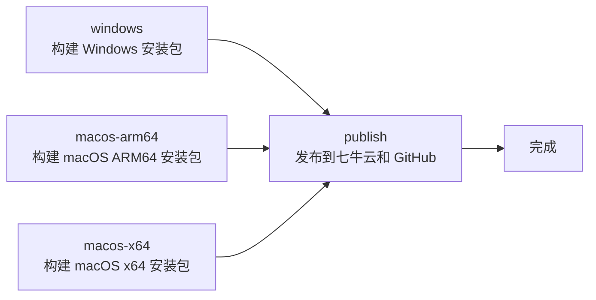

# M09 CI/CD 工作流如何阅读——从 `.github/workflows` 到发布自动化的完整链路

小林想知道 OriginOS 的桌面版是怎么发布的。她打开 `.github/workflows/` 目录，看到只有一个文件 `desktop-release.yml`。她以为 CI/CD 很简单——就一个工作流文件。

但她不知道的是：**这个文件有 409 行，定义了 5 个 job、数十个 step、跨平台构建和发布逻辑**。更关键的是，这个工作流不是孤立存在的——它依赖 `packages/desktop/scripts/` 下的 20 多个脚本、`docs/changes/releases/` 下的版本归档、以及七牛云和 GitHub Releases 两个发布目标。

本课解决一个理解问题：当你面对一个复杂的 CI/CD 工作流时，怎样从 `.yml` 文件出发，理解构建、验证、发布的完整链路，以及每个 step 的责任和失败后果。

## 场景：从"代码提交"到"用户下载"

### 1.1 CI/CD 的触发方式

打开 `.github/workflows/desktop-release.yml`，触发条件定义在文件头部：

```yaml
on:
  workflow_dispatch:          # 手动触发
    inputs:
      publish:                # 是否发布到七牛云
        description: Upload artifacts to Qiniu
        default: "false"
      resume_existing:        # 是否跳过已存在的产物
        default: "false"
  push:                       # 自动触发
    tags:
      - "desktop-v*"          # 只有推送 desktop-v* 标签时触发
```

**两种触发方式的区别**：

| 触发方式 | 场景 | 发布行为 |
| --- | --- | --- |
| `workflow_dispatch` | 手动触发，用于测试或紧急发布 | 可选是否发布（默认不发布） |
| `push` + `tags/desktop-v*` | 推送版本标签时自动触发 | 自动发布到七牛云和 GitHub Releases |

**关键理解**：`push` 触发是自动的——当开发者推送 `desktop-v0.1.47` 标签时，GitHub Actions 会自动启动构建流程。`workflow_dispatch` 是手动的——需要有人在 GitHub Actions 页面上点击"Run workflow"按钮。

### 1.2 工作流的五个 Job

`desktop-release.yml` 定义了 5 个 job：



| Job | 运行环境 | 产物 | 超时时间 |
| --- | --- | --- | --- |
| `windows` | `windows-latest` | `.exe`、`.zip`、`.blockmap` | 90 分钟 |
| `macos-arm64` | `macos-14`（ARM64） | `.dmg`、`.zip`、`.blockmap` | 120 分钟 |
| `macos-x64` | `macos-15-intel`（x64） | `.dmg`、`.zip`、`.blockmap` | 120 分钟 |
| `publish` | `ubuntu-latest` | 无（只上传产物） | 60 分钟 |

**关键理解**：三个构建 job 是并行执行的——Windows、macOS ARM64、macOS x64 同时构建。`publish` job 依赖三个构建 job 都成功后才能执行。

### 1.3 每个 Job 的核心步骤

以 `windows` job 为例，它的核心步骤：

| Step | 命令 | 作用 | 失败后果 |
| --- | --- | --- | --- |
| 1 | `actions/checkout@v4` | 检出代码 | 无法构建 |
| 2 | `pnpm/action-setup@v4` | 安装 pnpm | 无法安装依赖 |
| 3 | `actions/setup-node@v4` | 安装 Node.js | 无法运行脚本 |
| 4 | `pnpm install --frozen-lockfile` | 安装依赖 | 依赖缺失 |
| 5 | 验证 Pi Task Runtime | `pnpm --filter @originos/desktop test:pi-task-runtime-package` | Pi Agent 运行时异常 |
| 6 | 验证工作区路径 | `vitest run workspace-paths.test.ts` | 工作区路径错误 |
| 7 | `pnpm --filter @originos/desktop build:app` | 构建桌面应用 | 构建失败 |
| 8 | 验证工作区上传 | `verify:workspace-upload` | IPC 通信异常 |
| 9 | `electron-builder --win` | 打包 Windows 安装包 | 安装包生成失败 |
| 10 | 生成更新元数据 | `generate:update-metadata` | 自动更新失败 |
| 11 | 验证 Windows 包 | `verify:win-package` | 包内容异常 |
| 12 | 验证更新元数据 | `verify:update-metadata` | 更新元数据异常 |
| 13 | `actions/upload-artifact@v4` | 上传产物到 GitHub Artifacts | 产物丢失 |

**阅读要点**：每个 step 都有明确的输入、输出和失败后果。阅读工作流时，应该按顺序阅读每个 step，理解它在构建链路中的位置和作用。

## 2. 跨平台构建的差异

### 2.1 Windows 构建的特殊之处

Windows 构建有两个特殊配置：

```yaml
env:
  ORIGINOS_WINDOWS_SHORT_ZIP: "1"    # 启用短路径 ZIP

# 构建步骤
- run: pnpm --filter @originos/desktop build:app
  env:
    ORIGINOS_WINDOWS_SHORT_ZIP: "1"   # 传递给 build:app

# 打包步骤
- run: pnpm exec electron-builder --config electron-builder.yml --win --publish never
  env:
    CSC_IDENTITY_AUTO_DISCOVERY: "false"   # 禁用自动签名发现
```

| 配置 | 作用 | 原因 |
| --- | --- | --- |
| `ORIGINOS_WINDOWS_SHORT_ZIP: "1"` | 生成短路径 ZIP | Windows 有路径长度限制（260 字符） |
| `CSC_IDENTITY_AUTO_DISCOVERY: "false"` | 禁用自动代码签名 | Windows 构建不自动签名（macOS 需要） |

### 2.2 macOS 构建的特殊之处

macOS 构建比 Windows 复杂得多，因为它需要**代码签名**和 **Notarization**：

```yaml
- name: Verify macOS signing secrets
  env:
    MAC_CSC_LINK: ${{ secrets.MAC_CSC_LINK }}
    MAC_CSC_KEY_PASSWORD: ${{ secrets.MAC_CSC_KEY_PASSWORD }}
    APPLE_API_KEY: ${{ secrets.APPLE_API_KEY }}
    # ...
  run: |
    test -n "$MAC_CSC_LINK"
    test -n "$MAC_CSC_KEY_PASSWORD"
    # ...
```

**代码签名流程**：

1. **验证签名密钥**（`verify-mac-signing-secrets`）
2. **构建应用**（`build:app`）
3. **打包并签名**（`electron-builder --mac`）
4. **Notarization**（`afterSign: scripts/notarize-mac-app.js`）
5. **验证签名**（`verify:mac-signing`）
6. **验证包内容**（`verify:mac-package`）

**关键理解**：macOS 构建需要 Apple 开发者账号的密钥（`MAC_CSC_LINK`、`APPLE_API_KEY` 等）。这些密钥存储在 GitHub Secrets 中，工作流通过 `${{ secrets.XXX }}` 引用。如果密钥缺失或过期，构建会失败。

### 2.3 平台构建产物对比

| 平台 | 产物格式 | 签名方式 | 分发方式 |
| --- | --- | --- | --- |
| Windows | `.exe`（安装程序）、`.zip` | 无（或可选） | 七牛云 CDN |
| macOS ARM64 | `.dmg`（磁盘镜像）、`.zip` | 代码签名 + Notarization | 七牛云 CDN |
| macOS x64 | `.dmg`、`.zip` | 代码签名 + Notarization | 七牛云 CDN |

## 3. Publish Job：发布到七牛云和 GitHub Releases

### 3.1 Publish Job 的触发条件

```yaml
publish:
  if: >-
    always() &&
    (github.event_name == 'push' || inputs.publish == 'true') &&
    (inputs.artifact_run_id != '' ||
      (needs.windows.result == 'success' &&
       needs.macos-arm64.result == 'success' &&
       needs.macos-x64.result == 'success'))
```

**触发条件解析**：

| 条件 | 含义 |
| --- | --- |
| `always()` | 即使前面的 job 失败，也尝试执行 publish |
| `github.event_name == 'push' \|\| inputs.publish == 'true'` | 自动触发（push 标签）或手动触发时选择发布 |
| `needs.*.result == 'success'` | 所有构建 job 都成功 |

**关键理解**：`always()` 意味着即使某个构建 job 失败，publish 也会尝试执行。但后面的条件会检查所有构建 job 是否成功——如果有失败的，publish 不会真正执行上传操作。

### 3.2 发布到七牛云

```yaml
- name: Publish to Qiniu and website
  working-directory: packages/desktop
  env:
    QINIU_AK: ${{ secrets.QINIU_AK }}
    QINIU_AS: ${{ secrets.QINIU_AS }}
    # ...
  run: pnpm publish:qiniu
```

**发布流程**：

1. 从 GitHub Artifacts 下载构建产物
2. 组装发布产物（重命名、生成 SHA256SUMS）
3. 上传到七牛云 CDN
4. 更新官网的发布元数据

### 3.3 发布到 GitHub Releases

```yaml
- name: Publish GitHub Release
  env:
    GH_TOKEN: ${{ github.token }}
  run: |
    # 读取版本号
    VERSION="$(node -p "require('./packages/desktop/package.json').version")"
    
    # 读取 changelog
    CHANGELOG="docs/changes/releases/v${VERSION}/changelog.md"
    
    # 创建或更新 GitHub Release
    gh release create "desktop-v${VERSION}" ...
```

**关键理解**：GitHub Release 的发布笔记从 `docs/changes/releases/v${VERSION}/changelog.md` 读取——这就是 M04 中讲到的版本归档。版本归档不仅是给人读的，还是 CI/CD 自动化链路的输入。

## 4. CI/CD 工作流的阅读方法

### 4.1 三步阅读法

**第一步：看触发条件**

工作流什么时候会执行？是自动触发还是手动触发？需要什么条件？

**第二步：看 Job 依赖关系**

哪些 Job 是并行执行的？哪些 Job 依赖其他 Job？失败的 Job 会影响哪些后续步骤？

**第三步：看关键 Step**

每个 Job 中，哪些 Step 是构建核心？哪些是验证？哪些是发布？失败的后果是什么？

### 4.2 工作流与本地构建的关系

| 对比维度 | CI 构建 | 本地构建 |
| --- | --- | --- |
| 触发方式 | 标签推送或手动触发 | 手动运行命令 |
| 环境 | GitHub Actions 虚拟机 | 本地开发机 |
| 并行构建 | 三个平台同时构建 | 一次只能构建一个平台 |
| 签名 | 使用 GitHub Secrets | 需要本地配置密钥 |
| 发布 | 自动上传到七牛云和 GitHub | 不自动发布 |
| 产物保留 | GitHub Artifacts（可下载） | 本地 `release/` 目录 |

**关键理解**：CI 构建和本地构建的核心命令是相同的（都是 `pnpm desktop:build`），但 CI 构建有额外的验证步骤和自动发布能力。本地构建适合开发和测试，CI 构建适合发布。

## 5. 文档覆盖台账

| 本课直接精读的文档 | 精读范围 | 配对验证 | 本课只证明什么 |
| --- | --- | --- | --- |
| `.github/workflows/desktop-release.yml` | 完整文件（409 行） | 对照本地构建脚本验证 | CI/CD 工作流的完整链路 |
| `packages/desktop/scripts/publish-qiniu-updates.js` | 目录确认 | — | 七牛云发布脚本的存在 |
| `packages/desktop/scripts/release-qiniu.js` | 目录确认 | — | 七牛云发布脚本的存在 |
| `docs/changes/releases/v0.1.47/changelog.md` | M04 已精读 | 对照 CI 中的读取逻辑验证 | 版本归档作为 CI 输入 |

本课没有精读的内容也要明说：

- `packages/desktop/scripts/` 中其他脚本（prepare-apple-api-key.js、notarize-mac-app.js 等）只做了目录级确认
- 七牛云上传的具体实现逻辑未精读
- GitHub Actions 的其他工作流（如果有）未检查
- Electron Builder 的详细配置选项未逐一解释

## 6. 练习：CI/CD 链路追踪

### 任务 A：判断发布触发的条件

已知信息：开发者推送了 `desktop-v0.1.48` 标签。

问题：CI 会执行哪些 Job？Publish Job 会被触发吗？为什么？

### 任务 B：排查 macOS 构建失败

已知信息：macOS ARM64 构建在 "Verify macOS signing secrets" 步骤失败。

问题：可能的原因是什么？应该如何排查？

### 任务 C：理解产物来源

已知信息：用户从官网下载了 `OriginOS CE-0.1.47-x64.exe`。

问题：这个文件是怎么生成的？经历了哪些步骤？

### 参考答案

**任务 A：**

| 判断 | 依据 |
| --- | --- |
| 触发条件 | `push` + `tags/desktop-v*` 匹配 `desktop-v0.1.48` |
| 执行的 Job | windows、macos-arm64、macos-x64 全部执行 |
| Publish 触发 | 是，因为 `github.event_name == 'push'` 满足条件 |
| Publish 前提 | 三个构建 Job 都成功 |

**任务 B：**

| 排查步骤 | 操作 |
| --- | --- |
| 1 | 查看 GitHub Actions 日志，确认具体错误信息 |
| 2 | 检查 GitHub Secrets 中 `MAC_CSC_LINK`、`MAC_CSC_KEY_PASSWORD` 等是否存在 |
| 3 | 检查 Apple Developer 账号是否过期 |
| 4 | 检查 `prepare-apple-api-key.js` 的执行日志 |
| 5 | 在本地运行相同的验证命令，确认密钥是否有效 |

可能原因：GitHub Secrets 缺失、Apple Developer 账号过期、密钥格式错误。

**任务 C：**

| 步骤 | 操作 | 产物 |
| --- | --- | --- |
| 1 | 检出代码 | 源代码 |
| 2 | 安装依赖 | `node_modules/` |
| 3 | 构建 Pi Agent 适配器 | `dist/`（适配器产物） |
| 4 | 构建 Web 应用 | `packages/web/.next/` |
| 5 | 构建 Desktop 包 | `dist-electron/` |
| 6 | 验证 Agent Worker 运行时 | 验证通过 |
| 7 | `electron-builder --win` | `release/OriginOS CE-0.1.47-x64.exe` |
| 8 | 验证 Windows 包 | 验证通过 |
| 9 | 上传 GitHub Artifacts | 可下载的产物 |
| 10 | Publish Job 上传到七牛云 | CDN 可下载 |

## 7. 口头验收

学完本课后，不看正文也应能回答下面五个问题：

1. `desktop-release.yml` 的两种触发方式分别是什么？它们的区别是什么？
2. 工作流定义了哪 5 个 Job？它们之间的依赖关系是什么？
3. macOS 构建和 Windows 构建的主要区别是什么？为什么 macOS 构建更复杂？
4. Publish Job 的触发条件是什么？`always()` 的含义是什么？
5. 当你需要排查 CI 构建失败时，应该按什么步骤排查？

合格回答不要求背诵每个 step 的具体命令，但必须能说清 CI/CD 工作流的触发条件、Job 依赖关系、跨平台构建差异、以及排查构建失败的基本方法。能说清"代码提交后经历了什么"比只说清"工作流文件在哪里"更重要。
