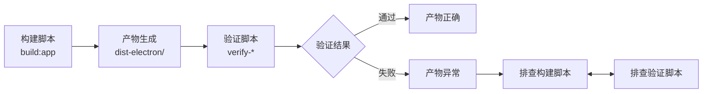

# M10 构建验证脚本如何阅读——从 `verify-*` 到产物完整性检查

小林在 CI 构建日志中看到一条报错：`verify-mac-package` 失败。她打开 `packages/desktop/scripts/verify-mac-package.js`，发现这个脚本有 300 多行，包含 ASAR 内容检查、签名验证、Notarization 验证等多个步骤。

她困惑了：构建已经"成功"了，为什么验证会失败？她不知道的是：**构建成功只意味着产物生成了，不代表产物是正确的**。验证脚本的责任是确认"生成的产物是否符合预期"——它检查的是产物的内容，不是构建过程本身。

本课解决一个理解问题：当你面对一个构建验证脚本时，怎样理解它的验证逻辑、判断标准、以及失败时应该如何排查。

## 场景：从"构建成功"到"产物正确"

### 1.1 为什么构建成功不等于产物正确

构建成功只证明了一件事：**构建命令执行完毕，没有报错退出**。它不证明：

- 产物包含了所有应该包含的文件
- 产物没有包含不应该包含的文件
- 产物的签名和 Notarization 是正确的
- 产物能在目标平台上正常安装和运行

验证脚本的责任就是填补这个 gap。OriginOS 的 Desktop 构建链中，有 6 个验证脚本：

| 脚本 | 验证内容 | 在构建链中的位置 |
| --- | --- | --- |
| `verify-agent-worker-runtime.js` | Agent Worker 运行时依赖 | `build:app` 中 |
| `verify-mac-package.js` | macOS 包的 ASAR 内容、签名、Notarization | CI macOS job |
| `verify-windows-package.js` | Windows 包的 ASAR 内容 | CI Windows job |
| `verify-pi-task-runtime-package.js` | Pi Task Runtime 依赖 | CI 所有平台 job |
| `verify-release-artifacts.js` | 发布产物完整性 | Publish job |
| `verify-update-metadata.js` | 更新元数据 | Publish job |

### 1.2 验证脚本的核心逻辑

所有验证脚本都遵循相同的模式：

```
1. 找到构建产物
2. 定义"正确的产物"应该包含什么
3. 检查产物是否包含所有必需的文件
4. 检查产物是否不包含不应该存在的文件
5. 输出验证结果
```

以 `verify-mac-package.js` 为例，它的核心逻辑：

```javascript
// 1. 找到构建产物
const releaseDir = path.resolve(__dirname, '../../release');
const candidateAppPaths = [
  path.join(releaseDir, 'mac-arm64', productName),
  path.join(releaseDir, 'mac', productName),
];

// 2. 验证 ASAR 内容
const asarPath = path.join(resourcesDir, 'app.asar');
const asarContents = await asar.listPackage(asarPath);

// 3. 检查关键文件是否存在
const requiredFiles = [
  'package.json',
  'dist-electron/desktop/src/main/main.js',
  // ...
];

// 4. 验证签名和 Notarization
// ...
```

**阅读要点**：验证脚本的核心是"**应该包含什么**"和"**不应该包含什么**"。阅读验证脚本时，重点看 `requiredFiles` 数组和排除规则——它们定义了"正确的构建产物"的标准。

## 2. `verify-mac-package.js` 精读

### 2.1 脚本结构

`verify-mac-package.js` 可以分解为 5 个验证阶段：

| 阶段 | 验证内容 | 失败后果 |
| --- | --- | --- |
| 1. 产物定位 | 找到 `.app` 包的路径 | 找不到产物，后续验证无法执行 |
| 2. ASAR 内容检查 | 检查 `app.asar` 中的文件列表 | 关键文件缺失或多余文件存在 |
| 3. 签名验证 | 检查 `.app` 包的代码签名 | 签名缺失或无效，macOS 会阻止安装 |
| 4. Notarization 验证 | 检查是否经过 Apple Notarization | Notarization 失败，macOS Gatekeeper 会阻止运行 |
| 5. 元数据验证 | 检查 `Info.plist` 等元数据 | 应用信息不正确 |

### 2.2 ASAR 内容检查

ASAR 是 Electron 的归档格式，所有应用代码和资源都打包在一个 `app.asar` 文件中。验证脚本会列出 ASAR 中的所有文件，然后检查：

```javascript
// 必须包含的文件
const requiredFiles = [
  'package.json',
  'dist-electron/desktop/src/main/main.js',
  'dist-electron/desktop/src/main/preload.js',
  // ...
];

// 不应该包含的文件（如 source map）
const excludedPatterns = [
  '**/*.map',
  '**/*.ts',
  // ...
];
```

**关键理解**：`requiredFiles` 定义了"最小可用产物"的标准。如果某个文件缺失，应用可能无法启动。`excludedPatterns` 定义了"不应该存在的文件"——source map 和 TypeScript 源文件不应该出现在生产构建中，因为它们会增加包体积并暴露源代码。

### 2.3 签名和 Notarization 验证

macOS 的代码签名验证：

```javascript
// 检查 .app 包的签名
const signCheck = spawnSync('codesign', ['-dv', '--verbose=4', appPath]);

// 检查 Notarization
const notaryCheck = spawnSync('spctl', ['-a', '-vv', appPath]);
```

| 验证项 | 命令 | 通过标准 |
| --- | --- | --- |
| 代码签名 | `codesign -dv --verbose=4` | 输出包含有效的签名证书信息 |
| Notarization | `spctl -a -vv` | 输出包含 "accepted" 或 "source=Notarized Developer ID" |

**关键理解**：代码签名和 Notarization 是 macOS 应用分发的强制要求。没有签名的应用无法通过 Gatekeeper 检查，用户无法直接安装。Notarization 是 Apple 对应用的安全扫描——即使签名了，如果没有经过 Notarization，macOS 也会阻止运行。

## 3. `verify-agent-worker-runtime.js` 精读

### 3.1 为什么需要验证 Agent Worker 运行时

OriginOS 的 Multi-Agent 协作运行时（Epic 9）依赖 Agent Worker 子进程。Agent Worker 是一个独立的 Node.js 进程，在沙箱中运行 Agent 代码。如果 Agent Worker 的运行时依赖缺失，协作功能就无法使用。

### 3.2 验证逻辑

```javascript
// 1. 找到 Agent Worker 的入口文件
const workerEntry = path.resolve(__dirname, '../../dist-electron/desktop/src/main/agent-worker.js');

// 2. 检查文件是否存在
if (!fs.existsSync(workerEntry)) {
  throw new Error(`Agent Worker entry not found: ${workerEntry}`);
}

// 3. 检查运行时依赖
const requiredModules = [
  '@anthropic-ai/sandbox-runtime',
  // ...
];
```

**关键理解**：Agent Worker 的运行时依赖是构建产物的一部分。如果 `pnpm build` 没有正确编译 Agent Worker 的代码，或者依赖没有正确打包，验证脚本就会失败。

## 4. 验证脚本的阅读方法

### 4.1 四步阅读法

**第一步：看验证目标**

这个脚本验证什么？是验证 ASAR 内容、签名、还是运行时依赖？

**第二步：看通过标准**

"正确的产物"应该包含什么？不应该包含什么？通过标准定义在 `requiredFiles` 和 `excludedPatterns` 中。

**第三步：看失败信息**

当验证失败时，脚本会输出什么错误信息？错误信息是否足够排查问题？

**第四步：看修复建议**

脚本是否提供了修复建议？比如"请检查 `dist-electron/` 目录是否存在"。

### 4.2 验证脚本与构建脚本的关系



**关键理解**：验证失败时，问题可能出在构建脚本（产物生成阶段），也可能出在验证脚本（验证逻辑错误）。排查时需要区分这两种情况。

## 5. 文档覆盖台账

| 本课直接精读的文档 | 精读范围 | 配对验证 | 本课只证明什么 |
| --- | --- | --- | --- |
| `packages/desktop/scripts/verify-mac-package.js` | 前 100 行（ASAR 内容检查 + 签名验证） | 对照 macOS 构建产物验证 | macOS 包验证的核心逻辑 |
| `packages/desktop/scripts/verify-agent-worker-runtime.js` | 前 50 行 | 对照 Agent Worker 代码验证 | Agent Worker 运行时验证逻辑 |
| `packages/desktop/scripts/verify-windows-package.js` | 目录确认 | — | Windows 包验证脚本的存在 |
| `packages/desktop/scripts/verify-pi-task-runtime-package.js` | 目录确认 | — | Pi Task Runtime 验证脚本的存在 |

本课没有精读的内容也要明说：

- `verify-release-artifacts.js` 和 `verify-update-metadata.js` 只做了目录级确认
- 各验证脚本的完整实现逻辑未逐行精读
- 验证脚本的错误处理和日志输出未详细分析

## 6. 练习：验证脚本阅读

### 任务 A：判断验证失败的原因

已知信息：`verify-mac-package.js` 在 ASAR 内容检查阶段失败，报错 `dist-electron/desktop/src/main/main.js not found in app.asar`。

问题：可能的原因是什么？应该如何排查？

### 任务 B：理解签名验证失败

已知信息：`verify-mac-package.js` 在签名验证阶段失败，报错 `code signing validation failed`。

问题：可能的原因是什么？这与 Notarization 验证失败有什么区别？

### 任务 C：验证脚本与构建脚本的配合

已知信息：构建脚本 `build:app` 成功执行，但 `verify-agent-worker-runtime.js` 失败。

问题：应该优先排查构建脚本还是验证脚本？为什么？

### 参考答案

**任务 A：**

| 排查步骤 | 操作 |
| --- | --- |
| 1 | 检查 `dist-electron/desktop/src/main/main.js` 是否在构建产物中存在 |
| 2 | 如果存在，检查 `electron-builder.yml` 的 `files` 字段是否包含该文件 |
| 3 | 如果不存在，检查 `pnpm build` 是否成功编译了 Desktop 包的 TypeScript |
| 4 | 检查 `packages/desktop/src/main/` 目录下是否有 `main.ts` 源文件 |

可能原因：TypeScript 编译失败、`files` 字段配置错误、源文件缺失。

**任务 B：**

| 验证项 | 签名验证失败 | Notarization 验证失败 |
| --- | --- | --- |
| 失败原因 | 签名证书缺失、过期、或配置错误 | Apple Notarization 服务拒绝、或应用包含恶意代码 |
| 影响 | 用户无法安装应用（Gatekeeper 阻止） | 用户无法运行应用（Gatekeeper 阻止） |
| 排查方向 | 检查 `MAC_CSC_LINK`、`MAC_CSC_KEY_PASSWORD` 等密钥 | 检查 Apple Developer 账号状态、检查应用是否包含敏感 API |

**任务 C：**

应该优先排查构建脚本。因为验证脚本只是检查产物，它不生成产物。如果验证失败，问题通常出在构建阶段——产物生成不完整或有误。只有在确认产物正确的情况下，才需要检查验证脚本本身是否有 bug。

## 7. 口头验收

学完本课后，不看正文也应能回答下面五个问题：

1. 为什么构建成功不等于产物正确？验证脚本的作用是什么？
2. `verify-mac-package.js` 的 5 个验证阶段分别是什么？每个阶段的失败后果是什么？
3. ASAR 内容检查中的 `requiredFiles` 和 `excludedPatterns` 分别定义了什么？
4. 代码签名验证和 Notarization 验证的区别是什么？各自的失败后果是什么？
5. 当验证脚本失败时，应该按什么步骤排查？优先排查构建脚本还是验证脚本？

合格回答不要求背诵每个验证脚本的具体代码，但必须能说清验证脚本的核心逻辑、通过标准、以及排查方法。能说清"验证脚本检查什么"比只说清"验证脚本在哪里"更重要。
