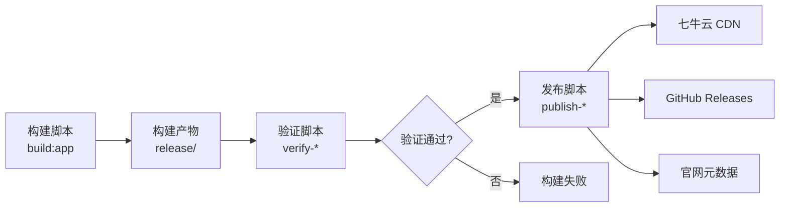

# M11 发布脚本如何阅读——从 `publish:qiniu` 到用户下载的完整链路

小林在 CI 日志中看到 `publish:qiniu` 步骤成功执行，但她在七牛云 CDN 上找不到对应的文件。她打开 `packages/desktop/scripts/publish-qiniu-updates.js`，发现这个脚本有 200 多行，包含产物组装、上传、元数据更新等多个步骤。

她困惑了：脚本明明执行成功了，为什么 CDN 上看不到文件？她不知道的是：**发布脚本的成功只意味着脚本执行完毕，不代表产物真的被用户可见**。发布脚本涉及多个步骤——产物组装、上传到七牛云、更新官网元数据——任何一个步骤失败都会导致用户无法下载。

本课解决一个理解问题：当你面对一个发布脚本时，怎样理解它的发布流程、判断标准、以及失败时应该如何排查。

## 场景：从"脚本执行成功"到"用户能下载"

### 1.1 发布脚本的责任边界

发布脚本的责任是：**将构建产物从 CI 环境发布到用户可访问的分发渠道**。OriginOS 的发布流程涉及两个分发渠道：

| 渠道 | 目标用户 | 产物格式 | 更新机制 |
| --- | --- | --- | --- |
| 七牛云 CDN | 中国用户 | `.exe`、`.dmg`、`.zip` | 自动更新（基于 `latest.yml`） |
| GitHub Releases | 全球用户 | `.exe`、`.dmg`、`.zip` | 手动下载 + 自动更新 |

发布脚本的核心任务是：

1. **产物组装**：从 GitHub Artifacts 下载构建产物，重命名，生成 SHA256SUMS
2. **上传到七牛云**：将产物上传到七牛云 CDN
3. **更新官网元数据**：更新官网的发布信息，让用户知道有新版本
4. **创建 GitHub Release**：在 GitHub 上创建 Release，上传产物

### 1.2 发布脚本的触发条件

发布脚本在 CI 的 `publish` job 中执行：

```yaml
- name: Publish to Qiniu and website
  working-directory: packages/desktop
  env:
    QINIU_AK: ${{ secrets.QINIU_AK }}
    QINIU_AS: ${{ secrets.QINIU_AS }}
    # ...
  run: pnpm publish:qiniu
```

**关键理解**：发布脚本需要七牛云的访问密钥（`QINIU_AK`、`QINIU_AS`）。这些密钥存储在 GitHub Secrets 中，工作流通过 `${{ secrets.XXX }}` 引用。如果密钥缺失或过期，发布脚本会失败。

## 2. `publish-qiniu-updates.js` 精读

### 2.1 脚本结构

`publish-qiniu-updates.js` 可以分解为 4 个阶段：

| 阶段 | 操作 | 失败后果 |
| --- | --- | --- |
| 1. 产物组装 | 从 GitHub Artifacts 下载产物，重命名，生成 SHA256SUMS | 产物缺失或命名错误 |
| 2. 上传到七牛云 | 使用七牛云 SDK 上传产物 | 产物无法访问 |
| 3. 更新官网元数据 | 更新官网的 `latest.yml` 和版本信息 | 用户不知道有新版本 |
| 4. 清理临时文件 | 删除临时下载的产物 | 无——只是清理 |

### 2.2 产物组装

产物组装阶段的核心逻辑：

```javascript
// 1. 从 GitHub Artifacts 下载产物
const artifacts = await downloadArtifacts(artifactRunId);

// 2. 重命名产物（统一命名格式）
const renamedArtifacts = artifacts.map(artifact => ({
  ...artifact,
  name: `${productName}-${version}-${platform}.${ext}`,
}));

// 3. 生成 SHA256SUMS
const sha256sums = await generateSHA256SUMS(renamedArtifacts);
```

**关键理解**：产物组装阶段需要确保所有平台的产物都存在。如果某个平台的构建产物缺失（比如 macOS ARM64 构建失败），发布脚本可能会跳过该平台，或者报错退出。

### 2.3 上传到七牛云

```javascript
// 1. 初始化七牛云 SDK
const qiniu = require('qiniu');
const mac = new qiniu.auth.digest.Mac(QINIU_AK, QINIU_AS);
const config = new qiniu.conf.Config();
const bucketManager = new qiniu.rs.BucketManager(mac, config);

// 2. 上传每个产物
for (const artifact of renamedArtifacts) {
  const key = `releases/${version}/${artifact.name}`;
  await uploadFile(bucket, key, artifact.path);
}
```

**关键理解**：七牛云上传使用 `qiniu` SDK，需要 `QINIU_AK`（Access Key）和 `QINIU_AS`（Secret Key）。上传的产物路径格式是 `releases/${version}/${artifact.name}`，这意味着每个版本的产物都存储在独立的目录下。

### 2.4 更新官网元数据

```javascript
// 1. 读取版本号
const version = require('../package.json').version;

// 2. 生成 latest.yml
const latestYml = generateLatestYML(version, artifacts);

// 3. 上传 latest.yml
await uploadFile(bucket, 'latest.yml', latestYml);
```

`latest.yml` 是 Electron 自动更新机制的核心文件。它的格式：

```yaml
version: 0.1.47
files:
  - url: OriginOS CE-0.1.47-x64.exe
    sha512: ...
    size: 12345678
  - url: OriginOS CE-0.1.47-arm64.dmg
    sha512: ...
    size: 23456789
```

**关键理解**：`latest.yml` 告诉 Electron 的自动更新模块"最新版本是什么、在哪里下载、文件大小和校验和是多少"。如果 `latest.yml` 没有正确更新，用户即使安装了旧版本，也无法自动更新到新版本。

## 3. `release-qiniu.js` 精读

### 3.1 与 `publish-qiniu-updates.js` 的区别

`release-qiniu.js` 是另一个发布脚本，它的职责与 `publish-qiniu-updates.js` 略有不同：

| 脚本 | 主要职责 | 触发时机 |
| --- | --- | --- |
| `publish-qiniu-updates.js` | 发布更新（自动更新） | 每次构建成功后 |
| `release-qiniu.js` | 发布新版本（首次发布） | 手动触发或首次发布时 |

### 3.2 脚本结构

`release-qiniu.js` 的核心逻辑：

```javascript
// 1. 读取版本号
const version = require('../package.json').version;

// 2. 检查版本是否已存在
const exists = await checkVersionExists(version);
if (exists) {
  console.log(`Version ${version} already exists, skipping...`);
  return;
}

// 3. 发布到七牛云
// ...
```

**关键理解**：`release-qiniu.js` 会检查版本是否已存在，避免重复发布。这在手动触发时特别有用——防止意外覆盖已发布的版本。

## 4. 发布脚本的阅读方法

### 4.1 四步阅读法

**第一步：看发布目标**

这个脚本发布到哪里？七牛云、GitHub Releases、还是其他渠道？

**第二步：看产物来源**

产物从哪里来？GitHub Artifacts、本地构建、还是其他来源？

**第三步：看发布流程**

发布流程包含哪些步骤？每个步骤的输入和输出是什么？

**第四步：看失败处理**

如果某个步骤失败，脚本会怎么处理？是继续执行还是退出？

### 4.2 发布脚本与构建脚本的关系



**关键理解**：发布脚本依赖构建产物和验证结果。只有验证通过的产物才会被发布。发布脚本本身不验证产物——验证是构建阶段的责任。

## 5. 文档覆盖台账

| 本课直接精读的文档 | 精读范围 | 配对验证 | 本课只证明什么 |
| --- | --- | --- | --- |
| `packages/desktop/scripts/publish-qiniu-updates.js` | 前 100 行（产物组装 + 上传逻辑） | 对照七牛云 CDN 验证 | 发布脚本的核心逻辑 |
| `packages/desktop/scripts/release-qiniu.js` | 前 50 行 | 对照发布流程验证 | 版本检查和发布逻辑 |
| `packages/desktop/package.json` | `publish:qiniu` script | 对照脚本内容验证 | 发布脚本的入口 |

本课没有精读的内容也要明说：

- 七牛云 SDK 的详细配置未精读
- GitHub Release 的创建逻辑未精读
- 官网元数据的更新逻辑未精读
- 发布脚本的错误处理和重试机制未详细分析

## 6. 练习：发布脚本阅读

### 任务 A：判断发布失败的原因

已知信息：`publish-qiniu-updates.js` 执行成功，但用户在七牛云 CDN 上看不到文件。

问题：可能的原因是什么？应该如何排查？

### 任务 B：理解自动更新机制

已知信息：用户安装了 OriginOS CE 0.1.46，但无法自动更新到 0.1.47。

问题：可能的原因是什么？应该检查哪些文件？

### 任务 C：发布脚本与构建脚本的配合

已知信息：构建脚本 `build:app` 成功，验证脚本 `verify-*` 通过，但发布脚本 `publish:qiniu` 失败。

问题：应该优先排查什么问题？

### 参考答案

**任务 A：**

| 排查步骤 | 操作 |
| --- | --- |
| 1 | 检查七牛云 CDN 的访问权限（`QINIU_AK`、`QINIU_AS` 是否正确） |
| 2 | 检查上传路径是否正确（`releases/${version}/`） |
| 3 | 检查七牛云 CDN 的缓存策略（可能需要刷新缓存） |
| 4 | 检查 `latest.yml` 是否正确更新 |

可能原因：密钥错误、上传路径错误、CDN 缓存未刷新。

**任务 B：**

| 排查步骤 | 操作 |
| --- | --- |
| 1 | 检查 `latest.yml` 是否包含 0.1.47 的版本信息 |
| 2 | 检查 `latest.yml` 的 URL 是否正确指向七牛云 CDN |
| 3 | 检查 Electron 的自动更新配置（`autoUpdater.setFeedURL`） |
| 4 | 检查网络连接（是否能访问七牛云 CDN） |

可能原因：`latest.yml` 未更新、自动更新配置错误、网络问题。

**任务 C：**

应该优先排查发布脚本本身的问题。因为构建和验证都已经通过，问题出在发布阶段。可能的原因：

- 七牛云密钥缺失或过期
- 网络连接问题
- 上传路径配置错误
- GitHub Artifacts 下载失败

## 7. 口头验收

学完本课后，不看正文也应能回答下面五个问题：

1. 发布脚本的责任是什么？它和构建脚本、验证脚本的区别是什么？
2. `publish-qiniu-updates.js` 的 4 个阶段分别是什么？每个阶段的失败后果是什么？
3. `latest.yml` 的作用是什么？如果它没有正确更新，会有什么后果？
4. `publish-qiniu-updates.js` 和 `release-qiniu.js` 的区别是什么？
5. 当发布脚本失败时，应该按什么步骤排查？

合格回答不要求背诵每个发布脚本的具体代码，但必须能说清发布脚本的核心逻辑、发布流程、以及排查方法。能说清"发布脚本做了什么"比只说清"发布脚本在哪里"更重要。
