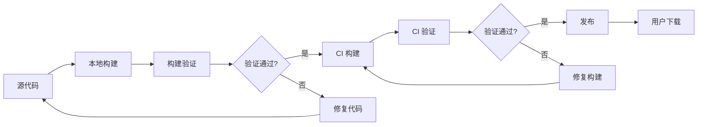

# M13 T20 构建轨道综合复盘——从 `package.json` 到用户下载的完整链路

小林学完了 M08—M12，对 OriginOS 的构建系统有了基本了解。但她发现这些知识是分散的——M08 讲构建脚本，M09 讲 CI/CD 工作流，M10 讲验证脚本，M11 讲发布脚本，M12 讲构建产物。她想知道：**这些环节之间是什么关系？从代码提交到用户下载，完整的链路是怎样的？**

本课把 M08—M12 的分散知识汇集成一条完整的构建链路，让读者理解每个环节的位置、责任和依赖关系。

## 场景：从"代码提交"到"用户下载"

### 1.1 完整构建链路概览

| 环节 | 对应课次 | 核心操作 | 产物 |
| --- | --- | --- | --- |
| 本地构建 | M08 | `pnpm desktop:build` | `dist-electron/`、`dist/` |
| 构建验证 | M10 | `verify-*` 脚本 | 验证报告 |
| CI 构建 | M09 | GitHub Actions `desktop-release.yml` | GitHub Artifacts |
| CI 验证 | M09—M10 | CI 中的 `verify-*` 步骤 | 验证报告 |
| 发布 | M11 | `publish:qiniu` | 七牛云 CDN、GitHub Releases |
| 用户下载 | M12 | 从官网或 GitHub 下载 | `.exe`、`.dmg` |

### 1.2 每个环节的责任边界

**本地构建（M08）**：

- **责任**：将源代码编译成可运行的应用
- **输入**：源代码、`package.json`、`electron-builder.yml`
- **输出**：`dist-electron/`（中间产物）、`dist/`（编译产物）
- **失败后果**：无法生成可运行的应用

**构建验证（M10）**：

- **责任**：确认构建产物是否完整、正确
- **输入**：`dist-electron/`、`release/`
- **输出**：验证报告（通过/失败）
- **失败后果**：产物不完整或有误，不能发布

**CI 构建（M09）**：

- **责任**：在标准化环境中重复本地构建
- **输入**：源代码、GitHub Actions 配置
- **输出**：GitHub Artifacts（构建产物）
- **失败后果**：无法生成发布产物

**CI 验证（M09—M10）**：

- **责任**：在 CI 环境中验证构建产物
- **输入**：GitHub Artifacts
- **输出**：验证报告
- **失败后果**：产物不能进入发布环节

**发布（M11）**：

- **责任**：将验证通过的产物发布到用户可访问的渠道
- **输入**：GitHub Artifacts、七牛云密钥
- **输出**：七牛云 CDN、GitHub Releases
- **失败后果**：用户无法下载新版本

**用户下载（M12）**：

- **责任**：用户从官网或 GitHub 下载安装包
- **输入**：`.exe`、`.dmg`
- **输出**：安装好的 OriginOS CE
- **失败后果**：用户无法使用 OriginOS

## 2. 链路中的关键依赖关系

### 2.1 依赖关系图

**关键理解**：构建链路是线性的，每个环节依赖前一个环节的输出。如果某个环节失败，链路会回退到上一个环节，修复后重新执行。

### 2.2 本地构建与 CI 构建的关系

| 对比维度 | 本地构建 | CI 构建 |
| --- | --- | --- |
| 触发方式 | 手动运行命令 | 标签推送或手动触发 |
| 环境 | 本地开发机 | GitHub Actions 虚拟机 |
| 并行构建 | 一次构建一个平台 | 三个平台同时构建 |
| 签名 | 需要本地配置密钥 | 使用 GitHub Secrets |
| 发布 | 不自动发布 | 自动发布到七牛云和 GitHub |
| 产物保留 | 本地 `release/` 目录 | GitHub Artifacts（可下载） |

**关键理解**：本地构建和 CI 构建的核心命令是相同的（都是 `pnpm desktop:build`），但 CI 构建有额外的验证步骤和自动发布能力。本地构建适合开发和测试，CI 构建适合发布。

### 2.3 构建链路中的失败回退

| 失败环节 | 回退策略 | 修复后重新执行 |
| --- | --- | --- |
| 本地构建失败 | 修复代码，重新运行 `pnpm desktop:build` | 本地构建 |
| 构建验证失败 | 排查验证脚本或修复构建产物 | 本地构建 + 验证 |
| CI 构建失败 | 查看 CI 日志，修复代码或配置 | CI 构建 |
| CI 验证失败 | 查看验证日志，修复构建产物 | CI 构建 + 验证 |
| 发布失败 | 查看发布日志，修复发布配置 | 发布 |

## 3. 链路中的关键文件

### 3.1 构建链路的文件依赖

| 文件 | 在链路中的位置 | 作用 | 如果缺失 |
| --- | --- | --- | --- |
| `package.json`（根目录） | 本地构建入口 | 定义构建脚本 | 无法运行构建命令 |
| `packages/desktop/package.json` | 本地构建核心 | 定义 `build:app` 脚本 | 无法构建 Desktop 包 |
| `packages/desktop/electron-builder.yml` | 本地构建配置 | 定义 Electron Builder 配置 | 构建产物格式错误 |
| `.github/workflows/desktop-release.yml` | CI 构建入口 | 定义 CI 工作流 | 无法触发 CI 构建 |
| `packages/desktop/scripts/verify-*.js` | 构建验证 | 验证产物完整性 | 无法确认产物正确 |
| `packages/desktop/scripts/publish-qiniu-updates.js` | 发布 | 发布到七牛云 | 无法自动发布 |
| `latest.yml` | 发布产物 | 自动更新元数据 | 自动更新不可用 |

### 3.2 文件的修改影响范围

| 修改的文件 | 影响的环节 | 影响范围 |
| --- | --- | --- |
| `packages/desktop/src/` 下的源代码 | 本地构建、CI 构建 | 应用功能 |
| `packages/desktop/package.json` | 本地构建、CI 构建 | 构建脚本和依赖 |
| `packages/desktop/electron-builder.yml` | 本地构建、CI 构建 | 产物格式和签名 |
| `.github/workflows/desktop-release.yml` | CI 构建、发布 | CI 流程和发布行为 |
| `packages/desktop/scripts/verify-*.js` | 构建验证、CI 验证 | 验证逻辑 |
| `packages/desktop/scripts/publish-*.js` | 发布 | 发布行为 |

## 4. 链路阅读方法

### 4.1 从问题出发定位环节

当你遇到构建相关的问题时，按以下步骤定位：

| 问题现象 | 定位环节 | 排查文件 |
| --- | --- | --- |
| `pnpm desktop:build` 报错 | 本地构建 | `packages/desktop/package.json` |
| 构建成功但产物无法运行 | 构建验证 | `packages/desktop/scripts/verify-*.js` |
| CI 构建失败 | CI 构建 | `.github/workflows/desktop-release.yml` |
| CI 验证失败 | CI 验证 | CI 日志、`verify-*.js` |
| 发布后无法下载 | 发布 | `packages/desktop/scripts/publish-*.js` |
| 自动更新不可用 | 发布产物 | `latest.yml` |

### 4.2 从文件出发理解链路

当你需要理解某个文件在链路中的位置时，问自己三个问题：

1. **这个文件的输入是什么？** 它依赖哪些文件或产物？
2. **这个文件的输出是什么？** 它生成什么产物或报告？
3. **这个文件的下游是什么？** 它的输出被哪个环节使用？

以 `electron-builder.yml` 为例：

| 问题 | 答案 |
| --- | --- |
| 输入 | `dist-electron/` 目录（由 `build:app` 生成） |
| 输出 | `release/` 目录下的 `.exe`、`.dmg` 等安装包 |
| 下游 | 验证脚本（`verify-*.js`）、发布脚本（`publish-*.js`） |

## 5. 文档覆盖台账

| 本课直接精读的内容 | 精读范围 | 配对验证 | 本课只证明什么 |
| --- | --- | --- | --- |
| M08—M12 的所有已精读内容 | 综合引用 | 对照实际构建流程验证 | 构建链路的完整性和连贯性 |
| 构建链路依赖图 | 示意图 | 对照实际构建流程验证 | 各环节之间的依赖关系 |

本课没有精读的内容也要明说：

- 本课是对 M08—M12 的综合复盘，没有新增精读内容
- 构建链路的具体实现细节（如 Electron Builder 的内部逻辑）未精读
- 各环节的详细配置选项未逐一解释

## 6. 练习：链路定位

### 任务 A：定位构建失败的原因

已知信息：开发者推送了 `desktop-v0.1.48` 标签，但 CI 构建在 `build:app` 步骤失败。

问题：应该排查哪些文件？如何定位问题？

### 任务 B：定位自动更新失败的原因

已知信息：用户安装了 OriginOS CE 0.1.46，但无法自动更新到 0.1.47。

问题：应该检查哪些环节和文件？

### 任务 C：理解文件修改的影响

已知信息：开发者修改了 `packages/desktop/electron-builder.yml` 中的 `files` 字段。

问题：这个修改会影响哪些环节？需要验证什么？

### 参考答案

**任务 A：**

| 排查步骤 | 操作 |
| --- | --- |
| 1 | 查看 CI 日志，确认 `build:app` 的具体错误 |
| 2 | 在本地运行相同的构建命令，复现问题 |
| 3 | 检查 `packages/desktop/package.json` 中的 `build:app` 脚本 |
| 4 | 检查 `packages/desktop/electron-builder.yml` 的配置 |
| 5 | 检查 `dist-electron/` 目录是否存在 |

**任务 B：**

| 排查步骤 | 操作 |
| --- | --- |
| 1 | 检查 `latest.yml` 是否包含 0.1.47 的版本信息 |
| 2 | 检查 `latest.yml` 的 URL 是否正确指向七牛云 CDN |
| 3 | 检查 Electron 的自动更新配置 |
| 4 | 检查网络连接 |
| 5 | 检查 `release/` 目录下是否有 0.1.47 的产物 |

**任务 C：**

| 影响环节 | 验证内容 |
| --- | --- |
| 本地构建 | 构建是否成功 |
| 构建验证 | 产物是否包含正确的文件 |
| CI 构建 | CI 构建是否成功 |
| CI 验证 | 验证脚本是否通过 |

## 7. 口头验收

学完本课后，不看正文也应能回答下面五个问题：

1. 从代码提交到用户下载，构建链路包含哪些环节？每个环节的责任是什么？
2. 本地构建和 CI 构建的区别是什么？为什么需要 CI 构建？
3. 当构建链路中的某个环节失败时，应该如何定位问题？
4. `electron-builder.yml` 在链路中的位置是什么？它的输入和输出分别是什么？
5. 当你修改了构建相关的文件时，应该验证哪些环节？

合格回答不要求背诵每个文件的具体内容，但必须能说清构建链路的完整流程、各环节的责任和依赖关系、以及问题定位方法。能说清"从代码到用户的完整链路"比只说清"某个脚本的作用"更重要。

## 8. 进入下一单元

M08—M13 完成了 T20（构建）轨道的学习。读者现在应该能够：

1. 理解构建脚本的分层结构和依赖关系（M08）
2. 阅读 CI/CD 工作流，理解触发条件和 Job 依赖（M09）
3. 阅读验证脚本，理解验证逻辑和通过标准（M10）
4. 阅读发布脚本，理解发布流程和自动更新机制（M11）
5. 理解构建产物的种类和作用（M12）
6. 把以上知识汇集成完整的构建链路（M13）

下一单元将进入 T21（数据）轨道，学习如何阅读数据目录、理解数据存储结构、以及数据迁移和备份策略。

因此，本单元的结论可以压缩成一句话：

> 构建不是单步操作，而是链路——从代码到产物，从产物到验证，从验证到发布，每个环节都有明确的责任和依赖。理解链路比理解单个脚本更重要。
