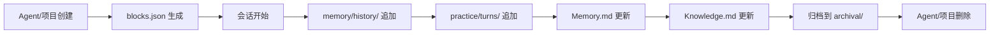

# M14 数据目录结构如何阅读——从 `data/` 到 Agent 工作目录

小林想了解 OriginOS 的数据是如何组织的。她打开 `packages/web/data/` 目录，看到 `agents/` 和 `projects/` 两个子目录。她以为数据很简单——就两类。

但她不知道的是：**每个 Agent 和项目都有复杂的子目录结构，包含记忆、知识库、实践日志、协作会话等多种数据类型**。更关键的是，Web 版本和 Desktop 版本的数据目录结构是相同的——这意味着数据可以在两个版本之间迁移。

本课解决一个理解问题：当你面对 OriginOS 的数据目录时，怎样理解每个目录的作用、它们之间的关系、以及数据的生命周期。

## 场景：从"两个目录"到"完整的数据地图"

### 1.1 `data/` 目录的顶层结构

OriginOS 的数据目录位于 `packages/web/data/`（Web 版本）和 `packages/desktop/data/`（Desktop 版本）。两者的结构相同：

```
packages/web/data/
├── agents/          # Agent 数据
│   └── {agentName}/
│       ├── blocks.json
│       ├── Memory.md
│       ├── memory/
│       │   └── history/
│       │       └── agent-{name}-{timestamp}.jsonl
│       ├── knowledge/
│       │   ├── log.md
│       │   └── index.md
│       ├── practice/
│       │   ├── summary.json
│       │   └── turns/
│       │       └── turn-{N}.json
│       └── archival/
│           ├── hnsw-index.bin
│           └── entries.jsonl
└── projects/        # 项目数据
    └── {projectId}/
        ├── Knowledge.md
        ├── Patterns.md
        ├── Memory.md
        ├── blocks.json
        ├── knowledge/
        │   ├── log.md
        │   └── index.md
        ├── practice/
        │   └── summary.json
        └── collaboration-sessions/
            └── {sessionId}/
                └── events.jsonl
```

### 1.2 两种数据类型：Agent 数据 vs 项目数据

| 维度 | Agent 数据 | 项目数据 |
| --- | --- | --- |
| 路径 | `data/agents/{agentName}/` | `data/projects/{projectId}/` |
| 代表 | 单个 Agent 的持久化数据 | 单个项目的持久化数据 |
| 包含 | 记忆、知识库、实践日志、归档索引 | 知识库、协作会话、实践日志 |
| 生命周期 | Agent 创建时生成，Agent 删除时清理 | 项目创建时生成，项目删除时清理 |
| 示例 | `agents/xiaofengjun/` | `projects/proj-1780888140037-jsoa98uyv/` |

**关键理解**：Agent 数据和项目数据是 OriginOS 的两类核心持久化数据。Agent 数据存储 Agent 的记忆、知识和经验；项目数据存储项目的协作会话和知识积累。

## 2. Agent 数据目录精读

### 2.1 Agent 目录结构

以 `agents/xiaofengjun/` 为例：

```
agents/xiaofengjun/
├── blocks.json                    # Agent 配置块
├── Memory.md                      # 历史记忆摘要
├── memory/
│   └── history/
│       └── agent-xiaofengjun-1781164079509.jsonl  # JSONL 历史记录
├── knowledge/
│   ├── log.md                     # 知识库日志
│   └── index.md                   # 知识库索引
├── practice/
│   ├── summary.json               # 实践日志摘要
│   └── turns/
│       ├── turn-1.json            # 第 1 轮实践记录
│       ├── turn-2.json
│       └── ...
└── archival/
    ├── hnsw-index.bin             # HNSW 语义索引
    └── entries.jsonl              # 归档条目
```

### 2.2 每个文件的作用

| 文件/目录 | 作用 | 格式 | 更新时机 |
| --- | --- | --- | --- |
| `blocks.json` | Agent 的配置块（角色定义、工具配置等） | JSON | Agent 创建/更新时 |
| `Memory.md` | 历史会话的摘要和关键信息 | Markdown | 每 N 轮落盘时 |
| `memory/history/` | 按时间戳组织的 JSONL 历史记录 | JSONL | 每轮会话后 |
| `knowledge/log.md` | 知识库的操作日志 | Markdown | 知识更新时 |
| `knowledge/index.md` | 知识库的索引快照 | Markdown | 周期更新 |
| `practice/summary.json` | 实践日志的摘要统计 | JSON | 每轮/周期更新 |
| `practice/turns/` | 按轮次组织的实践记录 | JSON | 每轮会话后 |
| `archival/hnsw-index.bin` | HNSW 语义索引（二进制） | Binary | 归档时 |
| `archival/entries.jsonl` | 归档条目的 JSONL 记录 | JSONL | 归档时 |

**关键理解**：Agent 数据的组织遵循"**分层存储**"原则——频繁访问的数据（如 `Memory.md`）放在顶层，历史数据（如 `memory/history/`）放在子目录中，归档数据（如 `archival/`）放在最深层。

### 2.3 `blocks.json` 的结构

```json
{
  "id": "agent-xiaofengjun",
  "name": "xiaofengjun",
  "type": "role-agent",
  "createdAt": "2026-08-20T16:22:00.000Z",
  "updatedAt": "2026-09-02T10:30:00.000Z",
  "config": {
    "role": "test-engineer",
    "allowedTools": ["bash", "file", "skill"]
  }
}
```

**关键理解**：`blocks.json` 是 Agent 的元数据文件，记录了 Agent 的基本信息和配置。它是 Agent 数据的入口文件——其他所有数据都通过 `id` 或 `name` 与之一一对应。

## 3. 项目数据目录精读

### 3.1 项目目录结构

以 `projects/proj-1780888140037-jsoa98uyv/` 为例：

```
projects/proj-1780888140037-jsoa98uyv/
├── Knowledge.md           # 项目知识库快照
├── Patterns.md            # 项目经验模式
├── Memory.md              # 项目历史记忆
├── blocks.json            # 项目配置块
├── knowledge/
│   ├── log.md             # 知识库日志
│   └── index.md           # 知识库索引
├── practice/
│   └── summary.json       # 实践日志摘要
└── collaboration-sessions/
    └── cs-1781164021937-twc74a/
        └── events.jsonl     # 协作会话事件记录
```

### 3.2 项目数据与 Agent 数据的区别

| 维度 | Agent 数据 | 项目数据 |
| --- | --- | --- |
| `Memory.md` | Agent 的历史会话摘要 | 项目的历史协作摘要 |
| `Knowledge.md` | Agent 的知识库快照 | 项目的知识库快照 |
| `Patterns.md` | Agent 的经验模式 | 项目的经验模式 |
| `practice/` | Agent 的实践日志 | 项目的实践日志 |
| `memory/history/` | Agent 的 JSONL 历史记录 | — |
| `archival/` | Agent 的归档索引 | — |
| `collaboration-sessions/` | — | 项目的协作会话 |

**关键理解**：项目数据和 Agent 数据有相同的"认知系统"文件（`Knowledge.md`、`Patterns.md`、`Memory.md`、`practice/`），但项目数据额外包含 `collaboration-sessions/`——这是多 Agent 协作运行时产生的事件记录。

## 4. 协作会话数据精读

### 4.1 `events.jsonl` 的结构

协作会话的数据存储在 `collaboration-sessions/{sessionId}/events.jsonl` 中：

```jsonl
{"timestamp":"2026-09-02T10:30:00.000Z","type":"session_start","agentId":"agent-1","data":{}}
{"timestamp":"2026-09-02T10:30:01.000Z","type":"message","agentId":"agent-1","data":{"content":"Hello"}}
{"timestamp":"2026-09-02T10:30:02.000Z","type":"message","agentId":"agent-2","data":{"content":"Hi there"}}
```

**关键理解**：`events.jsonl` 使用 JSON Lines 格式——每行是一个独立的 JSON 对象，便于追加写入和增量读取。这种格式适合记录事件流，因为事件是顺序发生的，不需要随机访问。

### 4.2 事件类型

| 事件类型 | 含义 | 示例 |
| --- | --- | --- |
| `session_start` | 会话开始 | 初始化协作会话 |
| `message` | 消息发送 | Agent 之间的通信 |
| `task_assign` | 任务分配 | Supervisor 分配任务给 Worker |
| `task_complete` | 任务完成 | Worker 完成任务 |
| `conflict_detected` | 冲突检测 | ConflictDetector 检测到冲突 |
| `session_end` | 会话结束 | 协作会话结束 |

## 5. 数据目录的阅读方法

### 5.1 三步阅读法

**第一步：看顶层结构**

`data/` 目录下有哪些子目录？是 Agent 数据还是项目数据？

**第二步：看子目录结构**

每个 Agent 或项目目录下有哪些文件？它们的命名规则是什么？

**第三步：看文件内容**

关键文件（如 `blocks.json`、`Memory.md`）的内容是什么？它们记录了什么信息？

### 5.2 数据生命周期



**关键理解**：数据的生命周期与 Agent/项目的生命周期绑定。Agent/项目创建时生成初始数据，每次会话后追加历史记录，定期更新摘要和知识库，最终归档或删除。

## 6. 文档覆盖台账

| 本课直接精读的内容 | 精读范围 | 配对验证 | 本课只证明什么 |
| --- | --- | --- | --- |
| `packages/web/data/` 目录结构 | 目录列表 | 对照 `packages/desktop/data/` 验证 | 数据目录的顶层结构 |
| `agents/xiaofengjun/blocks.json` | 示例内容 | 对照 Agent 配置验证 | Agent 元数据的结构 |
| `agents/xiaofengjun/Memory.md` | 目录确认 | — | Agent 记忆文件的存在 |
| `agents/xiaofengjun/memory/history/` | 目录列表 | — | JSONL 历史记录的组织方式 |
| `projects/proj-*/collaboration-sessions/` | 目录列表 | — | 协作会话数据的组织方式 |

本课没有精读的内容也要明说：

- `Memory.md`、`Knowledge.md`、`Patterns.md` 的具体内容未精读
- `practice/turns/` 中 JSON 文件的具体结构未精读
- `archival/hnsw-index.bin` 的二进制格式未精读
- 数据读写 API 的具体实现未涉及

## 7. 练习：数据目录阅读

### 任务 A：定位 Agent 的历史记录

已知信息：Agent 名为 `xiaofengjun`。

问题：它的历史记录存储在哪里？格式是什么？

### 任务 B：理解项目协作会话

已知信息：项目 ID 为 `proj-1780888140037-jsoa98uyv`，会话 ID 为 `cs-1781164021937-twc74a`。

问题：协作会话的事件记录存储在哪里？如何读取？

### 任务 C：判断数据完整性

已知信息：Agent `test-engineer` 的目录下缺少 `Memory.md`。

问题：这代表什么？可能的原因是什么？

### 参考答案

**任务 A：**

| 维度 | 答案 |
| --- | --- |
| 路径 | `packages/web/data/agents/xiaofengjun/memory/history/` |
| 格式 | JSONL（每行一个 JSON 对象） |
| 命名 | `agent-{name}-{timestamp}.jsonl` |
| 更新时机 | 每轮会话后 |

**任务 B：**

| 维度 | 答案 |
| --- | --- |
| 路径 | `packages/web/data/projects/proj-1780888140037-jsoa98uyv/collaboration-sessions/cs-1781164021937-twc74a/events.jsonl` |
| 格式 | JSONL |
| 读取方式 | 逐行读取，每行解析为 JSON 对象 |
| 内容 | 会话的事件流（session_start、message、task_assign 等） |

**任务 C：**

| 判断 | 说明 |
| --- | --- |
| 影响 | Agent 的历史记忆摘要缺失，可能影响 Agent 的上下文理解 |
| 可能原因 | Agent 尚未经过足够多的轮次触发 Memory.md 更新；或更新逻辑失败 |
| 排查 | 检查 `memory/history/` 是否有历史记录；检查 Agent 配置中的落盘阈值 |

## 8. 口头验收

学完本课后，不看正文也应能回答下面五个问题：

1. `data/` 目录下有哪些子目录？它们分别存储什么数据？
2. Agent 数据和项目数据有哪些相同的文件？哪些是不同的？
3. `events.jsonl` 的格式是什么？为什么使用这种格式？
4. Agent 数据的生命周期是怎样的？从创建到删除经历了哪些阶段？
5. 当你需要查找某个 Agent 的历史记录时，应该去哪里找？格式是什么？

合格回答不要求背诵每个文件的具体路径，但必须能说清数据目录的顶层结构、Agent 数据和项目数据的区别、以及数据的生命周期。能说清"数据在哪里"比只说清"数据是什么"更重要。
