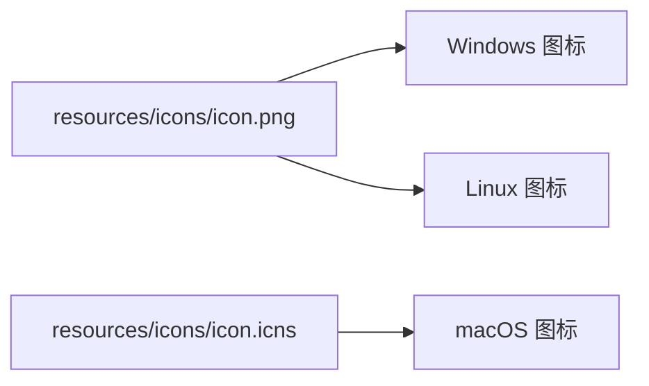

# M20 资源文件格式如何阅读——图标、权限与平台兼容性

小林想知道 OriginOS 的资源文件都使用什么格式。她看到 `.icns`、`.png`、`.plist` 等多种格式，不知道每种格式的特点和适用场景。

本课解决一个理解问题：当你面对 OriginOS 的多种资源文件格式时，怎样理解每种格式的特点、适用场景、以及平台兼容性。

## 场景：从"多种格式"到"每种格式都有明确用途"

### 1.1 资源文件格式概览

OriginOS 使用三种主要的资源文件格式：

| 格式 | 扩展名 | 用途 | 平台 |
| --- | --- | --- | --- |
| Apple Icon Image | `.icns` | macOS 应用图标 | macOS |
| Portable Network Graphics | `.png` | 通用图标、托盘图标 | 所有平台 |
| Property List | `.plist` | macOS 权限配置 | macOS |

### 1.2 格式选择的原则

OriginOS 选择资源格式的原则：

| 数据特征 | 选择格式 | 原因 |
| --- | --- | --- |
| macOS 应用图标 | `.icns` | 支持多种尺寸，系统自动选择 |
| 通用图标 | `.png` | 跨平台兼容，支持透明度 |
| macOS 权限配置 | `.plist` | Apple 标准格式，系统原生支持 |

## 2. `.icns` 格式精读

### 2.1 `.icns` 格式的特点

`.icns`（Apple Icon Image）是 macOS 的原生图标格式：

| 特点 | 说明 |
| --- | --- |
| 多尺寸支持 | 一个文件包含 16x16 到 1024x1024 的多种尺寸 |
| 自动选择 | macOS 根据显示场景自动选择合适的尺寸 |
| 透明度支持 | 支持 Alpha 通道 |
| 压缩 | 使用 PNG 或 JPEG 压缩 |

### 2.2 `.icns` 与 `.png` 的区别

| 特征 | `.icns` | `.png` |
| --- | --- | --- |
| 多尺寸 | ✅ 支持 | ❌ 不支持 |
| 自动选择 | ✅ 支持 | ❌ 不支持 |
| 跨平台 | ❌ macOS 专用 | ✅ 所有平台 |
| 文件大小 | 较大（包含多种尺寸） | 较小（单一尺寸） |

**关键理解**：`.icns` 是 macOS 的原生格式，适合 macOS 应用图标。`.png` 是跨平台格式，适合通用图标和托盘图标。

## 3. `.plist` 格式精读

### 3.1 `.plist` 格式的特点

`.plist`（Property List）是 Apple 的标准配置文件格式：

| 特点 | 说明 |
| --- | --- |
| 结构化 | 支持字典、数组、字符串等多种数据类型 |
| 可读性 | XML 格式，人类可读 |
| 系统原生 | macOS/iOS 系统原生支持 |
| 签名关联 | 与代码签名紧密关联 |

### 3.2 `.plist` 的结构示例

```xml
<?xml version="1.0" encoding="UTF-8"?>
<!DOCTYPE plist PUBLIC "-//Apple//DTD PLIST 1.0//EN" "http://www.apple.com/DTDs/PropertyList-1.0.dtd">
<plist version="1.0">
<dict>
    <key>com.apple.security.cs.allow-jit</key>
    <true/>
</dict>
</plist>
```

| 元素 | 含义 |
| --- | --- |
| `<dict>` | 字典，包含键值对 |
| `<key>` | 键名 |
| `<true/>` | 布尔值 true |

## 4. 平台兼容性

### 4.1 各平台的资源要求

| 平台 | 图标格式 | 权限配置 | 特殊要求 |
| --- | --- | --- | --- |
| macOS | `.icns` | `.plist` | Notarization、Hardened Runtime |
| Windows | `.png`、`.ico` | — | 代码签名（可选） |
| Linux | `.png` | — | AppImage 格式 |

### 4.2 跨平台资源管理



**关键理解**：跨平台应用需要为每个平台准备合适的资源格式。OriginOS 使用 `.png` 作为通用格式，`.icns` 作为 macOS 专用格式。

## 5. 文档覆盖台账

| 本课直接精读的内容 | 精读范围 | 配对验证 | 本课只证明什么 |
| --- | --- | --- | --- |
| `.icns` 格式特点 | 概念描述 | — | `.icns` 格式的基本特点 |
| `.plist` 格式特点 | 示例内容 | — | `.plist` 格式的基本结构 |
| 平台兼容性 | 概念描述 | — | 各平台的资源要求 |

本课没有精读的内容也要明说：

- `.icns` 文件的内部二进制结构未精读
- `.plist` 的完整规范未精读
- Windows `.ico` 格式未涉及

## 6. 练习：格式选择

### 任务 A：选择图标格式

已知信息：需要为 OriginOS 添加 macOS 应用图标。

问题：应该使用什么格式？为什么？

### 任务 B：理解权限配置

已知信息：应用需要在 macOS 上访问麦克风。

问题：应该在 `entitlements.mac.plist` 中添加什么配置？

### 参考答案

**任务 A：**

| 格式 | 适用性 | 原因 |
| --- | --- | --- |
| `.icns` | ✅ 适合 | macOS 原生格式，支持多尺寸 |
| `.png` | ❌ 不适合 | 不支持多尺寸自动选择 |

**任务 B：**

```xml
<key>com.apple.security.device.microphone</key>
<true/>
```

## 7. 口头验收

学完本课后，不看正文也应能回答下面五个问题：

1. OriginOS 使用哪三种资源文件格式？每种格式的特点是什么？
2. `.icns` 和 `.png` 的区别是什么？各适用于什么场景？
3. `.plist` 格式的作用是什么？它的结构是怎样的？
4. 各平台的资源要求有什么不同？
5. 当你需要为新的平台添加资源时，应该如何选择格式？

合格回答不要求背诵每种格式的具体语法，但必须能说清每种格式的特点、适用场景、以及平台兼容性。能说清"为什么用这种格式"比只说清"这种格式是什么"更重要。
