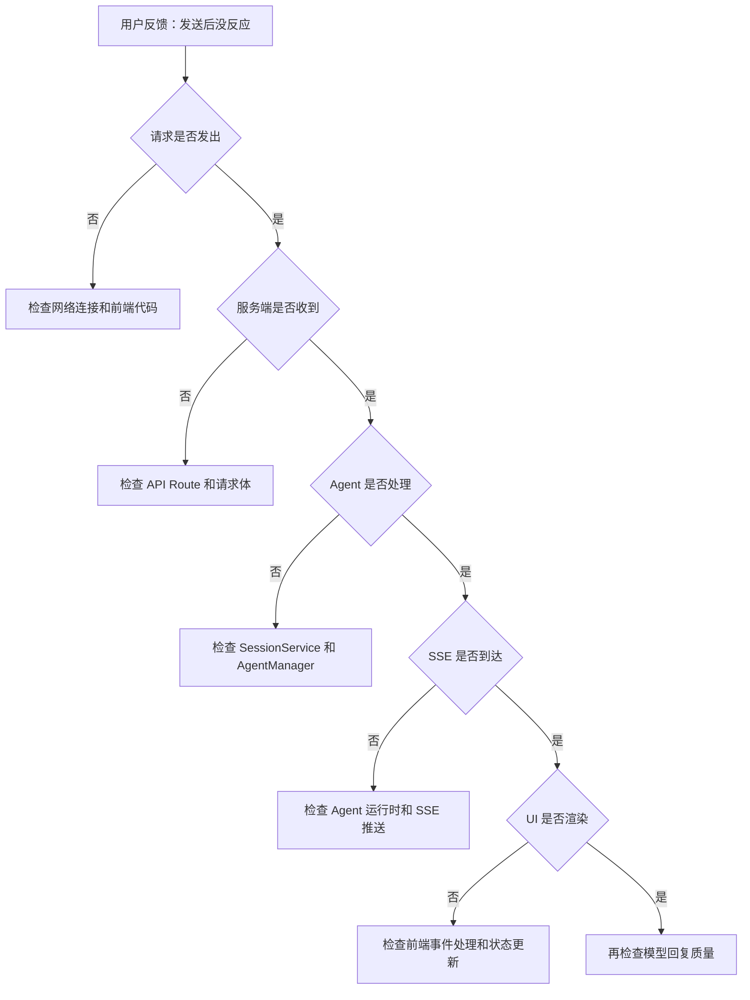

# 单元导读二：从会话创建到流式响应（N03—N04）

小林已经学完了入口链路（N01—N02）。现在他在 SkillDialog 里输入了一条消息："帮我规划一个五天的旅行行程。"几秒钟后，窗口里开始出现一段段文字，像有人在打字一样。

从用户视角看，这只是"输入→等待→看到回复"。但从系统视角看，这条消息触发了一条跨越浏览器、HTTP、Core Service、Agent Runtime、SSE Stream 和 UI 渲染的完整链路。本单元要追踪的就是这条链路。

## 本单元总问题

> `POST /api/agent/sessions` 到 SSE 事件到达 UI，中间经过哪些边界？数据如何在各层之间流动？

这个问题涉及 HTTP 请求、Core Service、Agent 运行时、流式传输和 UI 渲染多个边界。本单元要帮读者建立一条**可复述、可排查**的完整链路。

## 本页先读什么

如果只记住一句话：

> 流式响应不是"模型一次性吐出完整回复"，而是经过"请求→处理→流式→渲染"四层边界的连续事件流。

阅读本页可以按下面的顺序：

| 阅读阶段 | 重点问题 | 对应章节 |
|---------|---------|---------|
| 建立总图 | 从发送到渲染，中间经过哪些对象？ | 第 1、2 节 |
| 分清边界 | 哪些概念最容易混淆？ | 第 3 节 |
| 对回课程 | 两节课分别补上链路中的哪一段？ | 第 4 节 |
| 查证源码 | 哪些源码在本单元复用，哪些留到后面？ | 第 5 节 |
| 练习排查 | 流式链路异常时，应按什么顺序排查？ | 第 6—7 节 |

## 1. 同一条消息会落在不同层

小林输入"帮我规划一个五天的旅行行程"时，系统里同时发生了很多事情。初学者最容易犯的错误，是把这些事情都理解成"消息发送成功了"。

更准确的说法是：同一条消息会经过不同层，每一层能证明的事情都不同。

| 看到的现象 | 所在层 | 它能证明什么 | 它不能证明什么 |
|-----------|--------|-------------|---------------|
| 输入框文字消失，出现"发送中" | UI 层 | 用户输入已提交 | 服务端已收到 |
| Network 面板出现 POST 请求 | HTTP 层 | 请求已发出 | 服务端已处理 |
| SSE 事件开始到达 | 流式层 | 服务端开始推送 | 完整回复已生成 |
| 文字逐段出现在对话框 | 渲染层 | UI 正在更新 | 回复已完整 |
| 出现"完成"标记 | 状态层 | 本轮处理结束 | 历史已保存 |

这张表的关键是"能证明什么"和"不能证明什么"的分界。排查流式链路问题时，从一个现象推出它无法证明的结论，是最常见的误判。

## 2. 流式链路的主路径

下面这张图只回答一个问题：从小林输入消息到文字逐段出现在对话框，中间经过哪些对象？

```mermaid
flowchart TD
    A[用户输入消息] --> B[SkillDialog 发送]
    B --> C[POST /api/agent/sessions/{id}/messages]
    C --> D[API Route 解析请求]
    D --> E[SessionService 获取会话]
    E --> F[AgentManager 获取 Agent]
    F --> G[OriginOSAgent.sendMessage]
    G --> H[LLM 流式响应]
    H --> I[SSE 事件推送]
    I --> J[前端接收事件]
    J --> K[UI 逐段渲染]
    K --> L[用户看到回复]
```

可以把它分成四段读。

**第一段是请求**：用户点击发送后，`SkillDialog` 通过 `POST` 请求发送消息。请求体包含 `sessionId` 和消息内容。这一步的关键是**请求身份**——`sessionId` 决定了消息属于哪段会话。

**第二段是处理**：API Route 解析请求，`SessionService` 获取会话数据，`AgentManager` 获取 Agent 实例，`OriginOSAgent` 调用 `sendMessage`。这一步的关键是**运行时绑定**——Agent 实例必须与会话绑定，不能串会话。

**第三段是流式**：`OriginOSAgent` 调用 LLM，接收流式响应，转换为 SSE 事件，推送给前端。这一步的关键是**事件流**——不是一次性返回，而是持续推送。

**第四段是渲染**：前端接收 SSE 事件，更新 UI 状态，逐段渲染文字。这一步的关键是**状态管理**——`uiState` 是即时状态，不等于持久化事实。

## 3. 三组最容易混淆的对象

### 3.1 请求、会话、运行时

| 对象 | 负责什么 | 典型字段 | 常见误解 |
|------|---------|---------|---------|
| HTTP 请求 | 携带消息和身份 | `sessionId`, `content` | 请求成功等于消息已处理 |
| 会话 | 保存消息历史 | `messages`, `currentSessionId` | 会话存在等于 Agent 在运行 |
| 运行时 | 当前进程中的 Agent 实例 | `OriginOSAgent` 状态 | 运行时存在等于历史已保存 |

### 3.2 消息、事件、状态

| 对象 | 负责什么 | 重启后是否保留 | 常见误解 |
|------|---------|--------------|---------|
| 消息 | 用户或助手的内容 | 是（在历史中） | 消息等于事件 |
| 事件 | 运行时过程通知 | 否（通常不保留） | 事件等于状态 |
| 状态 | UI 当前显示 | 否（即时状态） | 状态等于持久化 |

### 3.3 SSE、流式、渲染

| 对象 | 负责什么 | 常见误解 |
|------|---------|---------|
| SSE | 服务端推送事件的协议 | SSE 等于 WebSocket |
| 流式 | 数据分块传输的方式 | 流式等于一次性返回 |
| 渲染 | UI 更新显示的过程 | 渲染等于数据已保存 |

## 4. 两节课连成一条因果链

| 课次 | 本课解决的判断问题 | 复用的 Part | 学完后的判断能力 |
|------|-------------------|------------|----------------|
| N03 | 从发送到渲染，中间经过哪些步骤？ | E, I, J | 能追踪"请求→处理→流式→渲染"的完整链路 |
| N04 | 流式链路的各个边界如何排查？ | E, I, J | 能按证据顺序定位流式链路故障，不跳过层级 |

## 5. 复用源码覆盖台账

| 课次 | 复用的生产源码（前序 Part 已精读） | 配对测试 | 本单元只证明什么 |
|------|----------------------------------|---------|---------------|
| N03 | `messages/route.ts` (I), `session-service.ts` (E), `agent.ts` (E), `stream-dedupe.ts` (E), `stream-render-scheduler.ts` (E) | 流式测试、会话测试 | 流式链路的数据流和边界，不证明模型质量 |
| N04 | 同上 + `client-hooks.ts` (E), `usePiAgent.ts` (E) | Hook 测试、UI 测试 | 流式链路的故障排查顺序，不证明跨链路一致性 |

本单元相邻但尚未复用的文件：`server-config.ts`（服务端配置，Part I 已讲）、`error-handler.ts`（错误处理，Part I 已讲）。它们属于服务端边界，在后续单元中复用。

## 6. 异常排查：流式链路

当小林说"消息发出去没反应"时，最稳的排查方式不是直接看模型日志，而是沿着流式链路逐步确认。



排查口诀：

1. 消息没发出去 → 先看网络和前端代码
2. 服务端没收到 → 先看 API Route 和请求体
3. Agent 没处理 → 先看 SessionService 和 AgentManager
4. SSE 没到达 → 先看 Agent 运行时和 SSE 推送
5. UI 没渲染 → 先看前端事件处理和状态更新
6. 前面都成立 → 再看模型回复质量

## 7. 口头验收

学完 N03—N04 后，不看正文也应能回答下面五个问题：

1. 从用户发送到 UI 渲染，中间经过哪些层？每层的关键对象是什么？
2. 为什么"请求成功"不等于"消息已处理"？
3. SSE 和 WebSocket 的区别是什么？
4. 如果发送后没反应，应该按什么顺序排查？
5. 如果文字出现到一半停止了，可能的原因有哪些？

## 8. 进入下一单元

N03—N04 建立的是流式链路的完整认知。下一单元（N05—N06）会继续追踪：**当链路出现故障时，如何从症状反推到责任层**。

本单元的结论可以压缩成一句话：

> 流式响应是四层边界的连续事件流，不是"发送→回复"。排查时先确认层级，再判断责任。
