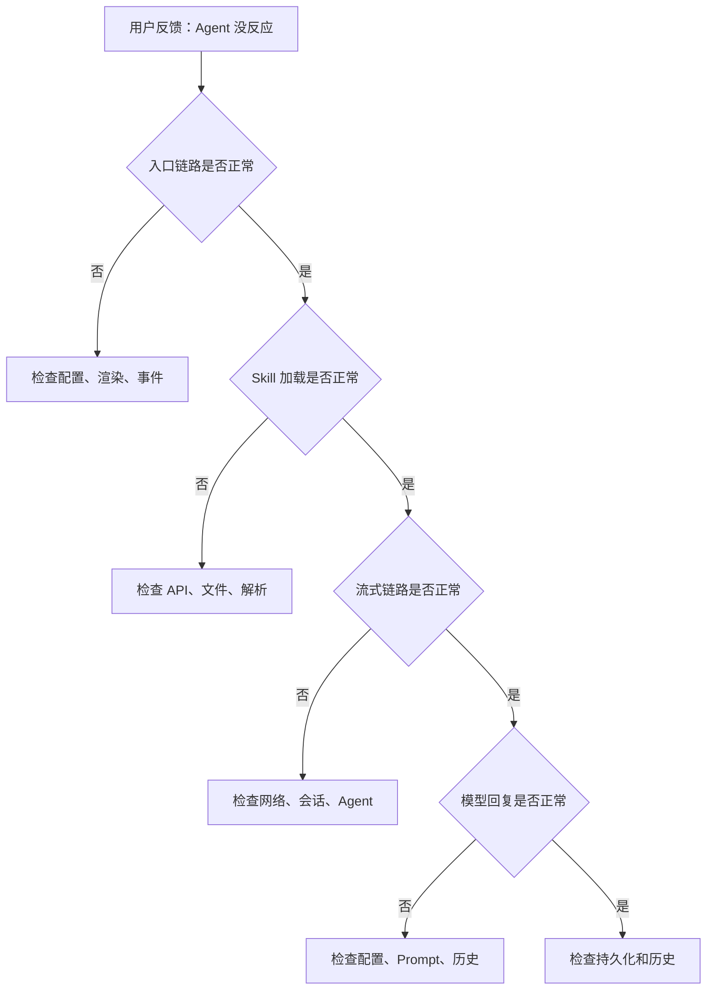
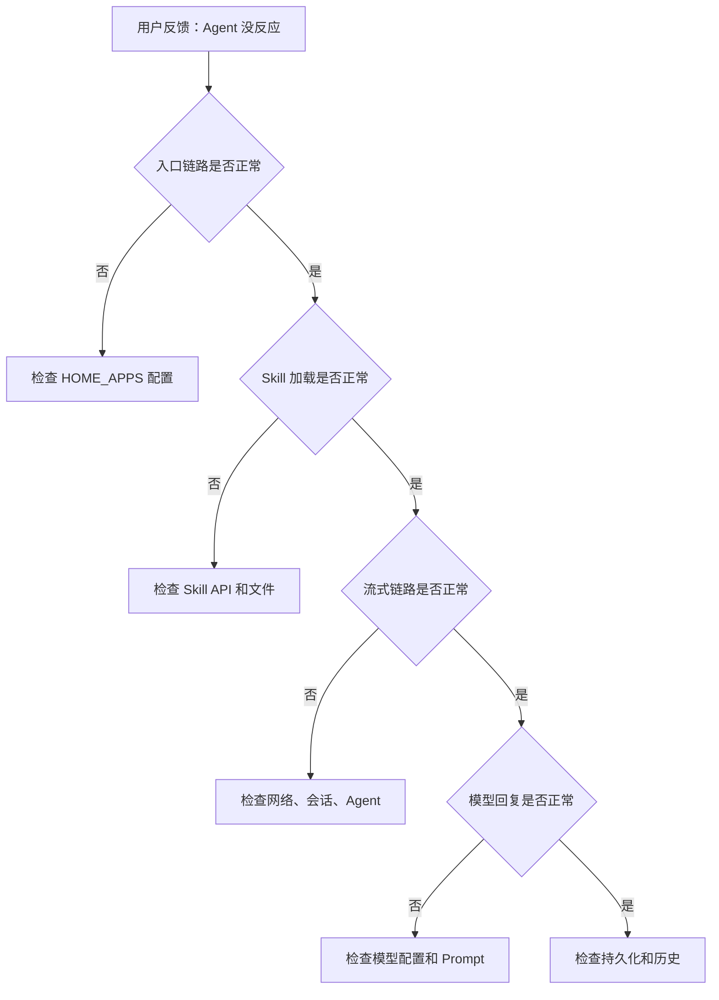

# 单元导读三：从故障症状到责任层定位（N05—N06）

小林已经学完了入口链路（N01—N02）和流式链路（N03—N04）。现在他遇到了一个问题：点击"旅行助手"后，窗口打开了，但输入消息后没有任何反应。

他想知道：问题出在哪里？是入口链路的问题？是流式链路的问题？还是模型本身的问题？

本单元要帮读者建立一套**系统化的故障诊断方法**，能从症状出发，按证据逐层定位责任。

## 本单元总问题

> 当 Agent 不回复、回复错误、会话丢失时，如何按证据逐层定位故障？

这个问题涉及入口链路、流式链路、模型运行时和持久化多个边界。本单元要帮读者建立一套**可复用的诊断框架**。

## 本页先读什么

如果只记住一句话：

> 故障诊断不是"猜原因"，而是"按证据逐层排除"。先确认层级，再判断责任，不跳过层级，不凭猜测。

阅读本页可以按下面的顺序：

| 阅读阶段 | 重点问题 | 对应章节 |
|---------|---------|---------|
| 建立总图 | 故障诊断的整体框架是什么？ | 第 1、2 节 |
| 分清边界 | 哪些症状对应哪些层级？ | 第 3 节 |
| 对回课程 | 两节课分别补上链路中的哪一段？ | 第 4 节 |
| 查证源码 | 哪些源码在本单元复用，哪些留到后面？ | 第 5 节 |
| 练习排查 | 真实故障场景如何排查？ | 第 6—7 节 |

## 1. 同一症状可能来自不同层

小林说"Agent 没反应"时，系统里可能同时存在多个问题。初学者最容易犯的错误，是直接从"模型坏了"开始排查。

更准确的说法是：**同一症状可能来自不同层，每一层的排查方法都不同**。

| 症状 | 可能的原因 | 所在层 | 排查方法 |
|------|-----------|--------|---------|
| 点击卡片没反应 | 配置错误、渲染失败、事件未绑定 | 入口链路 | 检查配置、组件、事件 |
| 窗口打开了但内容为空 | Skill 加载失败、内容解析错误 | Skill 层 | 检查 API、文件、解析 |
| 输入消息后没反应 | 请求失败、会话不存在、Agent 未注册 | 流式链路 | 检查网络、会话、Agent |
| 文字显示到一半停止 | SSE 中断、LLM 响应中断、网络断开 | 流式层 | 检查网络、SSE、模型 |
| 回复不符合预期 | 模型配置错误、Prompt 问题、历史污染 | 模型层 | 检查配置、Prompt、历史 |

这张表的关键是：**症状不等于原因**。同一症状可能来自不同层，排查时必须按证据顺序，不能凭猜测。

## 2. 故障诊断的主路径

下面这张图只回答一个问题：当小林说"Agent 没反应"时，应该按什么顺序排查？

可以把它分成四段读。

**第一段是入口链路排查**：确认卡片是否渲染、点击事件是否触发、窗口是否打开。这一步的关键是**先确认用户操作能到达系统**。

**第二段是 Skill 加载排查**：确认 Skill 内容是否加载、Prompt 是否构建正确、会话是否创建。这一步的关键是**确认系统能准备就绪**。

**第三段是流式链路排查**：确认请求是否发出、Agent 是否处理、SSE 是否到达、UI 是否渲染。这一步的关键是**确认数据能流动**。

**第四段是模型回复排查**：确认模型配置是否正确、Prompt 是否完整、历史是否污染。这一步的关键是**确认模型能正确工作**。

## 3. 三组最容易混淆的诊断方法

### 3.1 猜测 vs 证据

| 方法 | 特点 | 风险 |
|------|------|------|
| 猜测 | 凭经验或直觉判断原因 | 可能跳过真正的故障层 |
| 证据 | 按现象、日志、测试逐步排除 | 需要系统的排查框架 |

### 3.2 局部排查 vs 全局排查

| 方法 | 特点 | 适用场景 |
|------|------|---------|
| 局部排查 | 只检查某个组件或文件 | 已知故障范围 |
| 全局排查 | 从入口到出口逐层检查 | 故障范围未知 |

### 3.3 正向追踪 vs 反向诊断

| 方法 | 特点 | 适用场景 |
|------|------|---------|
| 正向追踪 | 从入口到出口逐步验证 | 验证链路完整性 |
| 反向诊断 | 从症状到责任层逐步定位 | 定位故障原因 |

## 4. 两节课连成一条因果链

| 课次 | 本课解决的判断问题 | 复用的 Part | 学完后的判断能力 |
|------|-------------------|------------|----------------|
| N05 | 典型故障如何反向诊断？ | A~E | 能从症状出发，按证据逐层定位 |
| N06 | 诊断框架如何系统化？ | A~E | 能建立可复用的诊断框架 |

## 5. 复用源码覆盖台账

| 课次 | 复用的生产源码（前序 Part 已精读） | 配对测试 | 本单元只证明什么 |
|------|----------------------------------|---------|---------------|
| N05 | `homeApps.ts`、`AppCard.tsx`、`page.tsx`、`SkillDialog.tsx`、`session-service.ts`、`agent.ts` | 入口链路测试、流式链路测试 | 故障诊断方法，不证明模型质量 |
| N06 | 同上 | 同上 | 诊断框架系统化，不证明所有故障场景 |

## 6. 异常排查：故障诊断

当小林说"Agent 没反应"时，最稳的排查方式不是直接看模型日志，而是按证据顺序逐步排除。

排查口诀：

1. 先确认入口链路 → 再确认 Skill 加载 → 再确认流式链路 → 再确认模型回复 → 最后检查持久化
2. 每一层都先检查"能证明什么"，再检查"不能证明什么"
3. 不跳过层级，不凭猜测

## 7. 口头验收

学完 N05—N06 后，不看正文也应能回答下面五个问题：

1. 当用户说"Agent 没反应"时，应该按什么顺序排查？
2. 为什么"猜测原因"不等于"按证据排查"？
3. 局部排查和全局排查的区别是什么？
4. 正向追踪和反向诊断的区别是什么？
5. 如何建立一套可复用的诊断框架？

## 8. 进入下一单元

N05—N06 建立的是故障诊断的完整认知。下一单元（N07）会把所有知识综合起来，做一次**全链路实战**。

本单元的结论可以压缩成一句话：

> 故障诊断不是"猜原因"，而是"按证据逐层排除"。先确认层级，再判断责任，不跳过层级，不凭猜测。

下一单元的核心判断是：**如何安全地做一个小改动，并验证它不破坏现有链路？**
