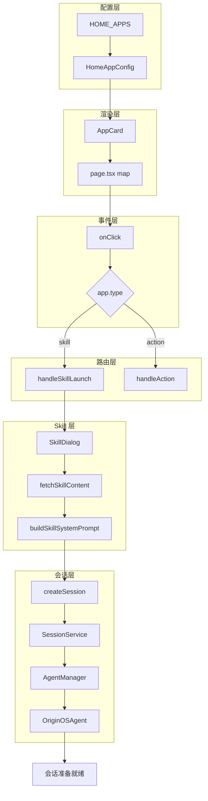

# N02：入口链路复盘工作坊

## 本页先读什么

如果只记住一句话：

> 入口链路不是"点击→响应"，而是"配置→渲染→事件→路由→服务→会话"六层边界。排查时先确认层级，再判断责任。

阅读本页可以按下面的顺序：

| 阅读阶段 | 重点问题 | 对应章节 |
|---------|---------|---------|
| 建立总图 | 入口链路的完整结构是什么？ | 第 1 节 |
| 核心区分 | 哪些概念最容易混淆？ | 第 2 节 |
| 排查地图 | 故障发生时按什么顺序排查？ | 第 3 节 |
| 章节因果链 | 两节课分别补上了哪段判断能力？ | 第 4 节 |
| 源码台账 | 哪些源码已精读，哪些还有缺口？ | 第 5 节 |
| 综合实验 | 如何验证自己的理解？ | 第 6 节 |
| 口头验收 | 能独立回答哪些问题？ | 第 7 节 |

## 1. 入口链路的完整结构

### 1.1 一句话总判断

入口链路的核心判断是：**配置驱动渲染，渲染触发事件，事件调用路由，路由委托服务，服务创建会话**。每一层只负责自己的事情，不能跨层假设。

### 1.2 三层含义

1. **配置层决定"有什么"**：`HOME_APPS` 声明了卡片的存在，但不保证卡片点击后一定有响应
2. **渲染层决定"看得见"**：`AppCard` 把配置变成可见 UI，但不处理业务逻辑
3. **会话层决定"能工作"**：`OriginOSAgent` 初始化后，Agent 才能处理消息，但初始化成功不代表消息一定能发送成功

### 1.3 总体认知图



这张图回答的问题是：**从配置到会话，数据和控制权如何逐层传递？**

- **配置层 → 渲染层**：`HomeAppConfig` 数组被 `page.tsx` 消费，通过 `map` 渲染成 `AppCard` 列表
- **渲染层 → 事件层**：`AppCard` 的 `onClick` 绑定到 `handleAppClick`，点击时传递 `HomeAppConfig`
- **事件层 → 路由层**：`handleAppClick` 根据 `app.type` 分流到 `handleSkillLaunch` 或 `handleAction`
- **路由层 → Skill 层**：`handleSkillLaunch` 打开 `SkillDialog`，加载 Skill 内容，构建 Prompt
- **Skill 层 → 会话层**：`createSession` 创建会话，`SessionService` 保存数据，`AgentManager` 注册 Agent
- **会话层 → 就绪**：`OriginOSAgent` 初始化完成，会话准备就绪

## 2. 核心区分

### 2.1 三组最容易混淆的对象

| 对象组 | 区别点 | 不能混用的原因 |
|--------|--------|--------------|
| `id` vs `name` vs `skillName` | `id` 是卡片唯一标识，`name` 是展示文本，`skillName` 是技能标识 | 用 `name` 代替 `skillName` 会导致 Skill 加载失败 |
| `type: 'skill'` vs `type: 'action'` | `skill` 打开 SkillDialog，`action` 执行页面动作 | 混用会导致点击后行为不符合预期 |
| `CLAUDE_SKILL_DIR` vs `agentBaseDir` vs `outputDir` | 源目录只读，工作目录可读写，产物目录用于输出 | 把产物写入源目录会违反架构规约 |

### 2.2 认知卡片

**卡片 1：配置 ≠ 可用**

```
HOME_APPS 中有配置
  → 卡片会渲染
  → 但 skillName 对应的 SKILL.md 可能不存在
  → 点击后可能加载失败
```

**卡片 2：渲染 ≠ 响应**

```
AppCard 渲染成功
  → 点击事件会触发
  → 但 handleSkillLaunch 可能抛出错误
  → 窗口可能打不开
```

**卡片 3：会话创建 ≠ Agent 工作**

```
createSession 返回成功
  → 会话数据已保存
  → OriginOSAgent 已初始化
  → 但 Agent 还没有收到任何消息
  → 真正的"工作"在 sendMessage 时才发生
```

## 3. 排查地图

### 3.1 故障排查流程图

```mermaid
flowchart TD
    A[用户反馈：点击卡片没反应] --> B{卡片是否渲染}
    B -->|否| C[检查 HOME_APPS 配置]
    B -->|是| D{点击是否触发 onClick}
    D -->|否| E[检查 AppCard 事件绑定]
    D -->|是| F{SkillDialog 是否打开}
    F -->|否| G[检查 handleSkillLaunch]
    F -->|是| H{内容是否加载}
    H -->|否| I[检查 API /skills/{name}/content]
    H -->|是| J{会话是否创建}
    J -->|否| K[检查 POST /api/agent/sessions]
    J -->|是| L[检查 Agent 运行时]
```

### 3.2 排查口诀

| 层级 | 现象 | 检查点 | 关键字段 |
|------|------|--------|---------|
| 配置层 | 卡片没有出现 | `HOME_APPS` 配置 | `id`, `type` |
| 渲染层 | 卡片出现但点击无反应 | `AppCard` 事件绑定 | `onClick` |
| 事件层 | 点击后窗口没打开 | `handleSkillLaunch` | `skillName` |
| 路由层 | 窗口打开但内容为空 | `fetchSkillContent` | `SKILL.md` |
| 服务层 | 内容加载但会话没创建 | `createSession` | `sessionId` |
| 会话层 | 会话创建但 Agent 不响应 | `OriginOSAgent` | `status` |

### 3.3 常见故障速查表

| 现象 | 可能原因 | 排查文件 |
|------|---------|---------|
| 卡片不出现 | `HOME_APPS` 配置缺失或导入错误 | `homeApps.ts` |
| 点击无反应 | `onClick` 未绑定或 `type` 不匹配 | `AppCard.tsx`, `page.tsx` |
| 窗口不打开 | `handleSkillLaunch` 抛出错误 | `SkillDialog.tsx` |
| 内容为空 | `skillName` 错误或 `SKILL.md` 缺失 | `templates/skills/` |
| 会话创建失败 | 存储层错误或配置缺失 | `session-service.ts` |
| Agent 不响应 | 模型配置错误或运行时异常 | `agent.ts` |

## 4. 章节因果链

| 课次 | 解决的判断问题 | 核心能力 | 边界 |
|------|--------------|---------|------|
| N01 | 从首页点击到 Agent 初始化，中间经过哪些步骤？ | 能追踪六层边界的完整链路 | 只到 Agent 初始化，不包括消息发送和流式响应 |
| N02 | 入口链路异常时如何按证据排查？ | 能按层级定位故障，不跳过层级 | 只覆盖入口链路，不包括运行时和流式链路 |

N01 建立了**正向追踪**能力：从用户点击到 Agent 初始化，能说出每一步的对象、数据和边界。

N02 建立了**反向诊断**能力：从故障症状到责任层，能按证据顺序排查，不凭猜测。

## 5. 源码覆盖台账

### 5.1 已精读（复用前序 Part）

| 文件 | 主讲章节 | 代码窗口 | 教学责任 |
|------|---------|---------|---------|
| `packages/web/src/config/homeApps.ts` | N01 | 第 1—30 行 | 配置驱动入口 |
| `packages/web/src/components/framework/AppCard.tsx` | N01 | 第 1—100 行 | 纯展示组件 |
| `packages/web/src/app/page.tsx` | N01 | 第 1400—1450 行 | 事件分流 |
| `packages/web/src/components/skills/SkillDialog.tsx` | N01 | 第 1—200 行 | Skill 加载和会话创建 |
| `packages/core/src/lib/features/agent/session-service.ts` | N01 | 第 1—100 行 | 会话生命周期 |
| `packages/core/src/lib/integrations/pi-agent/core/agent.ts` | N01 | 第 1—100 行 | Agent 初始化 |

### 5.2 背景引用

| 文件 | 引用场景 | 教学责任 |
|------|---------|---------|
| `packages/web/src/store/appWindowStore.ts` | 窗口管理 | 窗口状态与会话的关系 |
| `packages/web/src/services/AppWindowManager.ts` | 窗口管理 | 窗口生命周期 |

### 5.3 后续单元

| 文件 | 后续单元 | 教学责任 |
|------|---------|---------|
| `packages/core/src/lib/integrations/pi-agent/client-hooks.ts` | N03 | 客户端会话隔离 |
| `packages/web/src/app/api/agent/sessions/route.ts` | N03 | API 路由边界 |

## 6. 综合实验

### 实验 1：纸面推演

给定以下材料，推演入口链路的完整过程：

```
HOME_APPS = [
  { id: 'travel', name: '旅行助手', type: 'skill', skillName: 'travel-assistant' }
]
用户点击"旅行助手"卡片
```

**合格推演应包含**：

1. `page.tsx` 如何渲染 `AppCard`
2. `onClick` 如何调用 `handleSkillLaunch`
3. `handleSkillLaunch` 如何加载 Skill 内容
4. `createSession` 如何创建会话
5. 每一步的数据变化

### 实验 2：故障模拟

**场景 A**：`HOME_APPS` 中 `skillName` 拼写错误（`travel-assistant` → `travel-assitant`）。

**问题**：
1. 卡片会渲染吗？
2. 点击后会打开窗口吗？
3. 哪里会报错？
4. 如何修复？

**场景 B**：`SessionService.createSession` 时存储层失败。

**问题**：
1. `SkillDialog` 会显示什么？
2. 用户能看到什么反馈？
3. 会话数据是否已保存？
4. 如何排查？

### 实验 3：源码追踪

1. 在 `homeApps.ts` 中新增一个 `skill` 类型的卡片
2. 在 `page.tsx` 的 `handleAppClick` 处设置断点
3. 在 `SkillDialog.tsx` 的 `handleSkillLaunch` 处设置断点
4. 在 `session-service.ts` 的 `createSession` 处设置断点
5. 点击卡片，逐步执行，验证调用链

## 7. 口头验收

学完 N01—N02 后，不看正文也应能回答下面八个问题：

1. 从 `HOME_APPS` 配置到 `OriginOSAgent` 初始化，中间经过哪些层？每层的关键对象是什么？
2. 为什么 `id`、`name`、`skillName` 不能混用？
3. `AppCard` 为什么是纯展示组件？它的职责边界是什么？
4. `handleSkillLaunch` 是编排函数还是业务函数？它协调了哪些步骤？
5. 如果点击卡片后窗口没打开，应该按什么顺序排查？
6. 如果 `SkillDialog` 打开了但内容为空，可能的原因有哪些？
7. 为什么"会话创建成功"不等于"Agent 已经开始工作"？
8. 入口链路的六层边界中，哪一层最容易被忽略？为什么？

## 8. 进入下一单元

N01—N02 建立的是入口链路的完整认知。下一单元（N03—N04）会继续追踪：**会话创建后，消息如何发送，Agent 如何处理，流式事件如何回到 UI**。

本单元的结论可以压缩成一句话：

> 入口链路是六层边界的连续传递，不是"点击→响应"。排查时先确认层级，再判断责任，不跳过层级，不凭猜测。

下一单元的核心判断是：**会话创建后，数据如何从 Agent 运行时流回 UI，中间经过哪些边界？**
