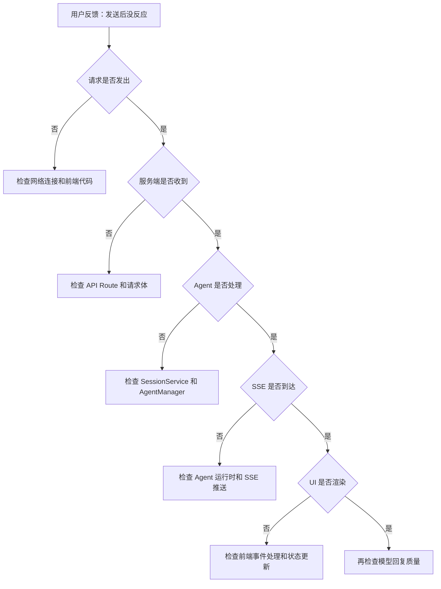

# N04：流式链路复盘工作坊

## 本页先读什么

如果只记住一句话：

> 流式响应是四层边界的连续事件流，不是"发送→回复"。排查时先确认层级，再判断责任。

阅读本页可以按下面的顺序：

| 阅读阶段 | 重点问题 | 对应章节 |
|---------|---------|---------|
| 建立总图 | 流式链路的完整结构是什么？ | 第 1 节 |
| 核心区分 | 哪些概念最容易混淆？ | 第 2 节 |
| 排查地图 | 故障发生时按什么顺序排查？ | 第 3 节 |
| 章节因果链 | 两节课分别补上了哪段判断能力？ | 第 4 节 |
| 源码台账 | 哪些源码已精读，哪些还有缺口？ | 第 5 节 |
| 综合实验 | 如何验证自己的理解？ | 第 6 节 |
| 口头验收 | 能独立回答哪些问题？ | 第 7 节 |

## 1. 流式链路的完整结构

### 1.1 一句话总判断

流式链路的核心判断是：**请求携带身份，处理绑定运行时，流式推送事件，渲染更新状态**。每一层只负责自己的事情，不能跨层假设。

### 1.2 三层含义

1. **请求层决定"发给谁"**：`sessionId` 决定了消息属于哪段会话，但请求成功不等于消息已处理
2. **处理层决定"怎么做"**：`OriginOSAgent` 调用模型、管理历史，但处理成功不等于流式事件已到达
3. **渲染层决定"看得见"**：UI 更新是即时状态，不等于持久化事实

### 1.3 总体认知图

```mermaid
flowchart TD
    subgraph Request["请求层"]
        A[用户输入消息] --> B[POST /api/agent/sessions/{id}/messages]
        B --> C[Request 解析]
    end

    subgraph Process["处理层"]
        C --> D[SessionService.getSession]
        D --> E[AgentManager.getAgent]
        E --> F[OriginOSAgent.sendMessage]
        F --> G[LLM 流式响应]
    end

    subgraph Stream["流式层"]
        G --> H[SSE 事件推送]
        H --> I[前端接收事件]
    end

    subgraph Render["渲染层"]
        I --> J[UI 状态更新]
        J --> K[逐段渲染文字]
        K --> L[用户看到回复]
    end
```

这张图回答的问题是：**从发送到渲染，数据和控制权如何逐层传递？**

- **请求层 → 处理层**：`POST` 请求携带 `sessionId` 和消息内容，API Route 解析后委托给 `SessionService`
- **处理层 → 流式层**：`OriginOSAgent` 调用 LLM，接收流式响应，转换为 SSE 事件
- **流式层 → 渲染层**：前端接收 SSE 事件，更新 UI 状态，逐段渲染文字
- **渲染层 → 用户**：用户看到完整的回复

## 2. 核心区分

### 2.1 三组最容易混淆的对象

| 对象组 | 区别点 | 不能混用的原因 |
|--------|--------|--------------|
| 请求成功 vs 处理成功 | 请求成功只证明请求已到达服务端 | 处理可能在后续步骤失败 |
| 处理成功 vs 流式到达 | 处理成功只证明模型已开始响应 | 流式事件可能因网络中断未到达 |
| 流式到达 vs 渲染成功 | 流式到达只证明事件已到达前端 | 渲染可能因状态管理错误失败 |

### 2.2 认知卡片

**卡片 1：请求成功 ≠ 处理成功**

```
POST 请求返回 200
  → 请求已到达服务端
  → 但 SessionService 可能找不到会话
  → AgentManager 可能找不到 Agent
  → OriginOSAgent 可能初始化失败
```

**卡片 2：处理成功 ≠ 流式到达**

```
OriginOSAgent.sendMessage 成功
  → 模型已开始响应
  → 但 SSE 连接可能断开
  → 前端可能收不到事件
  → 文字可能显示到一半停止
```

**卡片 3：流式到达 ≠ 渲染成功**

```
SSE 事件已到达前端
  → 前端已接收事件
  → 但 useState 更新可能出错
  → React 渲染可能重复
  → 文字可能不显示或重复显示
```

## 3. 排查地图

### 3.1 故障排查流程图



### 3.2 排查口诀

| 层级 | 现象 | 检查点 | 关键字段 |
|------|------|--------|---------|
| 请求层 | 发送后没反应 | 网络连接、前端代码 | `fetch`、`sessionId` |
| 处理层 | 服务端收到但 Agent 不处理 | SessionService、AgentManager | `sessionId`、`agentId` |
| 流式层 | Agent 处理但 SSE 不到达 | Agent 运行时、SSE 连接 | `stream`、`event` |
| 渲染层 | SSE 到达但 UI 不更新 | useState、React 渲染 | `messages`、`setMessages` |

### 3.3 常见故障速查表

| 现象 | 可能原因 | 排查文件 |
|------|---------|---------|
| 发送后没反应 | 网络断开、前端错误 | `SkillDialog.tsx` |
| 服务端返回 404 | 会话不存在、Agent 不存在 | `route.ts`、`session-service.ts` |
| 文字显示到一半停止 | SSE 连接中断、LLM 响应中断 | `agent.ts`、网络状态 |
| 文字重复显示 | 状态管理错误、渲染重复 | `SkillDialog.tsx` |
| 文字不显示 | SSE 事件未处理、状态未更新 | `SkillDialog.tsx` |

## 4. 章节因果链

| 课次 | 解决的判断问题 | 核心能力 | 边界 |
|------|--------------|---------|------|
| N03 | 从发送到渲染，中间经过哪些步骤？ | 能追踪四层边界的完整链路 | 只到 UI 渲染，不包括持久化和历史恢复 |
| N04 | 流式链路异常时如何按证据排查？ | 能按层级定位故障，不跳过层级 | 只覆盖流式链路，不包括入口链路 |

N03 建立了**正向追踪**能力：从用户发送到 UI 渲染，能说出每一步的对象、数据和边界。

N04 建立了**反向诊断**能力：从故障症状到责任层，能按证据顺序排查，不凭猜测。

## 5. 源码覆盖台账

### 5.1 已精读（复用前序 Part）

| 文件 | 主讲章节 | 代码窗口 | 教学责任 |
|------|---------|---------|---------|
| `packages/web/src/app/api/agent/sessions/[sessionId]/messages/route.ts` | N03 | 第 1—100 行 | API Route 边界 |
| `packages/core/src/lib/integrations/pi-agent/core/agent.ts` | N03 | 第 100—300 行 | Agent 消息处理 |
| `packages/web/src/components/skills/SkillDialog.tsx` | N03 | 第 200—400 行 | UI 状态管理 |

### 5.2 背景引用

| 文件 | 引用场景 | 教学责任 |
|------|---------|---------|
| `packages/core/src/lib/integrations/pi-agent/session-store.ts` | 会话存储 | 会话历史和恢复 |
| `packages/core/src/lib/integrations/pi-agent/agent-manager.ts` | Agent 管理 | Agent 注册和获取 |

### 5.3 后续单元

| 文件 | 后续单元 | 教学责任 |
|------|---------|---------|
| `packages/core/src/lib/integrations/pi-agent/core/stream-dedupe.ts` | N05 | 流式去重 |
| `packages/core/src/lib/integrations/pi-agent/core/stream-render-scheduler.ts` | N05 | 流式渲染调度 |

## 6. 综合实验

### 实验 1：纸面推演

给定以下材料，推演流式链路的完整过程：

```
sessionId = "trip-2024-001"
用户消息 = "帮我规划一个五天的旅行行程"
```

**合格推演应包含**：

1. `POST` 请求的 Request 和 Response
2. `SessionService.getSession` 的输入和输出
3. `OriginOSAgent.sendMessage` 的处理流程
4. SSE 事件的顺序和内容
5. UI 状态的更新过程

### 实验 2：故障模拟

**场景 A**：`sessionId` 不存在。

**问题**：
1. API Route 会返回什么？
2. `SkillDialog` 会显示什么？
3. 用户能看到什么反馈？
4. 如何修复？

**场景 B**：SSE 连接在文字显示到一半时断开。

**问题**：
1. 前端会显示什么？
2. 会话历史是否保存了部分回复？
3. 用户能否继续发送消息？
4. 如何恢复？

### 实验 3：源码追踪

1. 在 `route.ts` 的 `POST` 函数处设置断点
2. 在 `agent.ts` 的 `sendMessage` 处设置断点
3. 在 `SkillDialog.tsx` 的 SSE 处理处设置断点
4. 发送消息，逐步执行，验证调用链

## 7. 口头验收

学完 N03—N04 后，不看正文也应能回答下面八个问题：

1. 从用户发送到 UI 渲染，中间经过哪些层？每层的关键对象是什么？
2. 为什么"请求成功"不等于"消息已处理"？
3. SSE 和 WebSocket 的区别是什么？
4. 如果发送后没反应，应该按什么顺序排查？
5. 如果文字出现到一半停止了，可能的原因有哪些？
6. 为什么"处理成功"不等于"流式到达"？
7. 为什么"流式到达"不等于"渲染成功"？
8. 流式链路的四层边界中，哪一层最容易被忽略？为什么？

## 8. 进入下一单元

N03—N04 建立的是流式链路的完整认知。下一单元（N05—N06）会继续追踪：**当链路出现故障时，如何从症状反推到责任层**。

本单元的结论可以压缩成一句话：

> 流式响应是四层边界的连续事件流，不是"发送→回复"。排查时先确认层级，再判断责任，不跳过层级，不凭猜测。

下一单元的核心判断是：**当 Agent 不回复、回复错误、会话丢失时，如何按证据逐层定位故障？**
