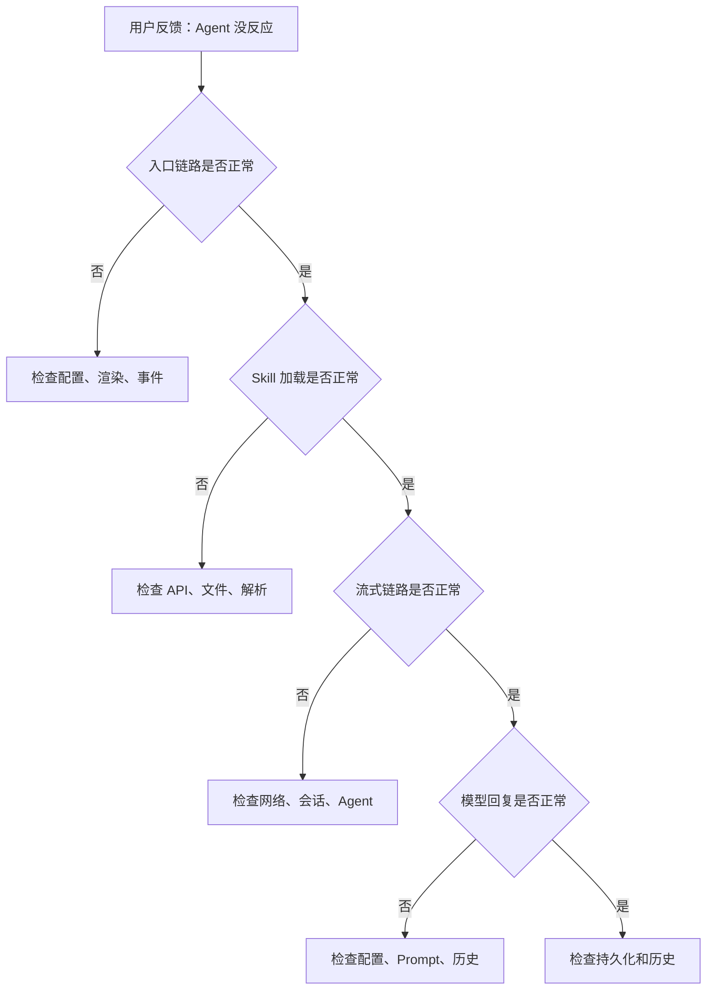

# N05：从故障症状到责任层定位

## 开篇场景

小林点击"旅行助手"，窗口打开了，输入消息后没有任何反应。他不知道问题出在哪里。

从用户视角看，这只是"没反应"。但从系统视角看，这个问题可能来自入口链路、流式链路、模型运行时或持久化任何一个层级。本课要建立一套**系统化的故障诊断方法**。

## 核心问题

> 当 Agent 不回复、回复错误、会话丢失时，如何按证据逐层定位故障？

## 1. 直觉与概念阶梯

### 1.1 直觉：没反应就是坏了

用户看到"没反应"时，第一反应是"系统坏了"。但"系统坏了"是一个模糊的判断，无法指导排查。

### 1.2 术语：症状、层级、证据

| 术语 | 定义 | 示例 |
|------|------|------|
| 症状 | 用户可见的现象 | "没反应"、"文字显示到一半" |
| 层级 | 系统架构中的边界 | 入口层、流式层、模型层 |
| 证据 | 可观察的事实 | 日志、网络请求、状态 |

### 1.3 边界：症状不等于原因

- **症状**是用户可见的现象，可能来自多个层级
- **层级**是系统架构中的边界，每个层级有明确的职责
- **证据**是可观察的事实，用于定位故障层级

## 2. 图解：故障诊断主路径



这张图可以分成四段读：

**第一段是入口链路排查**：确认卡片是否渲染、点击事件是否触发、窗口是否打开。这一步的关键是**先确认用户操作能到达系统**。

**第二段是 Skill 加载排查**：确认 Skill 内容是否加载、Prompt 是否构建正确、会话是否创建。这一步的关键是**确认系统能准备就绪**。

**第三段是流式链路排查**：确认请求是否发出、Agent 是否处理、SSE 是否到达、UI 是否渲染。这一步的关键是**确认数据能流动**。

**第四段是模型回复排查**：确认模型配置是否正确、Prompt 是否完整、历史是否污染。这一步的关键是**确认模型能正确工作**。

## 3. 源码精读

### 3.1 入口链路排查

[packages/web/src/config/homeApps.ts 第 1—30 行](../../../../packages/web/src/config/homeApps.ts#L1)

```typescript
// 检查点：配置是否正确
export const HOME_APPS: HomeAppConfig[] = [
  {
    id: 'travel-assistant',
    name: '旅行助手',
    type: 'skill',
    skillName: 'travel-assistant', // 检查点：skillName 是否正确
  },
];
```

[packages/web/src/components/framework/AppCard.tsx 第 1—100 行](../../../../packages/web/src/components/framework/AppCard.tsx#L1)

```typescript
// 检查点：事件是否绑定
export function AppCard({ app, onClick }: AppCardProps) {
  return (
    <div onClick={() => onClick(app)}> // 检查点：onClick 是否绑定
      <Icon name={app.icon} />
      <span>{app.name}</span>
    </div>
  );
}
```

### 3.2 流式链路排查

[packages/web/src/app/api/agent/sessions/[sessionId]/messages/route.ts 第 1—100 行](../../../../packages/web/src/app/api/agent/sessions/[sessionId]/messages/route.ts#L1)

```typescript
// 检查点：会话是否存在
const session = await sessionService.getSession(sessionId);
if (!session) {
  return new Response('Session not found', { status: 404 }); // 检查点：404 表示会话不存在
}

// 检查点：Agent 是否存在
const agent = await agentManager.getAgent(sessionId);
if (!agent) {
  return new Response('Agent not found', { status: 404 }); // 检查点：404 表示 Agent 不存在
}
```

### 3.3 模型回复排查

[packages/core/src/lib/integrations/pi-agent/core/agent.ts 第 100—300 行](../../../../packages/core/src/lib/integrations/pi-agent/core/agent.ts#L100)

```typescript
// 检查点：模型配置是否正确
const stream = await this.llm.chat.completions.create({
  messages: this.history, // 检查点：历史是否正确
  model: this.config.model, // 检查点：模型是否正确
  temperature: this.config.temperature, // 检查点：温度参数是否正确
});
```

## 4. 调用链和数据流

### 4.1 正向追踪

```text
用户反馈：Agent 没反应
  → 检查入口链路
    → 检查配置
    → 检查渲染
    → 检查事件
  → 检查 Skill 加载
    → 检查 API
    → 检查文件
    → 检查解析
  → 检查流式链路
    → 检查网络
    → 检查会话
    → 检查 Agent
  → 检查模型回复
    → 检查配置
    → 检查 Prompt
    → 检查历史
```

### 4.2 数据变化

| 步骤 | 数据变化 |
|------|---------|
| 检查配置 | 确认 `HOME_APPS` 配置正确 |
| 检查渲染 | 确认 `AppCard` 渲染成功 |
| 检查事件 | 确认 `onClick` 绑定正确 |
| 检查 API | 确认 `fetchSkillContent` 返回成功 |
| 检查文件 | 确认 `SKILL.md` 存在 |
| 检查解析 | 确认 `buildSkillSystemPrompt` 成功 |
| 检查网络 | 确认 `POST` 请求成功 |
| 检查会话 | 确认 `sessionId` 存在 |
| 检查 Agent | 确认 `AgentManager` 注册成功 |
| 检查配置 | 确认模型配置正确 |
| 检查 Prompt | 确认系统 Prompt 完整 |
| 检查历史 | 确认消息历史正确 |

## 5. 失败路径与边界

### 5.1 配置错误

**场景**：`HOME_APPS` 中 `skillName` 拼写错误。

**症状**：点击卡片后窗口打开，但内容为空。

**排查**：检查 `homeApps.ts` 中 `skillName` 是否正确。

### 5.2 会话不存在

**场景**：`sessionId` 错误或会话已过期。

**症状**：输入消息后返回 404。

**排查**：检查 `sessionId` 是否正确，会话是否已创建。

### 5.3 Agent 未注册

**场景**：`AgentManager` 中没有对应的 Agent 实例。

**症状**：输入消息后返回 404。

**排查**：检查 Agent 是否已注册，是否已初始化。

### 5.4 模型配置错误

**场景**：模型 API Key 缺失或模型不可用。

**症状**：Agent 处理消息时抛出错误。

**排查**：检查模型配置，确认 API Key 和模型可用性。

## 6. 测试证据

### 6.1 已有测试

| 测试文件 | 测试内容 | 证明什么 | 未证明什么 |
|---------|---------|---------|-----------|
| `packages/web/src/store/__tests__/dockStore.test.ts` | Dock 去重和恢复 | 配置稳定性 | 端到端链路 |
| `packages/core/src/lib/integrations/pi-agent/__tests__/agent.test.ts` | Agent 消息处理 | 消息发送 | 故障诊断 |

### 6.2 测试缺口

- 故障诊断自动化测试
- 端到端故障模拟测试
- 故障恢复测试

## 7. 小实验

### 实验 1：模拟配置错误

1. 在 `homeApps.ts` 中，把某个 `skillName` 改成不存在的值
2. 刷新页面，点击该卡片
3. 观察错误信息，定位到 `fetchSkillContent`
4. 恢复配置，验证正常

### 实验 2：模拟会话不存在

1. 在浏览器控制台中，手动发送 `POST` 请求到不存在的 `sessionId`
2. 观察返回的 404 错误
3. 检查 `session-service.ts` 的错误处理

### 实验 3：模拟模型配置错误

1. 在 `agent.ts` 中，把模型 API Key 改成错误的值
2. 发送消息，观察错误信息
3. 恢复配置，验证正常

## 8. 口头验收

学完本课后，不看正文也应能回答下面五个问题：

1. 当用户说"Agent 没反应"时，应该按什么顺序排查？
2. 为什么"猜测原因"不等于"按证据排查"？
3. 局部排查和全局排查的区别是什么？
4. 正向追踪和反向诊断的区别是什么？
5. 如何建立一套可复用的诊断框架？

## 9. 章节收束

本课建立了从故障症状到责任层定位的系统化方法。关键结论是：**故障诊断不是"猜原因"，而是"按证据逐层排除"。先确认层级，再判断责任，不跳过层级，不凭猜测**。

下一课（N06）会做单元小结，把这套方法组织成**可复用的诊断框架**。
