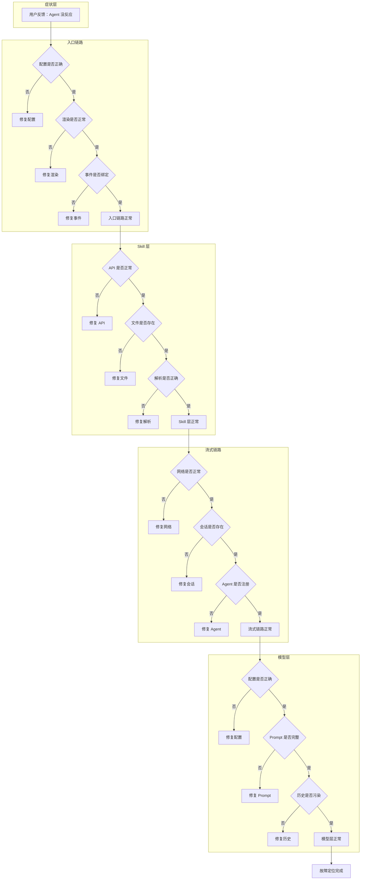
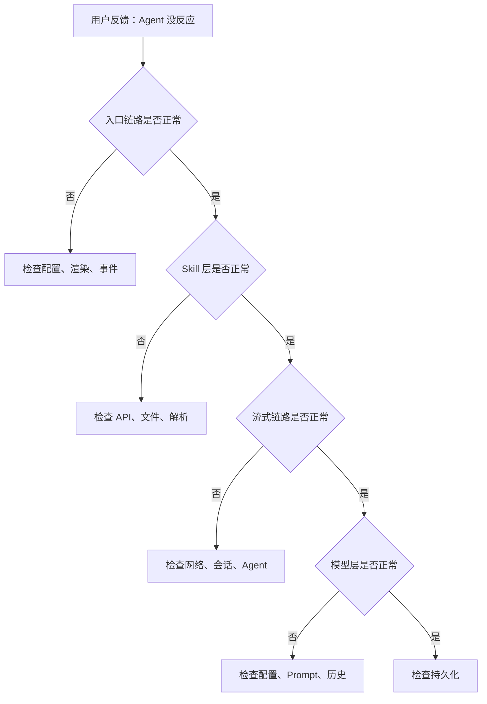

# N06：故障诊断复盘工作坊

## 本页先读什么

如果只记住一句话：

> 故障诊断不是"猜原因"，而是"按证据逐层排除"。先确认层级，再判断责任，不跳过层级，不凭猜测。

阅读本页可以按下面的顺序：

| 阅读阶段 | 重点问题 | 对应章节 |
|---------|---------|---------|
| 建立总图 | 故障诊断的完整框架是什么？ | 第 1 节 |
| 核心区分 | 哪些概念最容易混淆？ | 第 2 节 |
| 排查地图 | 真实故障场景如何排查？ | 第 3 节 |
| 章节因果链 | 两节课分别补上了哪段判断能力？ | 第 4 节 |
| 源码台账 | 哪些源码已精读，哪些还有缺口？ | 第 5 节 |
| 综合实验 | 如何验证自己的理解？ | 第 6 节 |
| 口头验收 | 能独立回答哪些问题？ | 第 7 节 |

## 1. 故障诊断的完整框架

### 1.1 一句话总判断

故障诊断的核心判断是：**症状不等于原因，层级不等于责任，证据不等于结论**。诊断时必须按证据顺序，不能凭猜测。

### 1.2 三层含义

1. **症状是起点，不是终点**：用户说"没反应"只是症状，真正的原因可能在入口链路、流式链路或模型层
2. **层级是边界，不是原因**：每一层只负责自己的事情，不能跨层假设
3. **证据是工具，不是结论**：证据用于定位层级，但不能直接得出原因

### 1.3 总体认知图



这张图回答的问题是：**当用户说"Agent 没反应"时，应该按什么顺序排查？**

- **症状层**：用户反馈是起点，但不是终点
- **入口链路**：先确认配置、渲染、事件是否正常
- **Skill 层**：再确认 API、文件、解析是否正常
- **流式链路**：再确认网络、会话、Agent 是否正常
- **模型层**：最后确认配置、Prompt、历史是否正常

## 2. 核心区分

### 2.1 三组最容易混淆的诊断方法

| 方法组 | 区别点 | 不能混用的原因 |
|--------|--------|--------------|
| 猜测 vs 证据 | 猜测凭直觉，证据凭事实 | 猜测可能跳过真正的故障层 |
| 局部 vs 全局 | 局部只检查某个组件，全局从入口到出口 | 局部排查可能遗漏真正的故障层 |
| 正向 vs 反向 | 正向从入口到出口，反向从症状到责任层 | 正向追踪适合验证，反向诊断适合定位 |

### 2.2 认知卡片

**卡片 1：症状 ≠ 原因**

```
用户说"没反应"
  → 这是症状，不是原因
  → 原因可能在入口链路、流式链路或模型层
  → 必须按证据顺序排查
```

**卡片 2：层级 ≠ 责任**

```
入口链路正常
  → 只证明入口链路没问题
  → 不能证明流式链路或模型层没问题
  → 必须继续排查下一层
```

**卡片 3：证据 ≠ 结论**

```
日志显示 404
  → 这是证据，不是结论
  → 404 可能表示会话不存在、Agent 未注册或路径错误
  → 必须进一步定位具体原因
```

## 3. 排查地图

### 3.1 故障排查流程图



### 3.2 排查口诀

| 层级 | 现象 | 检查点 | 关键字段 |
|------|------|--------|---------|
| 入口链路 | 卡片不出现、点击无反应 | 配置、渲染、事件 | `HOME_APPS`、`AppCard`、`onClick` |
| Skill 层 | 窗口打开但内容为空 | API、文件、解析 | `skillName`、`SKILL.md` |
| 流式链路 | 输入后没反应、文字显示到一半 | 网络、会话、Agent | `sessionId`、`AgentManager` |
| 模型层 | 回复不符合预期 | 配置、Prompt、历史 | `model`、`temperature`、`history` |

### 3.3 常见故障速查表

| 现象 | 可能原因 | 排查文件 |
|------|---------|---------|
| 卡片不出现 | 配置错误、导入错误 | `homeApps.ts` |
| 点击无反应 | 事件未绑定、类型不匹配 | `AppCard.tsx`、`page.tsx` |
| 窗口打开但内容为空 | Skill 加载失败、解析错误 | `SkillDialog.tsx`、API |
| 输入后没反应 | 会话不存在、Agent 未注册 | `route.ts`、`session-service.ts` |
| 文字显示到一半 | SSE 中断、网络断开 | `agent.ts`、网络状态 |
| 回复不符合预期 | 模型配置错误、Prompt 问题 | `agent.ts`、配置 |

## 4. 章节因果链

| 课次 | 解决的判断问题 | 核心能力 | 边界 |
|------|--------------|---------|------|
| N05 | 典型故障如何反向诊断？ | 能从症状出发，按证据逐层定位 | 只覆盖常见故障，不包括边缘场景 |
| N06 | 诊断框架如何系统化？ | 能建立可复用的诊断框架 | 只提供框架，不包括所有故障场景 |

N05 建立了**反向诊断**能力：从症状出发，按证据逐层定位故障。

N06 建立了**系统化框架**能力：把诊断方法组织成可复用的框架。

## 5. 源码覆盖台账

### 5.1 已精读（复用前序 Part）

| 文件 | 主讲章节 | 代码窗口 | 教学责任 |
|------|---------|---------|---------|
| `packages/web/src/config/homeApps.ts` | N05 | 第 1—30 行 | 配置驱动入口 |
| `packages/web/src/components/framework/AppCard.tsx` | N05 | 第 1—100 行 | 纯展示组件 |
| `packages/web/src/app/page.tsx` | N05 | 第 1400—1450 行 | 事件分流 |
| `packages/web/src/components/skills/SkillDialog.tsx` | N05 | 第 1—200 行 | Skill 加载和会话创建 |
| `packages/core/src/lib/features/agent/session-service.ts` | N05 | 第 1—100 行 | 会话生命周期 |
| `packages/core/src/lib/integrations/pi-agent/core/agent.ts` | N05 | 第 100—300 行 | Agent 消息处理 |

### 5.2 背景引用

| 文件 | 引用场景 | 教学责任 |
|------|---------|---------|
| `packages/web/src/store/appWindowStore.ts` | 窗口管理 | 窗口状态与会话的关系 |
| `packages/web/src/services/AppWindowManager.ts` | 窗口管理 | 窗口生命周期 |

### 5.3 后续单元

| 文件 | 后续单元 | 教学责任 |
|------|---------|---------|
| `packages/core/src/lib/integrations/pi-agent/core/stream-dedupe.ts` | N07 | 流式去重 |
| `packages/core/src/lib/integrations/pi-agent/core/stream-render-scheduler.ts` | N07 | 流式渲染调度 |

## 6. 综合实验

### 实验 1：纸面推演

给定以下材料，推演故障诊断的完整过程：

```
用户反馈：点击"旅行助手"后，窗口打开了，但输入消息后没有任何反应。
```

**合格推演应包含**：

1. 检查入口链路：配置、渲染、事件
2. 检查 Skill 层：API、文件、解析
3. 检查流式链路：网络、会话、Agent
4. 检查模型层：配置、Prompt、历史
5. 每一步的证据和结论

### 实验 2：故障模拟

**场景 A**：`HOME_APPS` 中 `skillName` 拼写错误。

**问题**：
1. 症状是什么？
2. 应该按什么顺序排查？
3. 最终原因是什么？
4. 如何修复？

**场景 B**：`SessionService.getSession` 返回 `null`。

**问题**：
1. 症状是什么？
2. 应该按什么顺序排查？
3. 最终原因是什么？
4. 如何修复？

### 实验 3：源码追踪

1. 在 `homeApps.ts` 中，把某个 `skillName` 改成不存在的值
2. 在浏览器中点击该卡片
3. 按证据顺序排查，定位故障
4. 恢复配置，验证正常

## 7. 口头验收

学完 N05—N06 后，不看正文也应能回答下面八个问题：

1. 当用户说"Agent 没反应"时，应该按什么顺序排查？
2. 为什么"猜测原因"不等于"按证据排查"？
3. 局部排查和全局排查的区别是什么？
4. 正向追踪和反向诊断的区别是什么？
5. 如何建立一套可复用的诊断框架？
6. 为什么"症状不等于原因"？
7. 为什么"层级不等于责任"？
8. 为什么"证据不等于结论"？

## 8. 进入下一单元

N05—N06 建立的是故障诊断的完整认知。下一单元（N07）会把所有知识综合起来，做一次**全链路实战**。

本单元的结论可以压缩成一句话：

> 故障诊断不是"猜原因"，而是"按证据逐层排除"。先确认层级，再判断责任，不跳过层级，不凭猜测。

下一单元的核心判断是：**如何安全地做一个小改动，并验证它不破坏现有链路？**
