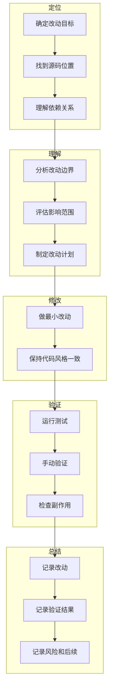

# N07：全链路实战工作坊

## 本页先读什么

如果只记住一句话：

> 实战不是"改完就跑"，而是"定位→理解→修改→验证→总结"的完整闭环。每一步都有证据，每一步都可追溯。

阅读本页可以按下面的顺序：

| 阅读阶段 | 重点问题 | 对应章节 |
|---------|---------|---------|
| 建立总图 | 实战的完整流程是什么？ | 第 1 节 |
| 核心区分 | 哪些步骤最容易被跳过？ | 第 2 节 |
| 实战场景 | 真实场景如何操作？ | 第 3 节 |
| 源码台账 | 哪些源码已精读，哪些还有缺口？ | 第 4 节 |
| 综合实验 | 如何验证自己的理解？ | 第 5 节 |
| 口头验收 | 能独立回答哪些问题？ | 第 6 节 |

## 1. 实战的完整流程

### 1.1 一句话总判断

实战的核心判断是：**改动不是目的，验证才是目的。每一步都有证据，每一步都可追溯**。

### 1.2 五步法

1. **定位**：找到需要改动的源码位置
2. **理解**：理解改动的边界和影响
3. **修改**：做最小改动
4. **验证**：验证改动不破坏现有链路
5. **总结**：记录改动和验证结果

### 1.3 总体认知图



这张图回答的问题是：**如何安全地做一个小改动，并验证它不破坏现有链路？**

- **定位**：找到需要改动的源码位置，理解依赖关系
- **理解**：分析改动边界，评估影响范围，制定改动计划
- **修改**：做最小改动，保持代码风格一致
- **验证**：运行测试，手动验证，检查副作用
- **总结**：记录改动、验证结果和风险

## 2. 核心区分

### 2.1 三组最容易混淆的步骤

| 步骤组 | 区别点 | 不能跳过的原因 |
|--------|--------|--------------|
| 定位 vs 理解 | 定位找到位置，理解分析边界 | 只定位不理解，可能改动影响范围未知 |
| 修改 vs 验证 | 修改是动作，验证是结果 | 只修改不验证，可能引入新 bug |
| 验证 vs 总结 | 验证是检查，总结是记录 | 只验证不总结，后续无法追溯 |

### 2.2 认知卡片

**卡片 1：定位 ≠ 理解**

```
找到了源码位置
  → 这是定位
  → 但还不理解改动的边界和影响
  → 必须继续分析依赖关系和影响范围
```

**卡片 2：修改 ≠ 验证**

```
代码已修改
  → 这是修改
  → 但还不知道是否引入新 bug
  → 必须运行测试和手动验证
```

**卡片 3：验证 ≠ 总结**

```
测试已通过
  → 这是验证
  → 但还没有记录改动和验证结果
  → 必须总结记录，便于后续追溯
```

## 3. 实战场景

### 3.1 场景：新增首页入口

**目标**：为已有 `task-manager` Skill 新增一个首页入口。

**步骤**：

1. **定位**：找到 `homeApps.ts` 和 `page.tsx`
2. **理解**：理解 `HomeAppConfig` 结构和 `handleSkillLaunch` 调用链
3. **修改**：在 `HOME_APPS` 中新增一项
4. **验证**：刷新页面，点击卡片，验证 SkillDialog 打开和内容加载
5. **总结**：记录改动和验证结果

### 3.2 场景：修改 Skill 内容

**目标**：修改 `travel-assistant` Skill 的说明文件。

**步骤**：

1. **定位**：找到 `templates/skills/travel-assistant/SKILL.md`
2. **理解**：理解 `SKILL.md` 结构和 `buildSkillSystemPrompt` 调用链
3. **修改**：修改 `SKILL.md` 内容
4. **验证**：刷新页面，点击卡片，验证内容更新
5. **总结**：记录改动和验证结果

### 3.3 场景：修复流式中断

**目标**：修复 SSE 连接中断后无法恢复的问题。

**步骤**：

1. **定位**：找到 `agent.ts` 和 `SkillDialog.tsx`
2. **理解**：理解 SSE 连接管理和重连机制
3. **修改**：添加重连逻辑
4. **验证**：模拟 SSE 中断，验证自动重连
5. **总结**：记录改动和验证结果

## 4. 源码覆盖台账

### 4.1 已精读（复用前序 Part）

| 文件 | 主讲章节 | 代码窗口 | 教学责任 |
|------|---------|---------|---------|
| `packages/web/src/config/homeApps.ts` | N01 | 第 1—30 行 | 配置驱动入口 |
| `packages/web/src/components/framework/AppCard.tsx` | N01 | 第 1—100 行 | 纯展示组件 |
| `packages/web/src/app/page.tsx` | N01 | 第 1400—1450 行 | 事件分流 |
| `packages/web/src/components/skills/SkillDialog.tsx` | N01 | 第 1—200 行 | Skill 加载和会话创建 |
| `packages/core/src/lib/features/agent/session-service.ts` | N01 | 第 1—100 行 | 会话生命周期 |
| `packages/core/src/lib/integrations/pi-agent/core/agent.ts` | N01 | 第 1—100 行 | Agent 初始化 |

### 4.2 背景引用

| 文件 | 引用场景 | 教学责任 |
|------|---------|---------|
| `packages/web/src/store/appWindowStore.ts` | 窗口管理 | 窗口状态与会话的关系 |
| `packages/web/src/services/AppWindowManager.ts` | 窗口管理 | 窗口生命周期 |

### 4.3 后续单元

| 文件 | 后续单元 | 教学责任 |
|------|---------|---------|
| `packages/core/src/lib/integrations/pi-agent/core/stream-dedupe.ts` | 后续 | 流式去重 |
| `packages/core/src/lib/integrations/pi-agent/core/stream-render-scheduler.ts` | 后续 | 流式渲染调度 |

## 5. 综合实验

### 实验 1：新增首页入口

1. 在 `homeApps.ts` 中新增一项：

```typescript
{
  id: 'task-manager',
  name: '任务管理',
  description: '管理你的任务',
  icon: 'CheckSquare',
  color: 'green',
  type: 'skill',
  skillName: 'task-manager',
}
```

2. 刷新页面，验证卡片出现
3. 点击卡片，验证 SkillDialog 打开
4. 验证内容加载正确

### 实验 2：修改 Skill 内容

1. 打开 `templates/skills/travel-assistant/SKILL.md`
2. 修改说明内容
3. 刷新页面，点击卡片
4. 验证内容更新

### 实验 3：修复流式中断

1. 打开 `agent.ts`
2. 添加 SSE 重连逻辑：

```typescript
// 简化示意
if (event.type === 'error') {
  // 重连逻辑
  setTimeout(() => {
    // 重新连接 SSE
  }, 1000);
}
```

3. 模拟 SSE 中断
4. 验证自动重连

## 6. 口头验收

学完 N07 后，不看正文也应能回答下面八个问题：

1. 实战的五步法是什么？
2. 为什么"定位不等于理解"？
3. 为什么"修改不等于验证"？
4. 为什么"验证不等于总结"？
5. 新增首页入口时，应该检查哪些点？
6. 修改 Skill 内容时，应该注意什么？
7. 修复流式中断时，应该考虑哪些边界？
8. 如何记录改动和验证结果？

## 7. 进入总结

N07 是 Part N 的最后一课。本 Part 的结论可以压缩成一句话：

> 全链路复盘不是"看完就忘"，而是"能追踪、能定位、能改动、能验证"。

学完 Part N 后，你应该能做到：

1. **追踪**：从用户入口到最终副作用，能说出每一步的对象、数据和边界
2. **定位**：从故障症状到责任层，能按证据顺序排查
3. **改动**：能安全地做一个小改动，并验证它不破坏现有链路
4. **验证**：能运行测试、手动验证、检查副作用

这就是 Part N 的核心目标：**把碎片知识连成可操作的能力**。
