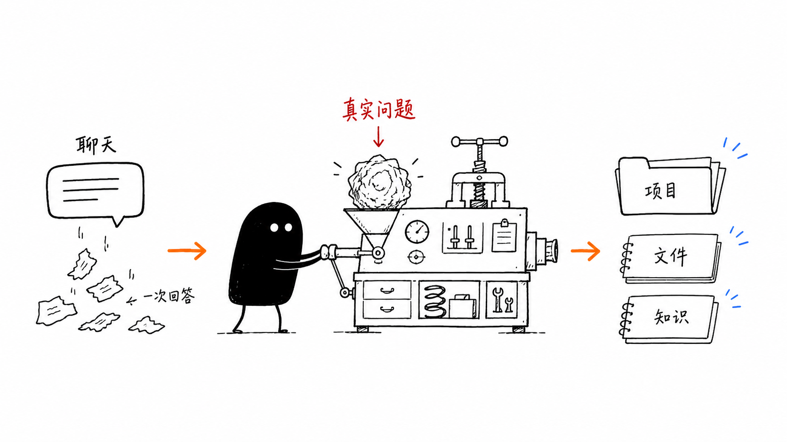
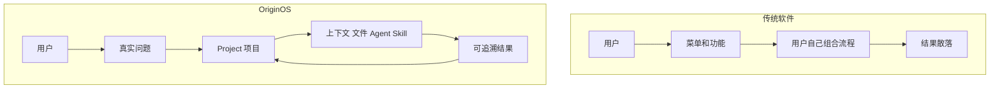
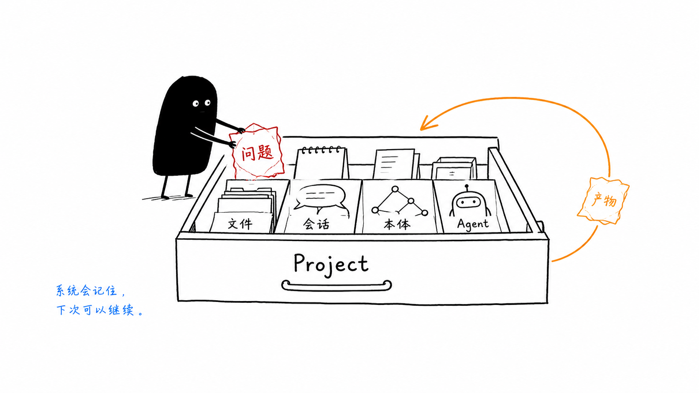
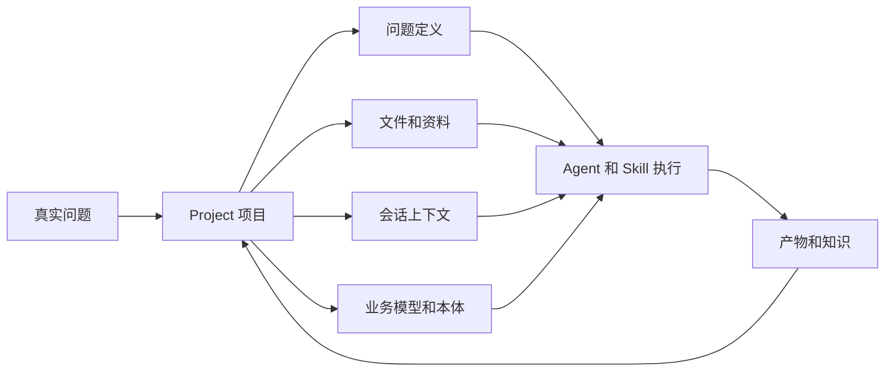
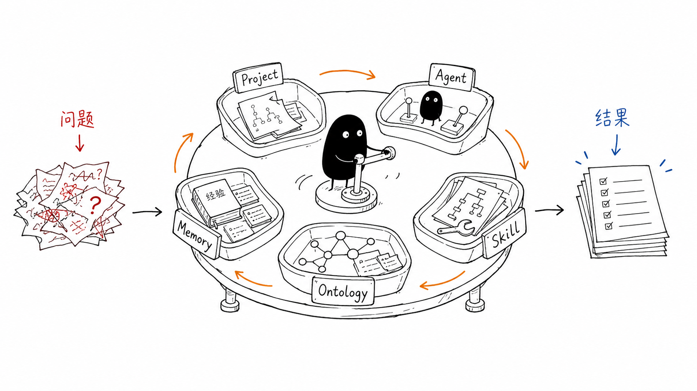
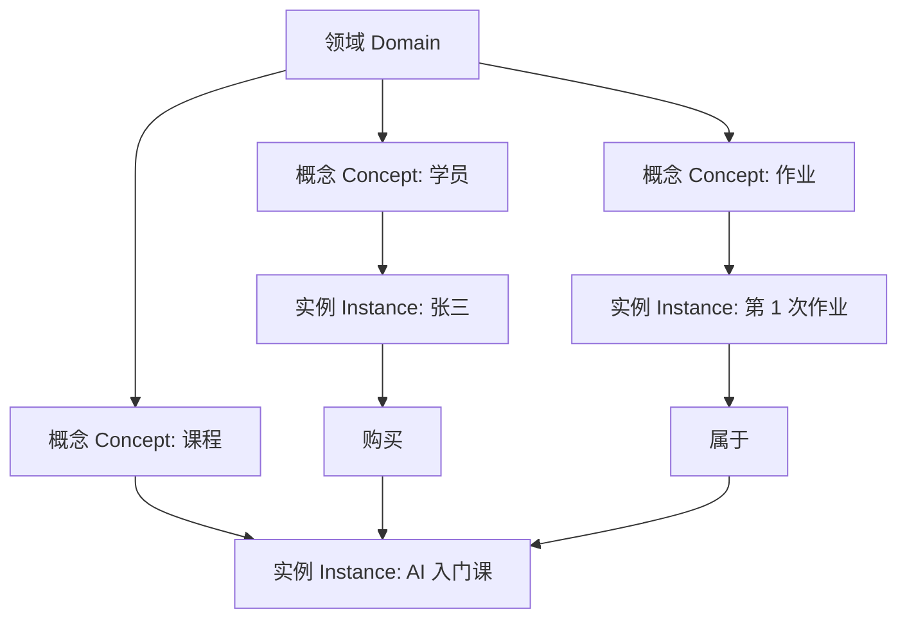
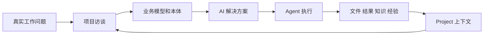
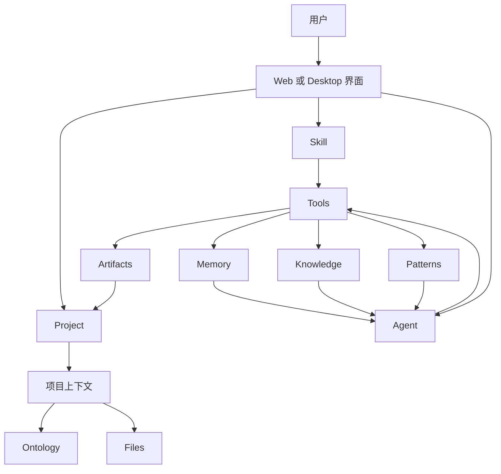
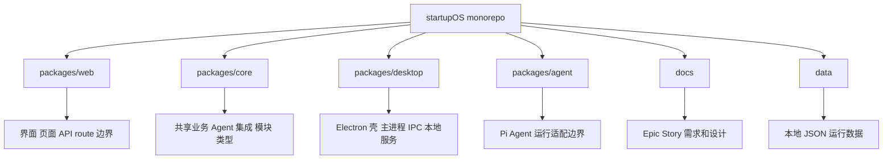

# 第 1 节：OriginOS 到底是什么

这一节先不追源码细节。我们先建立一张“项目地图”：以后你再看 `packages/web`、`packages/core`、`packages/desktop`、`Agent`、`Skill`、`Ontology`，不会觉得它们是一堆散乱名词。

本节目标：

- 知道 OriginOS 和普通聊天工具的根本区别；
- 知道为什么它从 `Project` 开始组织真实工作；
- 记住第一遍最重要的 5 个对象；
- 能看懂后面 11 节课会围绕什么展开。

参考入口：

- `README.md`
- `AGENTS.md`
- `learning-note/macro-map.md`

## 1. 一句话理解

OriginOS 是一个面向个人和小团队的 AI Native 工作系统。

这句话里有三个关键词：

- `AI Native`：AI 不是附加按钮，而是系统的核心交互方式；
- `工作系统`：它不只回答问题，还要组织项目、文件、上下文、执行和沉淀；
- `个人和小团队`：它面向真实工作，不是只做演示聊天。

通俗地说：

> 普通聊天工具像一个“问答窗口”；OriginOS 更像一个“AI 工作桌面”。

你带着一个真实问题进来，系统尝试把问题变成项目，再组织 Agent、Skill、文件、业务模型和知识沉淀，最后把事情推进到可交付的结果。



这张小黑图想表达的不是“它有聊天框”，而是：

- 左边：普通聊天容易变成一次性回答；
- 中间：小黑推动一个工作台，把真实问题压进系统；
- 右边：输出不只是文字，而是项目、文件和知识。

所以第一节最重要的判断是：

> OriginOS 不是围绕“回答”设计的，而是围绕“把一件工作持续做下去”设计的。

## 2. 从问题开始，而不是从菜单开始

`README.md` 里有一句很关键的话：

> Instead of starting from fixed software menus, it starts from the problem you want to solve.

人话翻译：

> 传统软件通常让你先找功能；OriginOS 想让你先说问题。

这是产品层面的根本变化。

传统软件通常是：

```text
打开软件
-> 看菜单
-> 找功能
-> 用户自己判断该怎么组合
-> 结果散在文件、聊天记录、截图和脑子里
```

比如你要做“用户增长分析”，传统工具可能各管一段：文档软件写报告，表格软件算数据，聊天工具帮你想结论，文件夹存资料。真正把这些东西串起来的人，是你自己。

OriginOS 想做的是：

```text
说出真实问题
-> 进入 Project
-> Project Agent 访谈和补上下文
-> 形成业务模型和本体
-> 设计 AI 方案
-> Agent / Skill 执行
-> 文件、知识、经验回到项目里
```

用 Mermaid 看更清楚：



这里要注意：OriginOS 不是没有菜单，也不是不需要 UI。它的意思是，系统的核心组织方式不是“菜单树”，而是“问题变成项目，项目驱动执行”。

## 3. 为什么问题要进入 Project

新手很容易问：

> 我直接问 AI 不就行了吗？为什么还要有 Project？

因为真实工作和一次问答不一样。

一次问答只需要：

- 当前问题；
- 当前模型；
- 当前回答。

但一个真实项目通常还需要：

- 问题定义；
- 背景资料；
- 用户上传的文件；
- 多轮会话；
- 业务事实；
- 结构化模型；
- 执行过程；
- 产物版本；
- 下次继续时还能接上。

`Project` 就是用来承载这些东西的容器。



这张图里，`Project` 像一个会记住东西的工作抽屉。小黑把“问题”塞进去以后，它不只是保存一句话，而是把文件、会话、本体、Agent 和产物都放在同一个上下文边界里。

对应到系统理解：



这一段先记住一句话：

> Project 是把“一次性问题”变成“可持续工作”的容器。

不要把 `Project` 只理解成一个文件夹。文件夹只是存储形式的一部分。产品概念上的 `Project` 更像一个工作上下文边界：什么资料属于这件事，哪个 Agent 在处理，产物写到哪里，后面怎么继续，都要靠它串起来。

## 4. 第一遍先记住 5 个核心对象

这一课不用背所有目录。先记住 5 个对象：

- `Project`
- `Agent`
- `Skill`
- `Ontology`
- `Memory / Knowledge / Patterns`



这张图的意思是：这 5 个对象不是并列摆设，它们会在同一件工作里协作。

下面逐个解释。

### 4.1 Project：项目上下文

`Project` 是真实工作的容器。

它负责回答一个问题：

> 这件工作到底属于哪里？

项目里可能会放：

- 项目元数据；
- 用户文件；
- 项目会话；
- 业务事实；
- 本体模型；
- 产物；
- 后续 Agent 可复用的上下文。

如果没有 `Project`，每次对话都容易变成孤立片段。你今天问过什么、上传过什么、生成过什么、下次该从哪里继续，都需要重新拼。

### 4.2 Agent：执行者

`Agent` 是能对话、能使用工具、能产生结果的执行者。

它不是简单的“调用一次模型 API”。在 OriginOS 里，一个 Agent 通常还会关联：

- 会话；
- system prompt；
- 工具列表；
- 工作目录；
- 记忆；
- 可访问的项目上下文；
- 流式输出过程。

后面我们会区分普通 Agent、RoleAgent、Project Agent。第一遍先不用展开，只要知道：

> Agent 是会在上下文里行动的执行者，不只是会说话的模型。

### 4.3 Skill：可复用工作流

`Skill` 可以理解成打包好的专项能力。

它更像一个“聚焦任务的小应用”：

- 做某类文件处理；
- 跑某个固定流程；
- 生成某类产物；
- 给 Agent 提供可复用方法。

Skill 和 Agent 的区别可以先这样粗略理解：

- `Agent` 更像一个执行者；
- `Skill` 更像执行者可以调用的一套方法或小工具。

当然，实际代码里 Skill 也会触发 Agent 会话，这个细节后面第 6 节再讲。

### 4.4 Ontology：结构化业务理解

`Ontology` 中文常翻译成“本体”。这个词很抽象，但第一遍可以这样理解：

> Ontology 是系统对一个业务世界的结构化理解。

比如一个“课程运营”项目，原始资料可能是一堆文档和聊天记录。本体会尝试把它整理成：

- 领域：课程、用户、订单、内容；
- 概念：学员、讲师、课节、作业；
- 实例：某个具体学员、某节具体课程；
- 关系：学员购买课程、讲师发布课节、作业属于课节。

Mermaid 可以画成这样：



为什么这很重要？

因为 AI 如果只拿到散文档，容易“看过但不好复用”。如果有结构化本体，Agent 后面更容易查询、推理、检查关系、生成方案。

### 4.5 Memory / Knowledge / Patterns：沉淀

这三个词先粗略区分：

- `Memory`：历史记忆，偏“发生过什么”；
- `Knowledge`：知识，偏“知道了什么事实”；
- `Patterns`：经验模式，偏“以后遇到类似事情怎么做更好”。

举例：

- Memory：上次用户说这个项目要服务小团队；
- Knowledge：这个项目的核心对象包括 Project、Agent、Skill；
- Patterns：以后解释复杂项目时，先讲产品闭环，再讲目录结构。

这就是 OriginOS 和一次性聊天的差异：完成过的工作，不应该只留在一段聊天记录里，而应该变成下一次工作的资产。

## 5. 产品主线：理解、设计、执行、沉淀

`README.md` 给出的产品闭环可以概括为：

```text
Project interview
-> Business model and ontology
-> AI solution
-> Agent execution
-> Artifacts and knowledge
```

换成中文：

```text
项目访谈
-> 业务模型和本体
-> AI 解决方案
-> Agent 执行
-> 产物和知识沉淀
```

图解如下：



这里有一个有深度的点：

> OriginOS 的闭环不是“用户输入 -> 模型输出”，而是“业务理解 -> 方案设计 -> AI 执行 -> 组织沉淀”。

这说明它的复杂度来自三层叠加：

- 产品层：要支持真实工作流程；
- 架构层：要把 Web、Core、Desktop、Agent 边界拆清楚；
- AI Runtime 层：要处理会话、工具、流式输出、工作目录和持久化。

## 6. 系统视角：用户看到 UI，系统组织上下文

从用户角度看，OriginOS 可能是首页、桌面、窗口、聊天框、技能入口。

但从系统角度看，它真正组织的是：

- 项目；
- Agent；
- Skill；
- 文件；
- 本体；
- 记忆和知识；
- 执行结果。



读这个图时，不要急着问每个箭头对应哪个函数。第一遍只要理解：

> UI 是入口，Project 是上下文，Agent/Skill 是执行方式，文件/知识/经验是沉淀结果。

## 7. 对应到代码：先知道去哪找

这一节不深入源码，但要先知道代码大概分在哪里。



第一遍可以这样记：

- `packages/web`：用户看见的 Web UI 和 Next.js App Router；
- `packages/core`：共享业务逻辑、Agent 集成、模块和类型；
- `packages/desktop`：Electron 桌面壳、本地文件和 IPC；
- `packages/agent`：Pi Agent adapter 运行边界；
- `docs`：需求、Story、架构解释；
- `data`：本地文件系统数据。

这和 `AGENTS.md` 的架构规约是一致的：业务逻辑不能随便塞进 `packages/web/src/app/`，共享业务要下沉到 `packages/core`。

## 8. 容易误解的点

### 误解 1：OriginOS 就是一个聊天 UI

不是。聊天只是入口之一。真正重要的是聊天背后的项目上下文、工具调用、文件产物和知识沉淀。

### 误解 2：Project 就是一个文件夹

不准确。Project 可能会落到文件系统里，但产品概念上它是一个工作上下文容器。

### 误解 3：Skill 就是普通脚本

不准确。Skill 更像被系统识别和加载的可复用能力，它可能带说明、参考文件、执行边界和输出目录规则。

### 误解 4：Ontology 是高级概念，第一遍不用管

也不准确。第一遍不需要掌握实现，但要知道它解决的是“业务世界如何被结构化理解”的问题。

### 误解 5：Memory、Knowledge、Patterns 是同一个东西

不是。它们都和沉淀有关，但关注点不同：历史、事实、经验。

## 9. 本节记忆卡

这一节先记住 5 句话：

1. OriginOS 是 AI Native 工作系统，不只是聊天工具。
2. 它从真实问题开始，而不是从固定菜单开始。
3. Project 是把一次性问题变成可持续工作的上下文容器。
4. 第一遍读项目，围绕 Project、Agent、Skill、Ontology、Memory 这 5 个对象建立地图。
5. 它的产品闭环是：项目访谈 -> 业务模型和本体 -> AI 方案 -> Agent 执行 -> 产物和知识沉淀。

## 10. 下一节看什么

第 2 节会从“产品概念”进入“仓库地图”：

- 为什么这是一个 monorepo；
- `packages/web`、`packages/core`、`packages/desktop` 分别负责什么；
- 为什么 `AGENTS.md` 强调单向依赖；
- 新手读代码应该先从哪些文件开始。
