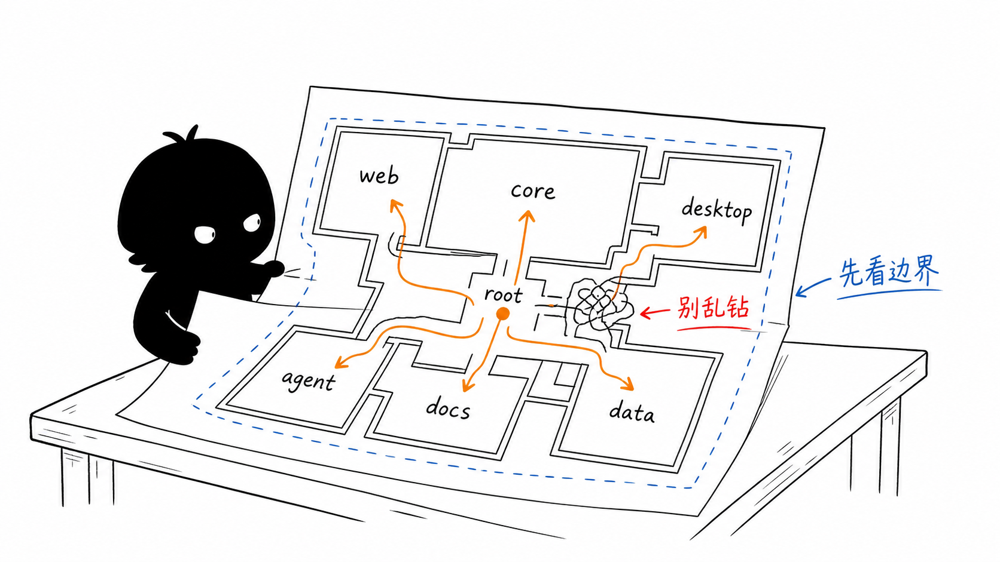
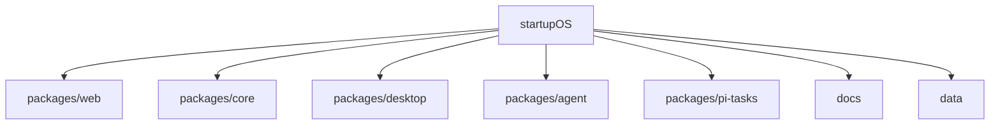
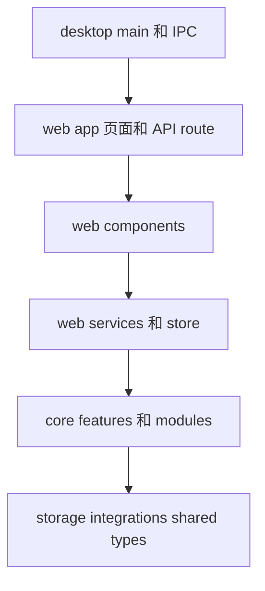

# 第 2 节：仓库怎么看

这一节学习仓库地图。你第一次看这个项目，最容易犯的错误是：看到一个文件名像，就直接钻进去。OriginOS 是 monorepo，必须先看清每个 package 的职责边界。

本节目标：

- 理解什么是 monorepo；
- 记住 `web`、`core`、`desktop`、`agent`、`docs`、`data` 的分工；
- 看懂 `AGENTS.md` 里的单向依赖规则；
- 知道新手读代码应该从哪里开始。

这张图的重点是“先看边界”。仓库像一张楼层图，`web`、`core`、`desktop`、`agent`、`docs`、`data` 是不同房间。你先知道每个房间放什么，再决定进哪个门。

## 1. monorepo 是什么

`monorepo` 的意思是：一个仓库里放多个相关 package。

OriginOS 不是一个单独的 Next.js 项目，而是多个包协同：

这样做的好处是：Web、桌面壳、Agent 运行边界、共享业务逻辑可以放在一个仓库里统一演进。

代价是：你不能只用“文件名直觉”找代码，还要考虑层级边界。比如业务逻辑不应该随手写进 `packages/web/src/app/`。

## 2. 每个 package 负责什么

第一遍可以这样记：

| 目录 | 你可以先怎么理解 |
| --- | --- |
| `packages/web` | 用户看见的界面，Next.js App Router 页面、组件、状态、Web 适配 |
| `packages/core` | 共享业务逻辑、Agent 集成、模块、类型、存储基础设施 |
| `packages/desktop` | Electron 桌面壳、主进程、IPC、本地服务 |
| `packages/agent` | Pi Agent adapter 运行边界 |
| `packages/pi-tasks` | 任务运行相关协议和工具 |
| `docs` | Epic、Story、需求、架构说明 |
| `data` | 本地运行数据，JSON、Markdown、JSONL 等 |

注意：`web` 不等于全部业务，`desktop` 也不等于全部业务。真正可复用的业务能力应该尽量下沉到 `core`。

## 3. AGENTS.md 的依赖规则

`AGENTS.md` 最核心的架构规约是：依赖要单向，不能乱。

简化成图：

这张图不是说所有运行时都真的严格按这个箭头调用，而是表达一个规约：上层可以使用下层，下层不能反向依赖上层。

为什么要这样？

- `core` 如果依赖 `web`，就不能被 `desktop` 干净复用；
- `features` 如果互相乱导内部文件，很容易形成循环依赖；
- `app/` 如果放业务逻辑，API route 和页面会越来越难维护。

## 4. 新手读代码路线

你现在可以用这个顺序读：

1. `README.md`：理解产品闭环。
2. `AGENTS.md`：理解架构边界。
3. `package.json`：理解命令和 package。
4. `packages/web/src/app/page.tsx`：看首页入口。
5. `packages/web/src/config/homeApps.ts`：看首页 AppCard 从哪里来。
6. `packages/web/src/components/skills/SkillDialog.tsx`：看 Skill 如何进入 Agent 会话。
7. `packages/web/src/app/api/agent/sessions/route.ts`：看 session 创建。
8. `packages/core/src/lib/features/agent/session-service.ts`：看 session 怎么存。

## 5. 本节记忆卡

先记住 4 句话：

1. OriginOS 是 monorepo，不是单包前端项目。
2. `web` 负责界面和入口，`core` 负责共享业务和 Agent 集成，`desktop` 负责桌面壳。
3. `AGENTS.md` 的核心是单向依赖：上层调用下层，下层不要反向依赖上层。
4. 新手读代码要先看边界，再看具体函数。

