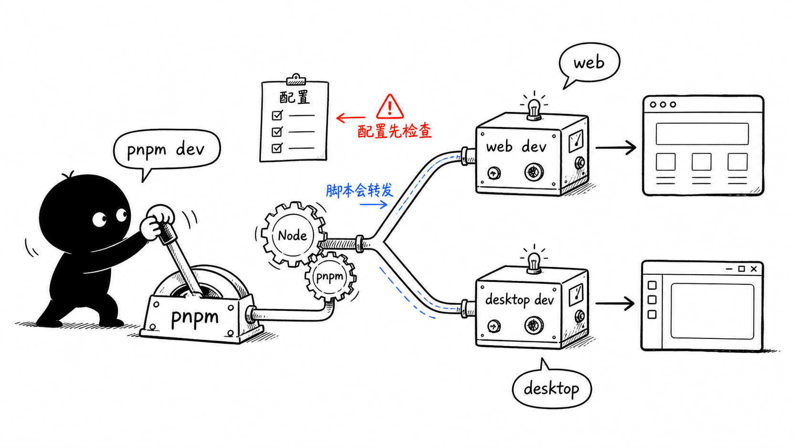
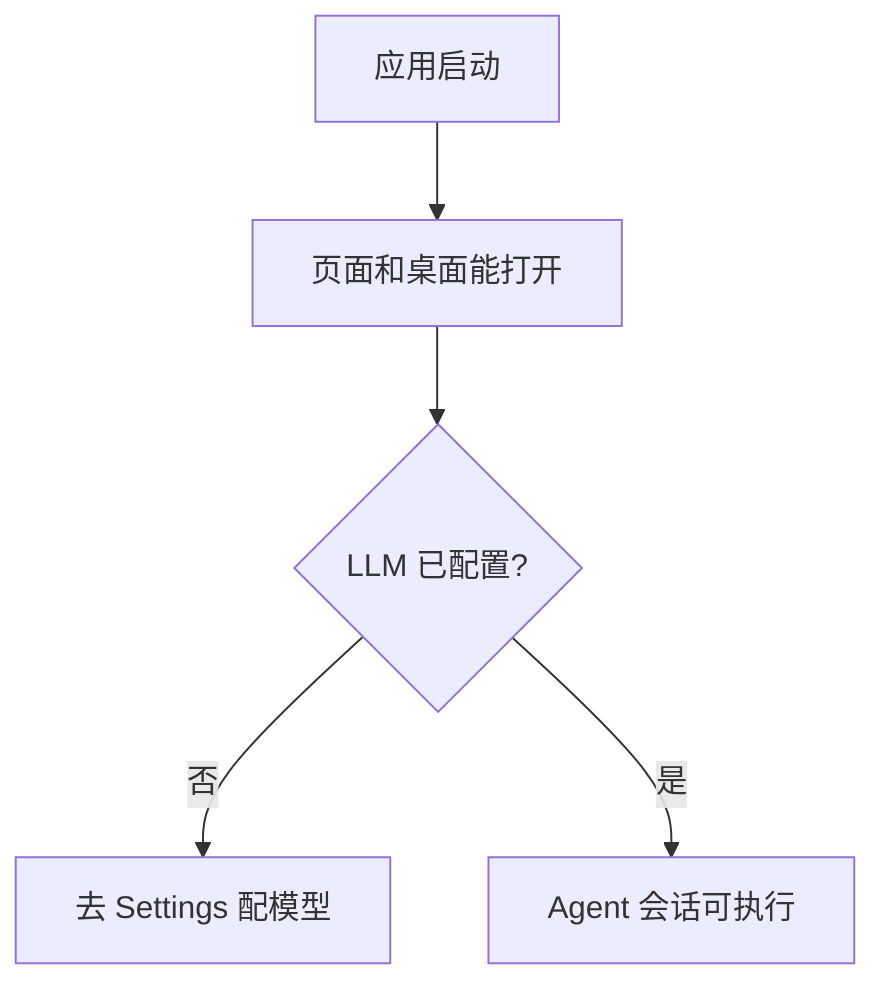

# 第 3 节：怎么跑起来

这一节学习运行命令。对新手来说，跑项目不是背命令，而是理解：根目录脚本会把命令转发给对应 package。

本节目标：

- 看懂 `package.json` 的脚本；
- 区分 `pnpm dev` 和 `pnpm desktop:dev`；
- 知道检查命令的用途；
- 理解运行前为什么要配置模型。



这张图的意思是：`pnpm` 像一个总开关。你在根目录执行命令，它会转发到 `@originos/web` 或 `@originos/desktop`。

## 1. 运行环境

根目录 `package.json` 里写了：

```json
{
  "engines": {
    "node": ">=22.19.0",
    "pnpm": ">=9.0.0"
  },
  "packageManager": "pnpm@9.15.9"
}
```

第一遍你只需要知道：

- 用 Node；
- 用 pnpm；
- 这是 workspace 项目，不要用 npm 随便安装。

## 2. 常用命令

根目录脚本里最重要的是：

```text
pnpm dev
pnpm desktop:dev
pnpm lint
pnpm type-check
pnpm test
```

它们的意思：

| 命令 | 做什么 |
| --- | --- |
| `pnpm dev` | 只启动 Web 界面 |
| `pnpm desktop:dev` | 启动 Electron 桌面开发环境 |
| `pnpm lint` | 检查 Web lint 和部分架构规则 |
| `pnpm type-check` | TypeScript 类型检查 |
| `pnpm test` | 跑测试 |

脚本转发关系：

```mermaid
flowchart LR
    Root[pnpm command at root] --> Dev[pnpm dev]
    Root --> Desktop[pnpm desktop:dev]
    Root --> Check[pnpm lint/type-check/test]

    Dev --> WebPkg[@originos/web dev]
    Desktop --> DesktopPkg[@originos/desktop dev]
    Check --> WebCheck[@originos/web checks]
```

## 3. 为什么运行前要配置模型

OriginOS 的核心交互依赖 LLM。`README.md` 的 First Run 里说，第一次要配置 model provider、model ID、endpoint 和 credential。

也就是说：

- 界面能起来，不代表 Agent 能正常回答；
- Agent 能创建 session，不代表模型调用已经成功；
- 如果模型配置缺失，后面发送消息可能会失败或没有内容。

你可以把项目分成两层启动：



## 4. 新手不要混淆的点

`pnpm dev` 启动的是 Web。它适合看 Next.js 页面、首页、SkillDialog 等。

`pnpm desktop:dev` 启动桌面壳。它适合看 Electron、本地文件、IPC、桌面窗口。

`pnpm lint` 不是“功能正确”的证明，它主要检查静态问题。真实修改后通常还要结合你改动的地方跑更具体的测试。

## 5. 本节记忆卡

1. 根目录脚本是入口，真实工作会转发到具体 package。
2. `pnpm dev` 看 Web，`pnpm desktop:dev` 看桌面。
3. LLM 配置是 Agent 可用的前提。
4. 修改代码后至少要知道自己该跑哪个检查命令。

