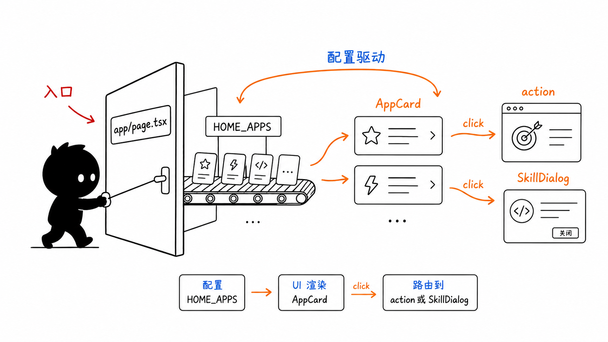
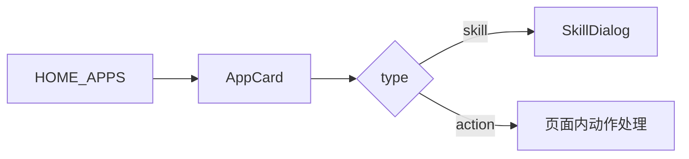
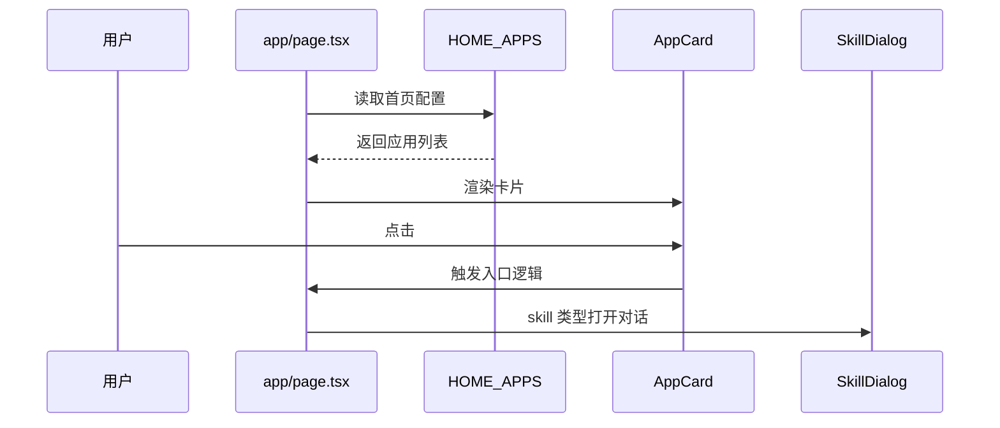

# 第 4 节：Web 首页怎么启动

这一节从 Web 入口看 OriginOS。第一遍不要试图读完 `page.tsx` 的所有细节，重点看：入口在哪里、首页卡片从哪里来、点击后去哪里。

本节目标：

- 认识 Next.js App Router 首页入口；
- 理解 `HOME_APPS` 配置驱动首页卡片；
- 区分 `action` 类型和 `skill` 类型；
- 知道从首页追到 SkillDialog 的路线。



这张图表达：`app/page.tsx` 是首页门口，`HOME_APPS` 是卡片原料，`AppCard` 是渲染出来的入口。点击后分流：普通 action 走动作处理，skill 类型打开 `SkillDialog`。

## 1. 首页入口文件

入口文件是：

```text
packages/web/src/app/page.tsx
```

因为项目使用 Next.js App Router，所以 `src/app/page.tsx` 就是根路由首页。

这个文件很长，不要一上来逐行读。先看它导入了什么：

- `HOME_APPS`：首页应用配置；
- `AppCard`：应用卡片；
- `SkillDialog`：技能对话；
- `AppWindowManager`：窗口管理；
- `Dock`：桌面 Dock；
- 各种窗口组件和 store。

## 2. HOME_APPS 是什么

配置文件：

```text
packages/web/src/config/homeApps.ts
```

它定义了首页有哪些内置应用：

```ts
export type AppCardType = 'skill' | 'action';
```

也就是说，首页卡片大致分两类：

- `skill`：点击后打开某个技能；
- `action`：点击后执行某个内置动作，比如打开工作区。

图解：



## 3. 为什么说首页是配置驱动

如果一个入口写死在 JSX 里，每加一个应用都要改组件结构。

`HOME_APPS` 的方式是：应用列表放在配置里，页面负责循环渲染。

这带来两个好处：

- 首页入口更容易增删；
- 每个入口的 `id/name/description/icon/type/skillName/action` 更集中。

第一遍你可以把 `HOME_APPS` 理解成：

> 首页 AppCard 的菜单数据源。

## 4. 读代码路线

本节建议按这个顺序读：

1. `packages/web/src/app/page.tsx`
2. `packages/web/src/config/homeApps.ts`
3. `packages/web/src/components/framework/AppCard`
4. `packages/web/src/components/skills/SkillDialog.tsx`

重点不是读完每个 UI 细节，而是追这条链：



## 5. 本节记忆卡

1. `packages/web/src/app/page.tsx` 是 Web 首页入口。
2. `HOME_APPS` 决定首页应用卡片有哪些。
3. `type: 'skill'` 会走 SkillDialog，`type: 'action'` 会走页面动作。
4. 新手读首页，不要先陷入样式，先追配置到点击的主线。

