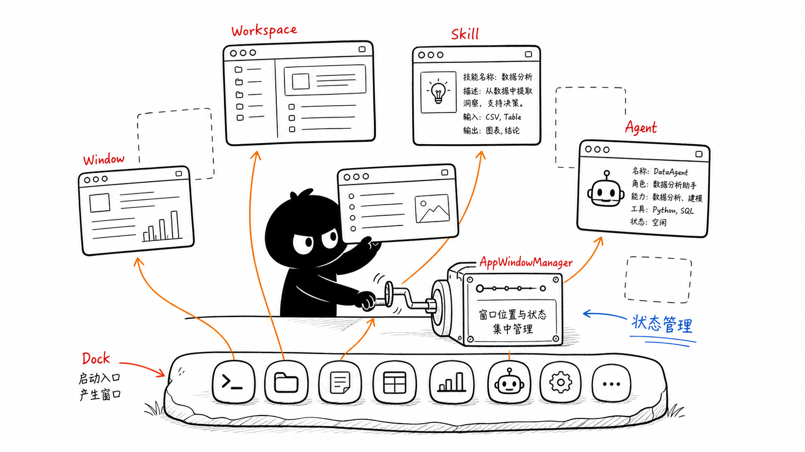
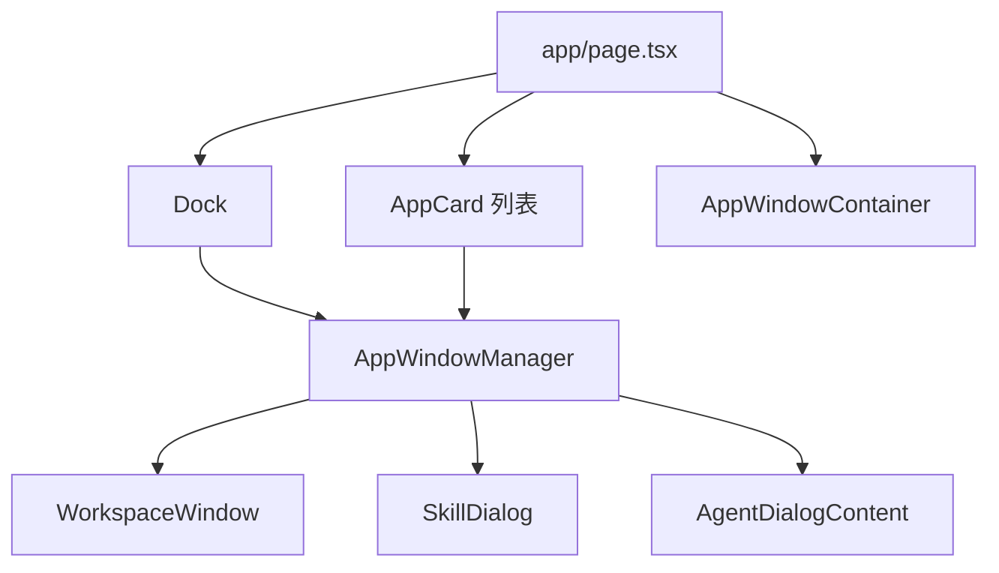
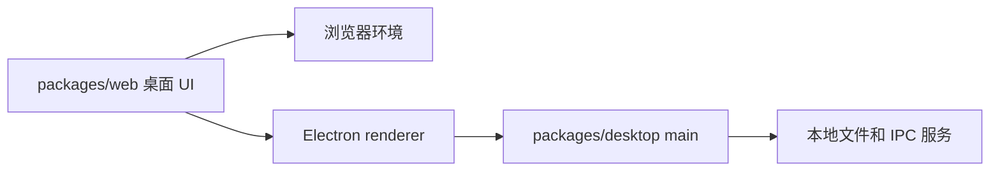

# 第 5 节：桌面界面怎么组织

这一节学习桌面 UI 的组织方式。OriginOS 的首页不是普通网页列表，它更像一个 AI 桌面：有 Dock、有窗口、有工作区、有 Skill、有 Agent 对话。

本节目标：

- 理解 Dock、Window、Workspace、Skill、Agent 的关系；
- 知道窗口状态由管理器集中处理；
- 区分 Web 页面和 Electron 桌面壳；
- 看懂桌面交互不是一个单组件完成的。

图里小黑通过 `AppWindowManager` 管窗口。Dock 像启动入口，点击后打开不同窗口：Workspace、Skill、Agent 等。

## 1. 桌面不是一个页面

用户看到的可能是一个桌面，但代码上它由很多部分组成：

- `Dock`：底部入口；
- `AppCard`：首页应用卡片；
- `AppWindowContainer`：窗口容器；
- `WorkspaceWindow`：工作区窗口；
- `SkillDialog`：Skill 对话窗口；
- `AgentDialogContent`：Agent 对话内容；
- `AppWindowManager`：窗口打开、关闭、状态管理。

简化图：

## 2. 为什么需要窗口管理器

如果每个组件自己管理自己的打开关闭，很快会乱：

- 哪个窗口在最上层？
- 是否最小化？
- 是否最大化？
- 窗口位置和尺寸是多少？
- 关闭后状态如何清理？

所以系统需要一个集中管理窗口状态的地方。`AGENTS.md` 也明确提到基于 `AppWindowManager` 的窗体管理。

你可以先把它理解成：

> 桌面上的窗口调度员。

## 3. Web 和 Desktop 的区别

这里有两个“desktop”概念，容易混：

- `packages/web/src/app/page.tsx` 里实现的是“桌面风格的 Web UI”；
- `packages/desktop` 是 Electron 桌面壳和主进程。

也就是说，Web 负责渲染桌面界面，Electron 负责把它包成本地桌面应用，并提供本地能力。

## 4. 读代码入口

建议先看：

- `packages/web/src/app/page.tsx`
- `packages/web/src/components/os/dock/`
- `packages/web/src/components/os/window/AppWindowContainer`
- `packages/web/src/services/AppWindowManager`
- `packages/desktop/src/main/main.ts`
- `packages/desktop/src/main/ipc-protocol.ts`

第一遍只看它们的职责，不需要掌握所有状态字段。

## 5. 本节记忆卡

1. OriginOS 的主界面是桌面式 UI，不是普通列表页。
2. Dock 和 AppCard 是入口，Window 是承载工作内容的容器。
3. `AppWindowManager` 集中处理窗口状态。
4. `packages/web` 做界面，`packages/desktop` 做 Electron 壳和本地服务。

