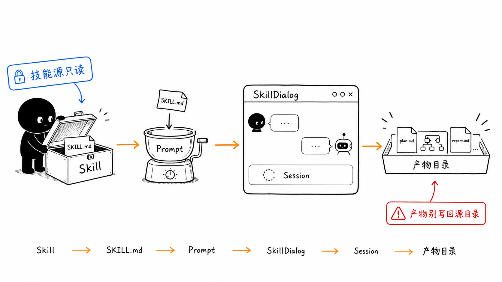
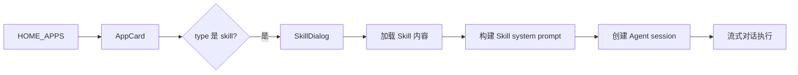
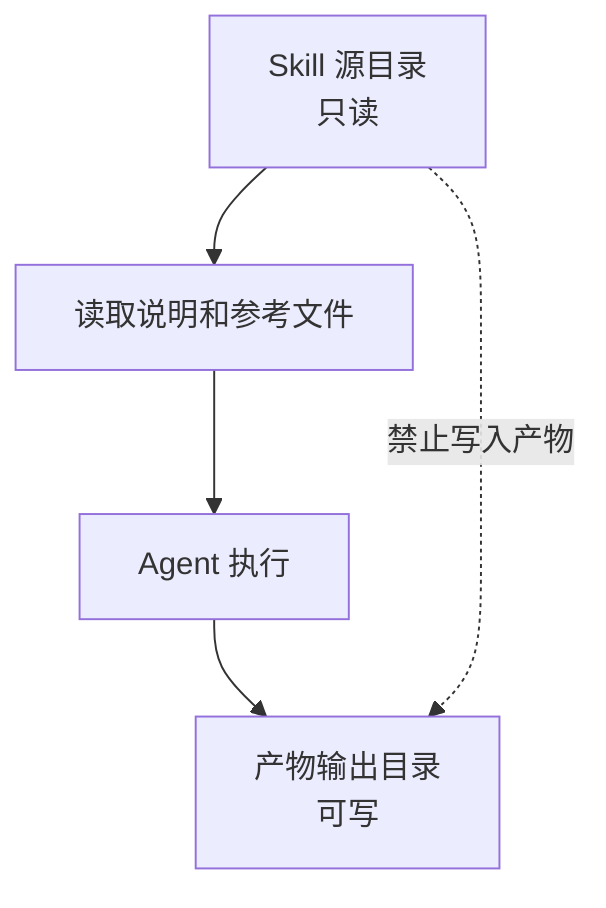

# 第 6 节：Skill 是什么

这一节学习 Skill。第一遍先把 Skill 理解成“打包好的专项工作流”，它可以从首页启动，进入 `SkillDialog`，再通过 Pi Agent 会话执行。

本节目标：

- 理解 Skill 和普通按钮的区别；
- 看懂 Skill 从首页到会话的链路；
- 知道 `SKILL.md` 的作用；
- 理解“技能源目录”和“产物输出目录”不能混。



这张图有一个关键提醒：Skill 的源文件是说明和参考，不是产物目录。Agent 执行产生的文件应该写到输出目录。

## 1. Skill 的产品理解

Skill 可以理解成：

> 被系统识别、加载、执行的一套专项能力。

它不像普通按钮只触发一个固定函数，而是通常会携带：

- 技能说明；
- 使用规则；
- 参考文件；
- 工作目录；
- 输出目录；
- Agent 执行上下文。

## 2. 从首页到 SkillDialog

入口链路：



相关代码：

- `packages/web/src/config/homeApps.ts`
- `packages/web/src/components/skills/SkillDialog.tsx`
- `packages/core/src/lib/features/skills/`
- `packages/core/src/lib/integrations/pi-agent/core/skills.ts`

## 3. SKILL.md 是什么

`SkillDialog.tsx` 里有 `loadSkillContent` 和 `buildSkillSystemPrompt`。

第一遍可以这样理解：

- `loadSkillContent`：把技能说明读出来；
- `buildSkillSystemPrompt`：把技能说明、工作目录、输出目录等信息拼进 system prompt；
- `usePiAgent`：启动和驱动 Agent 会话。

也就是说，Skill 不是“直接执行一段脚本”，而是：

```text
读取技能定义
-> 构建 Agent 指令
-> 创建会话
-> 对话式执行
-> 产物写入指定目录
```

## 4. 源目录和输出目录

这是非常重要的边界。

`AGENTS.md` 里强调：

- `.claude/skills/` 是只读定义目录；
- `CLAUDE_SKILL_DIR` 指向技能源目录，供读取参考；
- 产物要写到 `data/skills/{skillName}/` 或项目工作目录。

简化图：



## 5. 本节记忆卡

1. Skill 是可复用专项工作流，不是普通按钮。
2. 首页 skill 入口会打开 `SkillDialog`。
3. `SKILL.md` 会进入 system prompt，影响 Agent 怎么做事。
4. 技能源目录只读，产物要写到输出目录。

