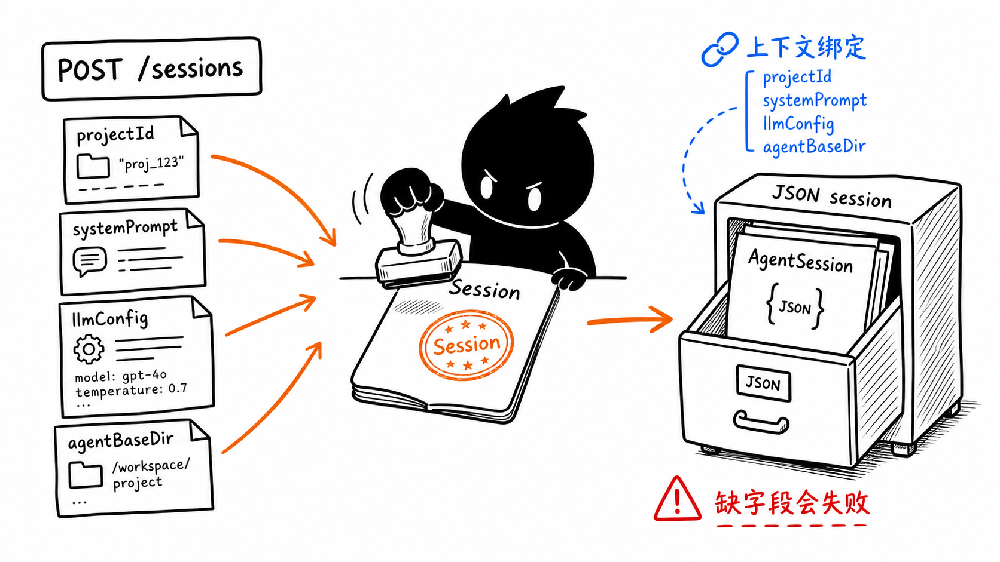
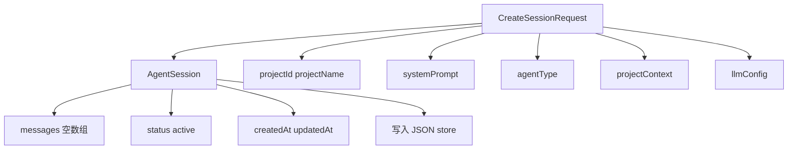
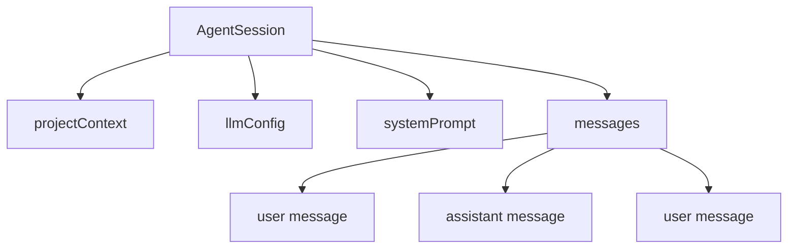

# 第 7 节：Agent 会话怎么开始

这一节学习 Agent session。你可以把 session 理解成“一次 Agent 工作的运行档案”：它把项目、system prompt、模型配置、工作目录和消息历史绑定在一起。

本节目标：

- 理解为什么要先创建 session；
- 看懂 `POST /api/agent/sessions` 的输入和输出；
- 知道 session 会被保存成 JSON；
- 区分 session 和单条 message。



图里小黑把 `projectId`、`systemPrompt`、`llmConfig`、`agentBaseDir` 等材料盖成一个 `AgentSession`，再放进 JSON 文件柜。

## 1. 为什么需要 session

如果没有 session，每次发消息都像这样：

```text
用户消息 -> 模型 -> 回答
```

这不够，因为 Agent 工作需要更多上下文：

- 这是哪个项目；
- 当前 Agent 的身份是什么；
- system prompt 是什么；
- 模型配置是什么；
- 工作目录在哪里；
- 历史消息有哪些；
- 产物应该写到哪里。

所以要先创建 session：

```text
创建 session
-> 保存运行上下文
-> 后续 message 都挂到这个 session 上
```

## 2. API 入口

Session 创建入口：

```text
packages/web/src/app/api/agent/sessions/route.ts
```

核心 API：

```text
POST /api/agent/sessions
```

它会做几类事情：

- 校验 `projectId` 和 `projectName`；
- 持久化 runtime LLM 配置；
- 合并用户配置里的模型 mapping；
- 确保 `agentBaseDir` 存在；
- 调用 `agentSessionService.createSession`；
- 返回创建好的 session。

## 3. session 里有什么

在 `packages/core/src/lib/features/agent/session-service.ts` 里，创建 session 的核心字段包括：



第一遍不用背类型，只要知道：

> session 是 Agent 运行上下文和消息历史的容器。

## 4. session 存在哪里

`AgentSessionService` 用的是 `jsonStore`。

如果有项目 ID，session 会走项目会话目录：

```text
projects/{projectId}/sessions/{sessionId}.json
```

如果没有项目，就会走全局会话目录：

```text
sessions/{sessionId}.json
```

这和 `AGENTS.md` 的文件系统存储规约是一致的：MVP 阶段使用本地 JSON，不引入数据库。

## 5. session 和 message 的区别

非常重要：

- `session`：一条会话档案，保存上下文和消息列表；
- `message`：这次会话中的一条用户或 assistant 消息。

图解：



## 6. 本节记忆卡

1. Agent 开始工作前要先有 session。
2. session 绑定项目、prompt、模型配置、工作目录和消息历史。
3. `POST /api/agent/sessions` 是创建入口。
4. `agentSessionService` 负责把 session 保存到 JSON。

