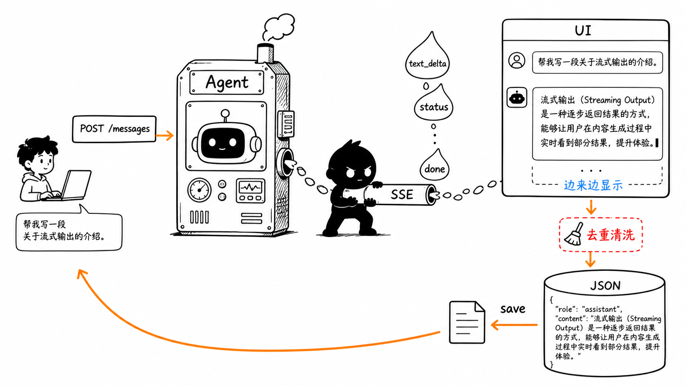
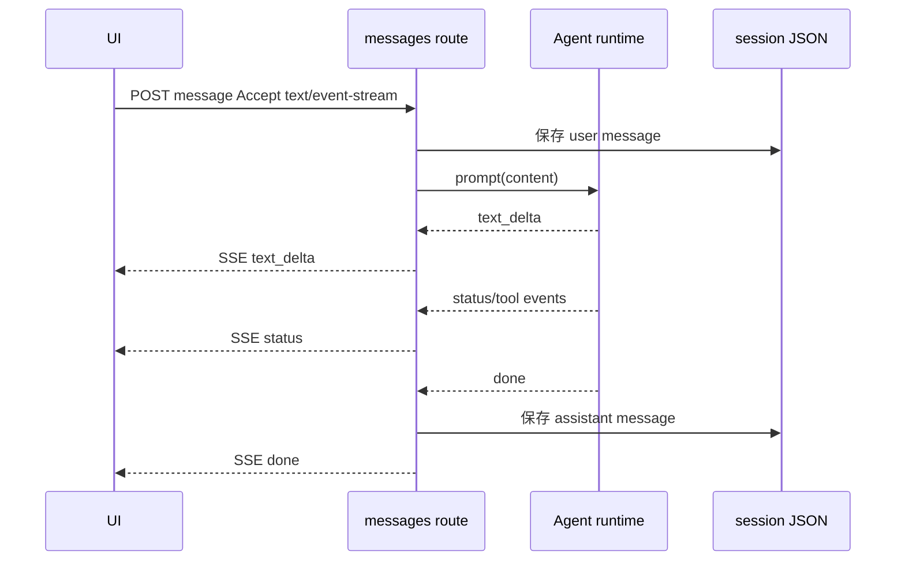

# 第 8 节：消息怎么流式返回

这一节学习 message 和 streaming。用户点发送后，不是等模型完整回答完才显示，而是通过 SSE 把事件一段段推给 UI。

本节目标：

- 看懂 `POST /api/agent/sessions/{sessionId}/messages`；
- 理解 SSE 流式返回；
- 知道 `text_delta`、`status`、`done` 的作用；
- 理解为什么最终还要保存 assistant message。



这张图的重点是“边来边显示”。Agent 不是一次性吐出完整文本，而是通过流把增量事件送到 UI。

## 1. message API 入口

文件：

```text
packages/web/src/app/api/agent/sessions/[sessionId]/messages/route.ts
```

API：

```text
POST /api/agent/sessions/{sessionId}/messages
```

它会做这些事：

1. 读取 `sessionId` 和请求 body；
2. 校验 `content`；
3. 从 `agentSessionService` 读取 session；
4. 恢复 Agent runtime；
5. 先把 user message 保存进 session；
6. 如果请求接受 `text/event-stream`，返回 SSE；
7. Agent 运行时不断发事件；
8. 最终保存 assistant message。

## 2. 流式返回是什么

普通返回像这样：

```text
请求 -> 等待很久 -> 一次性返回完整回答
```

流式返回像这样：

```text
请求 -> 返回一点 -> 再返回一点 -> 状态变化 -> 完成
```

Mermaid：



## 3. 为什么要处理 delta

流式输出可能会遇到一些实际问题：

- 同一段文本重复发送；
- 最终消息和中间 delta 需要合并；
- 工具调用状态不应该全部暴露成正文；
- UI 要知道什么时候结束。

所以代码里会出现：

- `getVisibleStreamDelta`
- `reconcileFinalStreamContent`
- `sanitizeAgentDisplayContent`
- `StreamRenderScheduler`

第一遍不用深究算法，先知道它们解决的是：

> 把 Agent runtime 的事件整理成用户能看的消息流。

## 4. 最终为什么还要保存

流式显示只是 UI 体验。真正让会话可恢复的是持久化。

所以流程里会：

- 先保存 user message；
- Agent 生成 assistant 内容；
- 最后保存 assistant message。

这样下次打开同一个 session，历史还能恢复。

## 5. 本节记忆卡

1. 发送消息走 `POST /api/agent/sessions/{sessionId}/messages`。
2. SSE 让 UI 可以边生成边显示。
3. `text_delta` 是增量文本，`status` 是状态，`done` 是完成。
4. 流式显示结束后，还要把 assistant message 写回 session。

