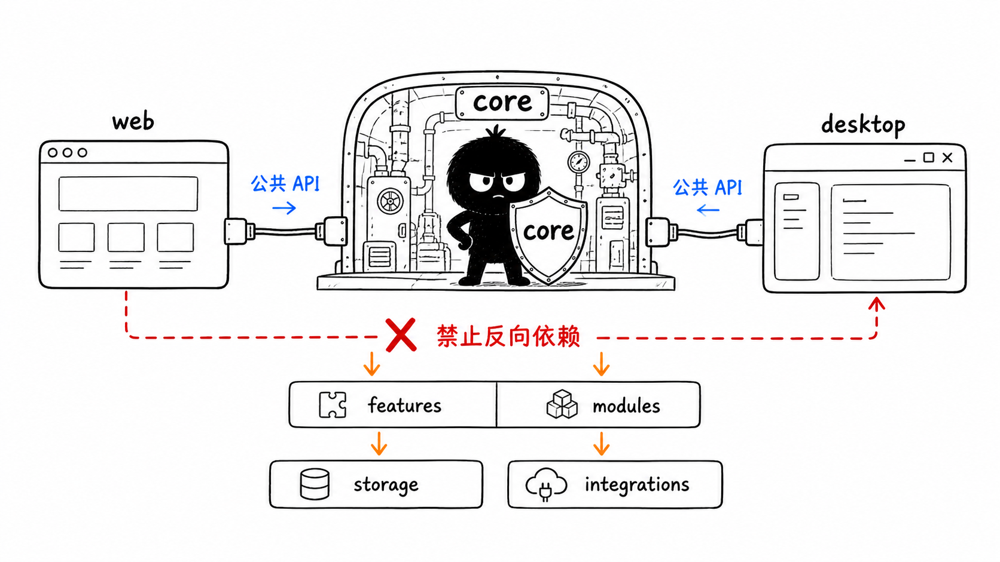
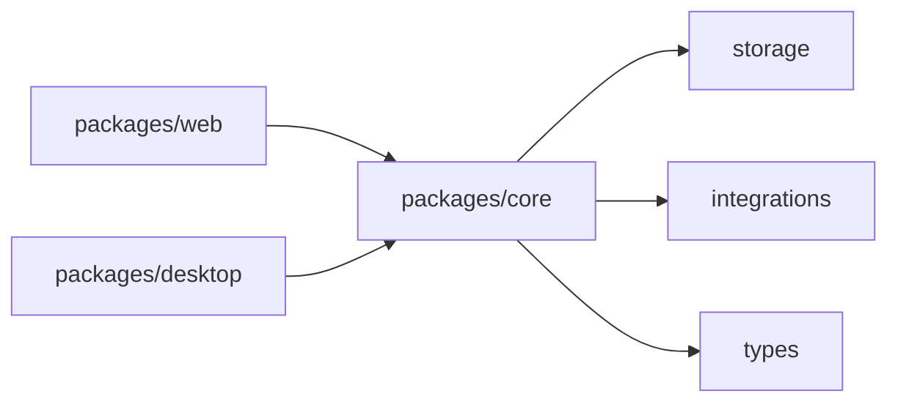
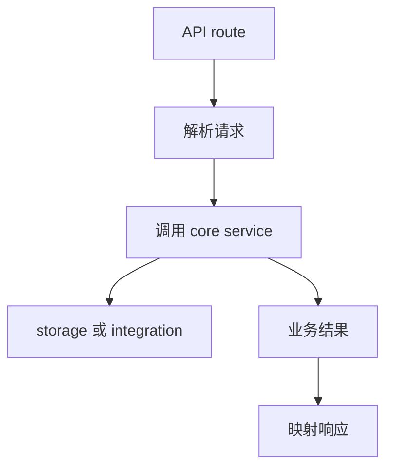

# 第 9 节：core 为什么重要

这一节学习 `packages/core`。如果说 `web` 是用户看见的界面，`desktop` 是本地桌面壳，那么 `core` 就是共享业务和 Agent 集成的发动机房。

本节目标：

- 理解为什么业务逻辑要放在 core；
- 看懂 features、modules、integrations、storage 的区别；
- 理解公共 API 和内部实现边界；
- 知道哪些代码不应该写进 `app/`。

图里的小黑守住 `core`，意思是：Web 和 Desktop 可以通过公共 API 使用 core，但不要把业务逻辑复制到各自里面，更不要让 core 反向依赖上层。

## 1. core 的定位

`packages/core` 负责：

- 共享业务功能；
- Agent 集成；
- 数据存储基础设施；
- 可复用模块；
- 类型定义；
- 部分跨端组件。

它让 Web 和 Desktop 不必各写一套业务逻辑。

## 2. core 里怎么看

常见目录：

| 目录 | 作用 |
| --- | --- |
| `src/lib/features` | 共享业务功能，比如 agent、skills、ontology、project |
| `src/lib/integrations` | 外部或运行时集成，比如 pi-agent、electron |
| `src/lib/storage` | JSON/file 存储基础设施 |
| `src/lib/shared` | 共享工具 |
| `src/modules` | 更独立的模块，比如 memory-core、scheduler、collaboration-runtime |
| `src/types` | 类型 |

第一遍可以这样判断：

- 业务概念：先看 `features`；
- Agent 运行：看 `integrations/pi-agent`；
- 存储：看 `storage`；
- 较大能力模块：看 `modules`。

## 3. API route 为什么不能放业务逻辑

`AGENTS.md` 规定：

> `packages/web/src/app/` 仅用于页面、布局和 API route 边界，禁止放业务逻辑。

API route 应该做：

- 参数解析；
- 权限或环境拼装；
- 调用下层服务；
- 响应映射。

不应该在 API route 里写一大坨业务流程。

图解：

## 4. 公共 API 和内部实现

`AGENTS.md` 还强调：feature 之间不要直接导入内部实现，要通过 `index.ts` 暴露公共 API。

这背后的意思是：

- 内部文件可以调整；
- 对外 API 要稳定；
- 避免跨 feature 乱依赖；
- 降低循环依赖风险。

第一遍读代码时，看到 `index.ts` 不要跳过，它往往告诉你这个模块对外提供什么。

## 5. 本节记忆卡

1. `core` 是共享业务和 Agent 集成中心。
2. Web 和 Desktop 应该复用 core，而不是复制业务逻辑。
3. API route 是边界，不是业务主实现。
4. feature 之间通过公共 API 交互，少碰内部实现。

