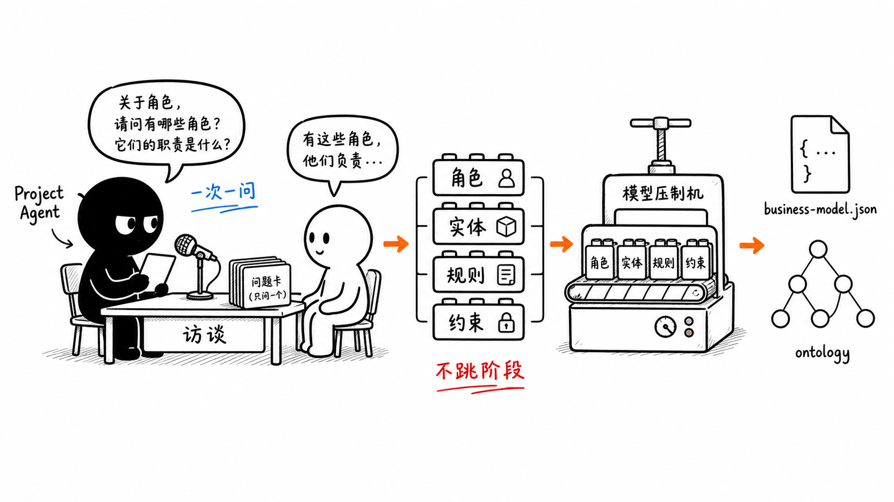
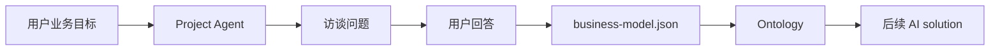
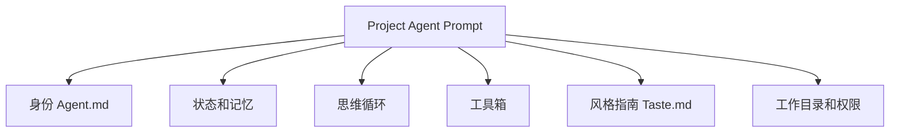

# 第 10 节：项目访谈怎么工作

这一节学习 Project Agent 和项目访谈。它是 OriginOS 产品闭环里的第一步：从用户的真实工作问题出发，逐步形成业务模型和本体。

本节目标：

- 理解 Project Agent 和普通聊天的区别；
- 看懂项目访谈为什么“一次一问”；
- 知道业务模型和本体从哪里来；
- 认识 Project Agent prompt 的分层。



这张图表达：Project Agent 不只是陪聊，它通过访谈收集角色、实体、规则、约束，然后压成 `business-model.json` 和 ontology。

## 1. 项目访谈解决什么问题

真实业务问题一开始通常很模糊：

```text
我想做一个课程运营系统
我想分析用户增长
我想把团队流程自动化
```

这些话还不能直接执行。系统需要继续问：

- 这个业务里有哪些角色？
- 有哪些核心实体？
- 角色之间怎么协作？
- 有哪些规则和约束？
- 最终要输出什么？

这就是项目访谈的价值。

## 2. Project Agent 的位置

相关入口：

- `packages/core/src/lib/integrations/pi-agent/project-agent/project-context.ts`
- `packages/core/src/lib/integrations/pi-agent/project-agent/project-prompt.ts`
- `packages/core/src/lib/features/interview/`
- `packages/core/src/lib/features/ontology/`

简化流程：



## 3. 为什么一次只问一个问题

`project-prompt.ts` 里强调 Project Agent 的 thinking loop，要按阶段加载不同技能，并且使用业务语言与用户对话，一次只问一个问题。

这是因为用户不是在填复杂表单。

一次问太多会带来问题：

- 新手用户不知道怎么答；
- 回答容易漏项；
- Agent 不容易判断下一步；
- 业务模型容易混乱。

一次一问的好处是：

- 降低用户压力；
- 每轮只补一个关键事实；
- 便于渐进形成模型。

## 4. Project Agent prompt 分层

`project-prompt.ts` 构建的是分层 prompt。第一遍不用背代码细节，只记住它把这些东西拼起来：



这些层共同决定 Project Agent：

- 它是谁；
- 当前项目到哪一步；
- 该按哪个访谈阶段推进；
- 能用哪些工具；
- 文件操作边界在哪里。

## 5. Ontology 在这里的作用

访谈不是为了生成聊天摘要，而是为了把业务世界结构化。

`AGENTS.md` 里定义的本体三层是：

- Domain：领域；
- Concept：概念对象；
- Instance：实例数据。

项目访谈会帮助系统识别这些结构，为后续 Agent 执行提供更稳定的上下文。

## 6. 本节记忆卡

1. Project Agent 负责把模糊业务目标变成可建模上下文。
2. 项目访谈一次只问一个问题，是为了渐进澄清业务。
3. 输出重点是业务模型和本体，不只是聊天记录。
4. Project Agent prompt 由身份、记忆、思维循环、工具箱、风格和权限组成。

