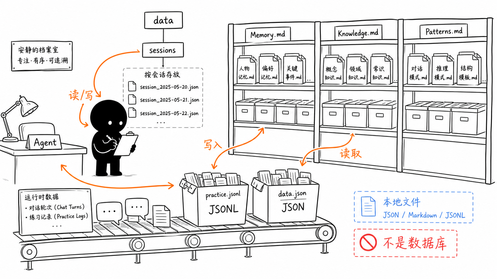
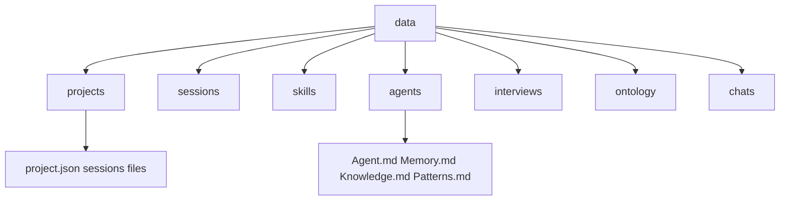
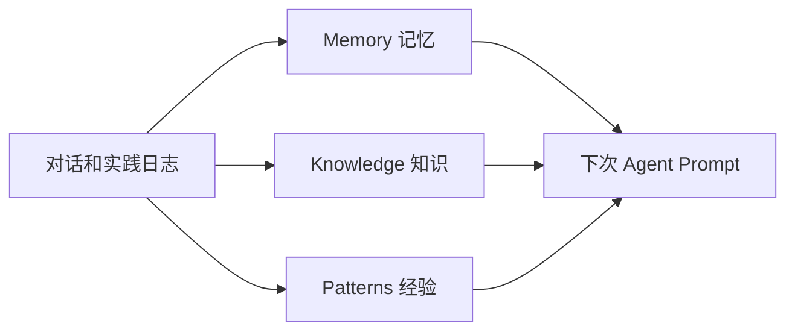

# 第 11 节：记忆和知识怎么存

这一节学习 OriginOS 的沉淀层。它不是把所有东西塞进数据库，而是用本地文件系统保存项目、会话、记忆、知识、经验和实践日志。

本节目标：

- 理解为什么 MVP 阶段使用 JSON/file 存储；
- 区分 Memory、Knowledge、Patterns；
- 看懂 data 目录的大致结构；
- 理解 Frozen Snapshot 的基本思路。

图里档案室的重点是：这是本地文件，不是数据库。Agent 运行时会读写 session、Memory、Knowledge、Patterns、practice log。

## 1. 为什么是文件存储

`AGENTS.md` 明确规定 MVP 阶段禁止使用数据库，使用本地文件系统 JSON。

好处：

- 本地优先；
- 容易追溯；
- 方便用户掌控数据；
- 对个人和小团队场景更轻量。

代价：

- 要认真设计目录；
- 要控制 JSON 格式；
- 要考虑版本和并发写入；
- 查询能力不如数据库。

## 2. data 目录装什么

规约里的大致结构：

第一遍你只要知道：

- 项目相关的东西在 `projects/{project-id}`；
- 全局会话在 `sessions`；
- Skill 产物在 `skills/{skillName}`；
- Agent 产物在 `agents/{agentName}`；
- 访谈、本体、聊天也有独立目录。

## 3. Memory、Knowledge、Patterns 区别

这三个很容易混：

| 名称 | 人话理解 | 例子 |
| --- | --- | --- |
| `Memory` | 发生过什么 | 用户上次确认目标是小团队知识库 |
| `Knowledge` | 知道什么事实 | OriginOS 的核心对象包括 Project、Agent、Skill |
| `Patterns` | 以后怎么做更好 | 解释复杂项目时先画地图再讲代码 |

图解：

## 4. Frozen Snapshot 是什么

`AGENTS.md` 提到 Project Agent 的 Frozen Snapshot 模式。

第一遍可以这样理解：

> Agent 启动时读取 Knowledge.md 和 Patterns.md 的快照，运行中新增知识先写磁盘，不马上改变已经在内存里的 prompt。

为什么这么做？

- prompt 更稳定；
- 有利于缓存；
- 避免运行中上下文不断变形；
- 新知识可以在下次启动时进入快照。

## 5. 读代码入口

建议看：

- `packages/core/src/lib/features/agent/session-service.ts`
- `packages/core/src/lib/storage/`
- `packages/core/src/modules/memory-core/`
- `packages/core/src/lib/integrations/pi-agent/cognitive/`
- `packages/core/src/lib/integrations/pi-agent/project-agent/project-prompt.ts`

## 6. 本节记忆卡

1. MVP 阶段使用本地 JSON/file 存储，不用数据库。
2. Memory 记历史，Knowledge 记事实，Patterns 记经验。
3. data 目录是运行时资产的根。
4. Frozen Snapshot 让 Agent 启动时加载稳定知识快照，运行中写入留到后续生效。

