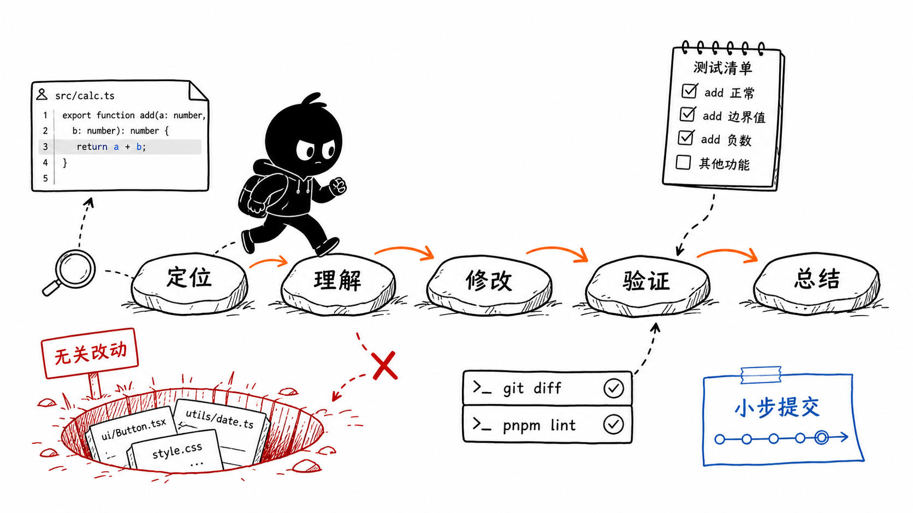
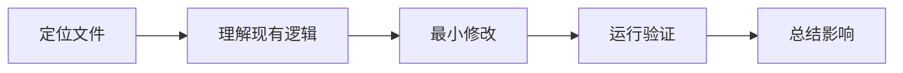
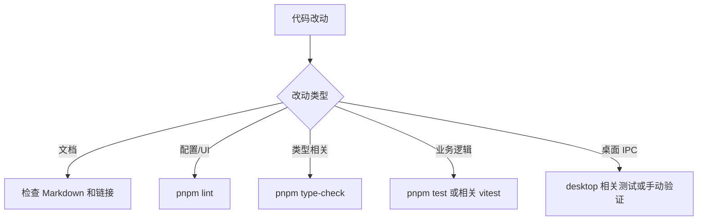

# 第 12 节：自己做一个小改动

这一节学习如何开始真正改代码。目标不是大改架构，而是建立一套安全流程：定位、理解、修改、验证、总结。

本节目标：

- 学会小改动的基本步骤；
- 知道如何避免无关改动；
- 理解为什么要先看依赖边界；
- 能给自己设计最小验证。

图里的路线是：定位 -> 理解 -> 修改 -> 验证 -> 总结。旁边的坑是“无关改动”。这对新手非常重要：能小步走，才不容易把项目改乱。

## 1. 小改动流程

推荐流程：

每一步都要问一个问题：

- 定位：这件事最可能在哪个模块？
- 理解：现有代码为什么这样写？
- 修改：最小改动是什么？
- 验证：怎么证明没破坏？
- 总结：我改了什么，风险在哪里？

## 2. 先判断改哪个层

你可以用这个判断表：

| 需求类型 | 优先看哪里 |
| --- | --- |
| 首页入口增删 | `packages/web/src/config/homeApps.ts` |
| 首页 UI 展示 | `packages/web/src/app/page.tsx` 和 components |
| Skill 对话 | `packages/web/src/components/skills/SkillDialog.tsx` |
| Agent session | `packages/web/src/app/api/agent/sessions/` 和 `core/features/agent` |
| Agent runtime | `packages/core/src/lib/integrations/pi-agent/` |
| 存储格式 | `packages/core/src/lib/storage/` 和相关 feature service |
| 桌面本地能力 | `packages/desktop/src/main/` |

## 3. 最小改动原则

小改动不是“不认真”，而是控制风险。

比如你只是要改首页一个 AppCard 的描述，就不应该顺手重构 `page.tsx`。你只需要改 `homeApps.ts`。

比如你只是要修一个 Skill 输出目录提示，就不应该重写整个 Agent session service。

## 4. 验证怎么选

验证不是永远跑全部命令，而是和风险匹配。

至少要做：

- `git diff` 看自己改了什么；
- 运行和改动相关的检查；
- 如果没法验证，要说明原因。

## 5. 新手最常见的坑

### 坑 1：看到相似名字就改

先确认入口链路，不要只凭文件名。

### 坑 2：把业务逻辑写进 app route

API route 是边界，核心业务要下沉到 core。

### 坑 3：顺手格式化一堆文件

这会让 diff 变大，难以审查。

### 坑 4：没有验证就说完成

至少说明做过什么检查，没做什么检查。

### 坑 5：改了用户已有改动

如果工作区已有别人的修改，不要随便覆盖或回退。

## 6. 本节记忆卡

1. 小改动流程是：定位、理解、修改、验证、总结。
2. 优先找正确层级，不要凭文件名乱改。
3. 最小改动能降低风险，也更容易验证。
4. 完成一个改动时，要说清改了什么、怎么验证、还有什么风险。

