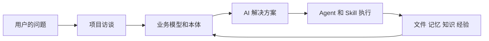
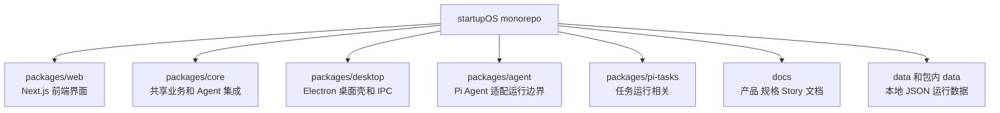
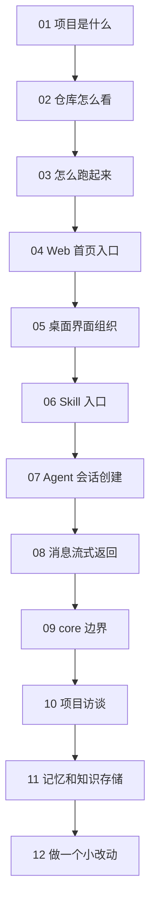

# OriginOS 宏观学习地图

## 这一轮学习目标

这一轮先宏观学习一遍，不深入每个实现细节。目标是建立一张脑内地图：

- OriginOS 要解决什么问题；
- 项目由哪些大模块组成；
- 用户操作如何进入 Web、Agent、Skill、数据存储；
- 后续深度学习应该从哪些入口继续。

## 产品主线图

人话理解：

OriginOS 不是单纯聊天工具，而是把“一个真实工作问题”变成“可执行的 AI 工作流”，最后沉淀成文件、知识和经验。

## 仓库分层图

第一遍只需要记：

- `web` 负责用户看见和点击的界面；
- `core` 负责可复用业务逻辑；
- `desktop` 负责桌面应用壳；
- `docs` 解释为什么这样设计；
- `data` 存运行时产物。

## 12 节课路线图

## 画图方式

宏观结构图使用 Mermaid。

当某节课需要“正文配图”帮助理解时，使用 `ian-xiaohei-illustrations` 的小黑风格，原则是：

- 16:9 横版；
- 白底手绘；
- 小黑参与核心动作；
- 少量中文标注；
- 每张图只表达一个概念。

## 后续深挖方向

宏观 12 节之后，可以按模块继续深挖：

- Agent 会话链路；
- Skill 加载和运行；
- Project Agent 访谈；
- Ontology 本体；
- Memory / Knowledge / Patterns；
- Electron 桌面主进程；
- AI solution 和多 Agent 协作。
