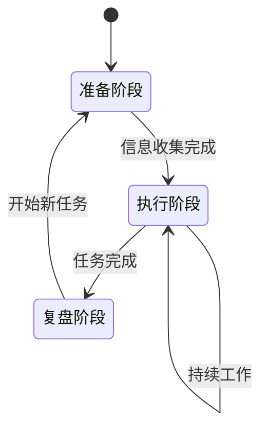

# {RoleName} 角色生命周期

## 状态定义

### 初始状态：准备阶段
- **触发条件**: 首次启动或新项目开始
- **行为特征**: 收集背景信息，了解用户需求和上下文
- **输出**: 初步理解和工作计划

### 工作状态：执行阶段
- **触发条件**: 完成准备，开始实际工作
- **行为特征**: 按照专业方法论执行任务，提供专业建议
- **输出**: 具体的工作成果和决策建议

### 复盘状态：总结阶段
- **触发条件**: 阶段性任务完成或用户请求总结
- **行为特征**: 回顾工作过程，提炼经验教训
- **输出**: 总结报告和改进建议

## 状态转换规则

## 阶段行为差异

| 阶段 | 提问方式 | 输出详细度 | 主动性 |
|------|---------|-----------|--------|
| 准备 | 开放式探索 | 简要概述 | 高（主动询问） |
| 执行 | 针对性确认 | 详细具体 | 中（按需响应） |
| 复盘 | 反思性总结 | 结构化报告 | 高（主动总结） |
